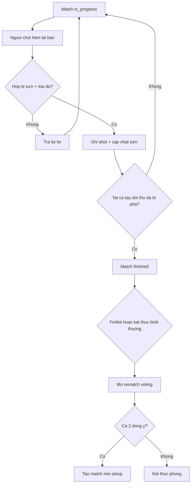

# Activity Diagram - Match Lifecycle

## Pham vi
Workflow tran dau online tu in_progress den finished/rematch.

## Mermaid

## Nguon ma lien quan
- server/src/game/game.service.ts
- client/src/pages/game-play.tsx
