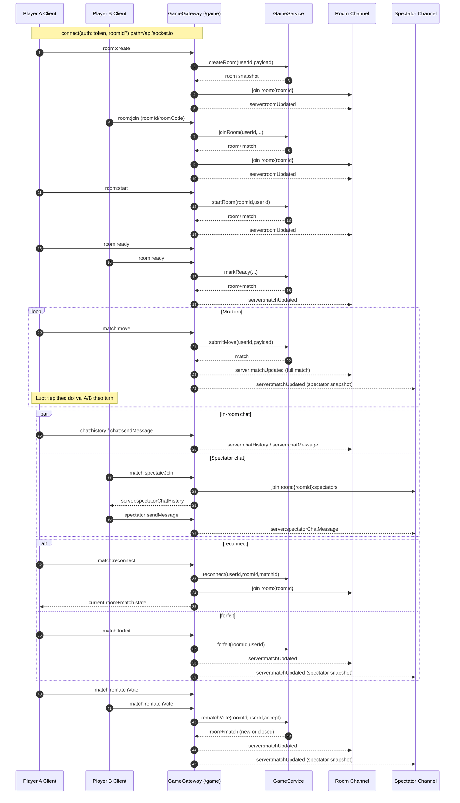

# Online Match - Socket Topic va Luong

## Pham vi
Tai lieu mo ta luong choi online theo Socket.IO namespace game.
No tap trung vao:
- Luong 2 nguoi choi (host, guest)
- Cac server event broadcast theo room channel
- Luong spectator va chat

## So do luong online (sequence)


## So do socket topics
```mermaid
flowchart TB
  subgraph C2S[Client -> Server topics]
    C1[room:create]
    C2[room:configureSetup]
    C3[room:list]
    C4[room:join]
    C5[room:start]
    C6[room:ready]
    C7[match:move]
    C8[match:reconnect]
    C9[match:forfeit]
    C10[match:rematchVote]
    C11[room:leave]
    C12[room:state]
    C13[chat:history]
    C14[chat:sendMessage]
    C15[match:spectateJoin]
    C16[match:spectateLeave]
    C17[spectator:chatHistory]
    C18[spectator:sendMessage]
  end

  subgraph Rooms[Broadcast channels]
    R1[room:{roomId}]
    R2[room:{roomId}:spectators]
  end

  subgraph S2C[Server -> Client topics]
    S1[server:roomUpdated]
    S2[server:matchUpdated]
    S3[server:chatHistory]
    S4[server:chatMessage]
    S5[server:spectatorChatHistory]
    S6[server:spectatorChatMessage]
    S7[server:error]
  end

  C1 --> R1
  C2 --> R1
  C4 --> R1
  C5 --> R1
  C6 --> R1
  C7 --> R1
  C7 --> R2
  C8 --> R1
  C9 --> R1
  C9 --> R2
  C10 --> R1
  C10 --> R2
  C11 --> R1
  C13 --> S3
  C14 --> S4
  C15 --> R2
  C17 --> S5
  C18 --> S6

  R1 --> S1
  R1 --> S2
  R1 --> S4
  R2 --> S2
  R2 --> S6
```

## Nguon ma lien quan
- client/src/services/gameSocketService.ts
- server/src/game/constants/game-events.const.ts
- server/src/game/game.gateway.ts
