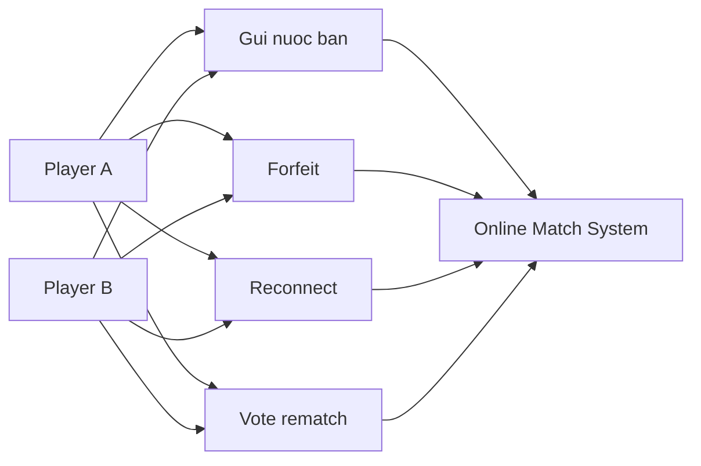

# Use Case Diagram - Online Match

## Pham vi
Use case cua 2 nguoi choi trong tran online.

## Mermaid

## Nguon ma lien quan
- client/src/pages/game-play.tsx
- client/src/services/gameSocketService.ts
- server/src/game/game.gateway.ts
