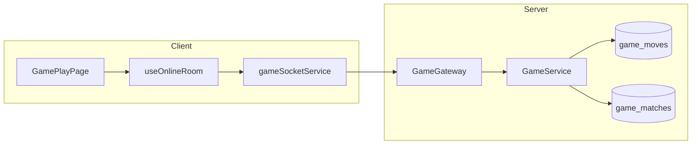

# Component Diagram - Online Match

## Pham vi
Thanh phan va phu thuoc cho luong match realtime.

## Mermaid

## Nguon ma lien quan
- client/src/pages/game-play.tsx
- client/src/hooks/useOnlineRoom.ts
- client/src/services/gameSocketService.ts
- server/src/game/game.gateway.ts
- server/src/game/game.service.ts
