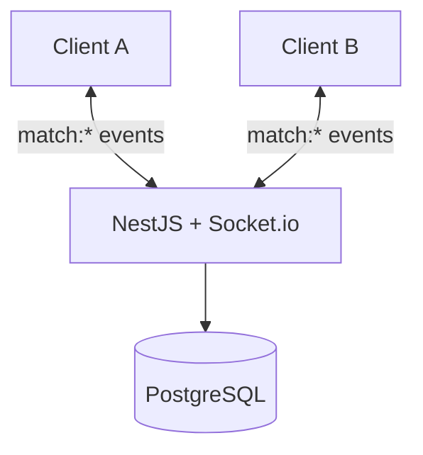

# Deployment Diagram - Online Match

## Pham vi
Topologi runtime cho tran online qua websocket.

## Mermaid

## Nguon ma lien quan
- server/src/game/game.gateway.ts
- server/src/game/game.service.ts
- docker-compose.yml
