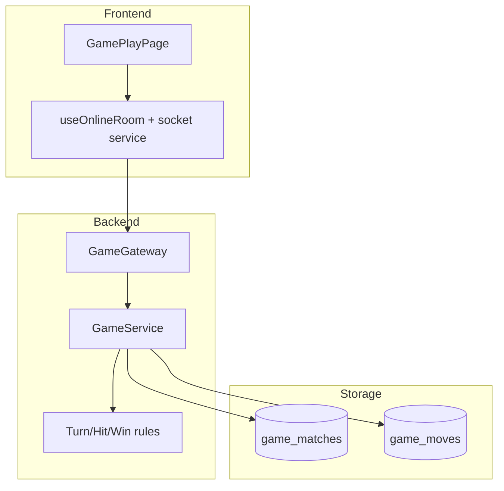

# Architecture Diagram - Online Match

## Pham vi
Kien truc match theo luong client realtime -> server authority.

## Mermaid

## Nguon ma lien quan
- client/src/pages/game-play.tsx
- client/src/hooks/useOnlineRoom.ts
- server/src/game/game.gateway.ts
- server/src/game/game.service.ts
