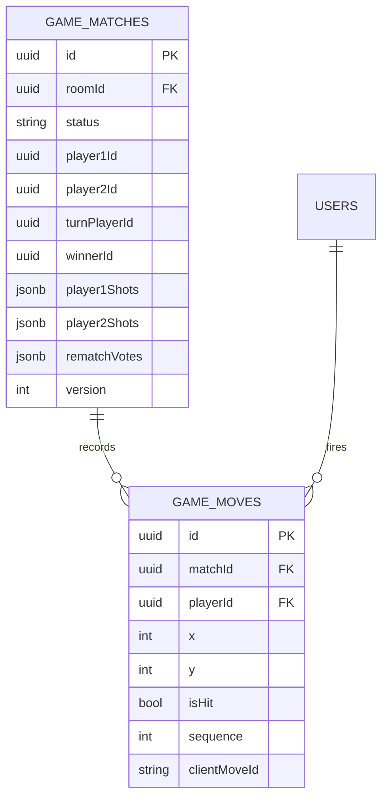

# ERD - Online Match

## Pham vi
Quan he du lieu match va move trong gameplay online.

## Mermaid

## Nguon ma lien quan
- server/src/game/infrastructure/persistence/relational/entities/match.entity.ts
- server/src/game/infrastructure/persistence/relational/entities/move.entity.ts
- server/src/database/migrations/1773446400001-InitGameTables.ts
