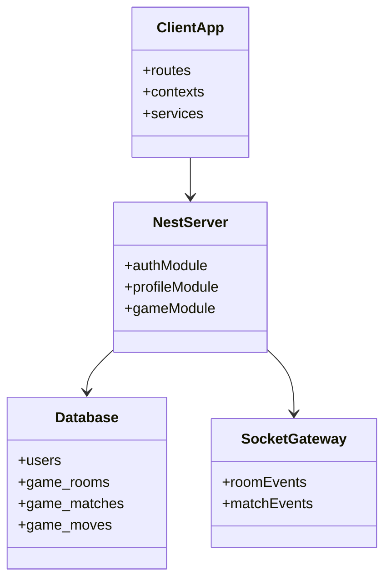

# Class Diagram - System Platform

## Pham vi
Tong quan cac thanh phan lop chinh giua client, server va persistence.

## Mermaid

## Nguon ma lien quan
- client/src/routes/index.tsx
- client/src/services/axios.ts
- client/src/services/gameSocketService.ts
- server/src/app.module.ts
- server/src/game/game.gateway.ts
- server/src/database/data-source.ts
