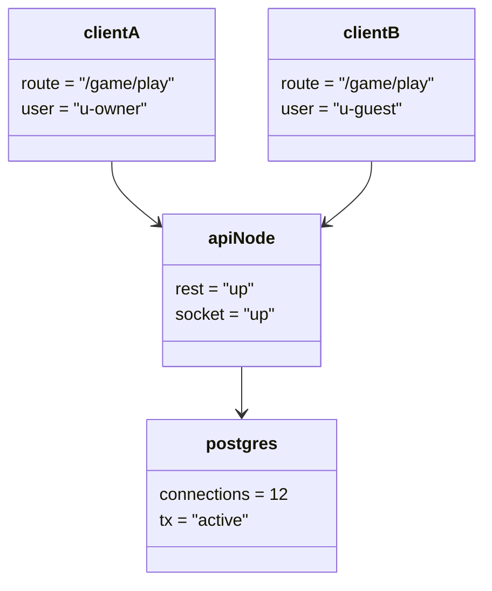

# Object Diagram - System Platform

## Pham vi
Anh xa doi tuong runtime khi he thong dang phuc vu 1 tran online.

## Mermaid

## Nguon ma lien quan
- docker-compose.yml
- client/src/pages/game-play.tsx
- server/src/main.ts
