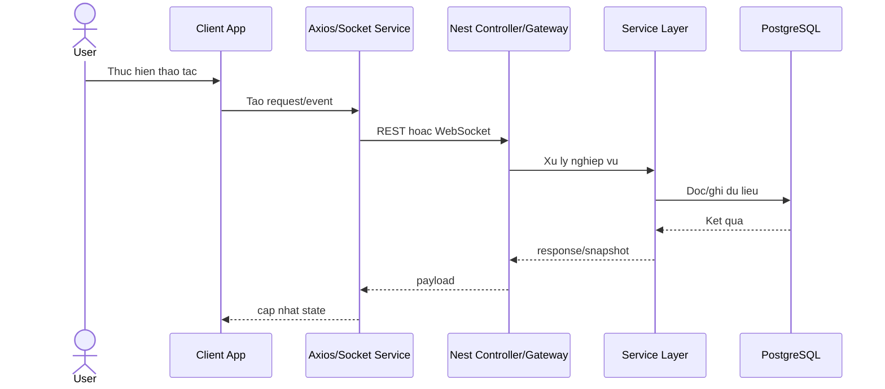

# Sequence Diagram - End-to-End Request

## Pham vi
Luong tong quat request REST va su kien websocket.

## Mermaid

## Nguon ma lien quan
- client/src/services/axios.ts
- client/src/services/gameSocketService.ts
- server/src/auth/auth.controller.ts
- server/src/game/game.gateway.ts
- server/src/game/game.service.ts
