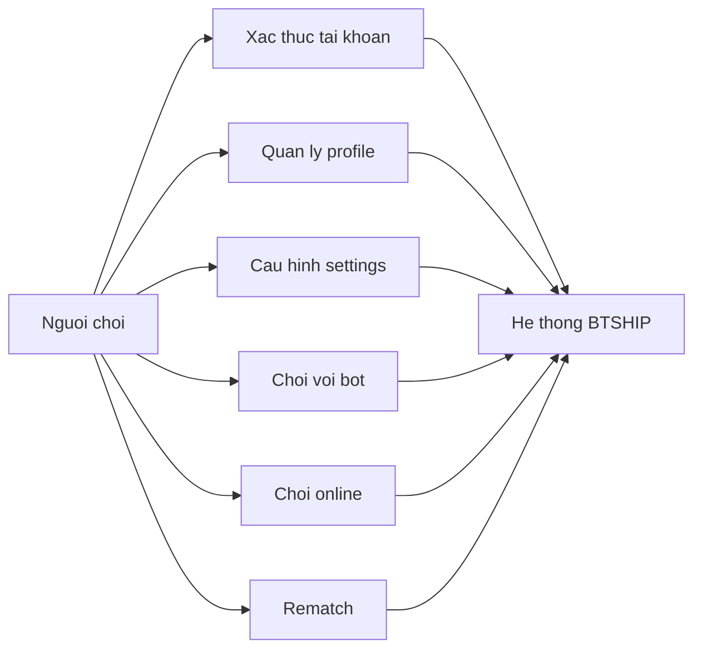

# Use Case Diagram - System Platform

## Pham vi
Use case tong hop cua toan he thong.

## Mermaid

## Nguon ma lien quan
- client/src/pages/welcome.tsx
- client/src/pages/home.tsx
- client/src/pages/game-play.tsx
- server/src/app.module.ts
