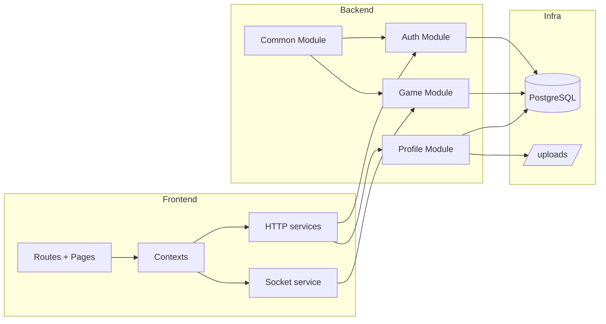

# Component Diagram - System Platform

## Pham vi
Thanh phan kien truc chinh toan he thong.

## Mermaid

## Nguon ma lien quan
- client/src/store
- client/src/services
- server/src/auth
- server/src/profile
- server/src/game
- server/src/common
