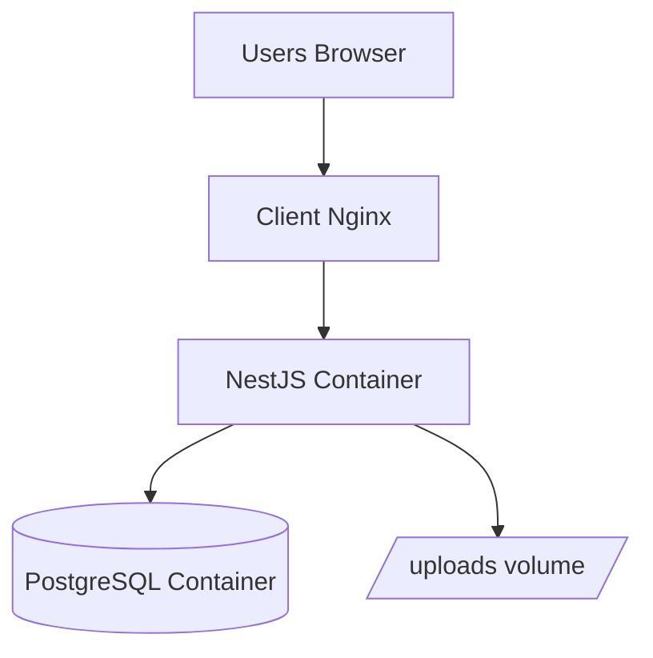

# Deployment Diagram - System Platform

## Pham vi
So do trien khai dev/prod muc tong quan.

## Mermaid

## Nguon ma lien quan
- docker-compose.yml
- docker-compose.prod.yml
- client/nginx.conf
- server/Dockerfile
