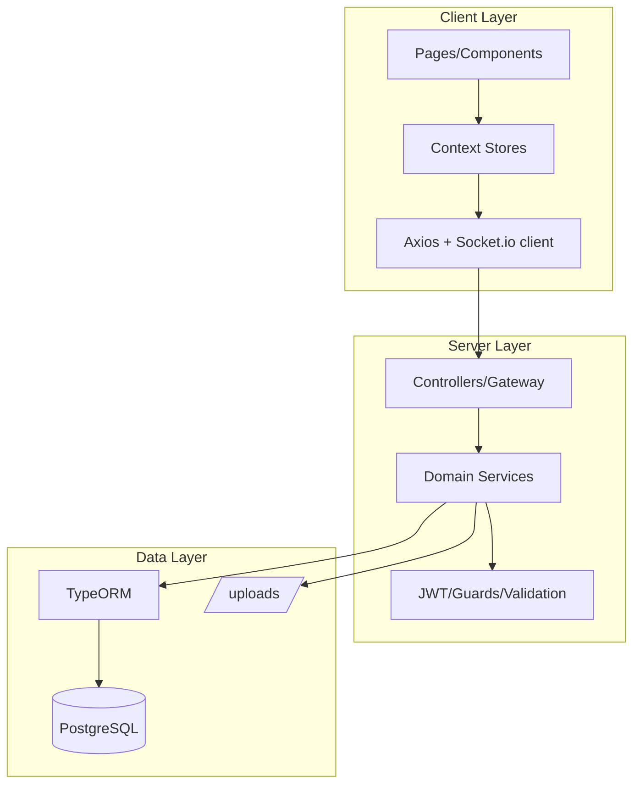

# Architecture Diagram - System Platform

## Pham vi
Kien truc tong the full-stack cua du an.

## Mermaid

```mermaid
flowchart TB
  subgraph Client Layer
    PAGES[Pages/Components]
    CTX[Context Stores]
    NET[Axios + Socket.io client]
  end

  subgraph Server Layer
    CTRL[Controllers/Gateway]
    APP[Domain Services]
    SEC[JWT/Guards/Validation]
  end

  subgraph Data Layer
    ORM[TypeORM]
    DB[(PostgreSQL)]
    FS[/uploads/]
  end

  PAGES --> CTX
  CTX --> NET
  NET --> CTRL
  CTRL --> APP
  APP --> SEC
  APP --> ORM
  ORM --> DB
  APP --> FS
```

## Nguon ma lien quan
- client/src
- server/src
- server/src/database
