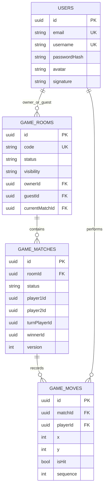

# ERD - System Platform

## Pham vi
Tong hop ERD cac bang trong he thong backend.

## Mermaid

## Nguon ma lien quan
- server/src/game/infrastructure/persistence/relational/entities/room.entity.ts
- server/src/game/infrastructure/persistence/relational/entities/match.entity.ts
- server/src/game/infrastructure/persistence/relational/entities/move.entity.ts
- server/src/auth/infrastructure/persistence/relational/entities/user.entity.ts
- server/src/database/migrations/1773446400001-InitGameTables.ts
