# Biểu đồ Use Case — Hệ thống Battleship Online

> **Công cụ render:** [PlantUML](https://plantuml.com) — dán code vào [plantuml.com/plantuml](https://www.plantuml.com/plantuml/uml/) hoặc dùng extension PlantUML trong VS Code.

**Bản chất tài liệu:** đây là **báo cáo phân tích & thiết kế** ở giai đoạn **trước / độc lập với triển khai mã nguồn** — mô tả chức năng, luồng, trạng thái, tương tác và **mô hình lớp dự kiến** của hệ thống. Các tên lớp, API, sự kiện realtime trong tài liệu thể hiện **quyết định thiết kế**, không phải hướng dẫn đọc repo hay cấu trúc thư mục dự án.

**Phạm vi use case:** **20 use case chi tiết** (**UC01–UC20**) — mỗi UC một mục trong [Bảng mô tả các Use Case](#bảng-mô-tả-các-use-case). **Mục lục 1–8** là **tám nhóm biểu đồ Use Case tổng quan** (gói chức năng), **không** phải số lượng UC. Thêm **Cài đặt (Settings)** ở cuối Phần I (ngoài UC01–UC20); phần state có thêm **một sơ đồ riêng cho Settings**.

---

## Mục lục

### Phần I — Tám nhóm biểu đồ Use Case (tổng quan)

| #   | Biểu đồ                                                                                   | Mức độ             |
| --- | ----------------------------------------------------------------------------------------- | ------------------ |
| 1   | [Tổng quan toàn hệ thống](#1-tổng-quan-toàn-hệ-thống)                                     | ⭐ Quan trọng nhất |
| 2   | [Trận đấu online (Match Lifecycle)](#2-trận-đấu-online-match-lifecycle)                   | ⭐ Quan trọng nhất |
| 3   | [Quản lý phòng chơi (Room Lifecycle)](#3-quản-lý-phòng-chơi-room-lifecycle)               | ⭐ Quan trọng nhất |
| 4   | [Xếp tàu & Cấu hình (Setup & Placement)](#4-xếp-tàu--cấu-hình-setup--placement)           | ⭐ Quan trọng      |
| 5   | [Xác thực & Phiên đăng nhập (Auth & Session)](#5-xác-thực--phiên-đăng-nhập-auth--session) | Cơ bản             |
| 6   | [Hồ sơ cá nhân (Profile)](#6-hồ-sơ-cá-nhân-profile)                                       | Cơ bản             |
| 7   | [Chơi với Bot (Bot Gameplay)](#7-chơi-với-bot-bot-gameplay)                               | Mở rộng            |
| 8   | [Cài đặt hệ thống (Settings)](#8-cài-đặt-hệ-thống-settings)                               | Mở rộng            |

### 20 use case chi tiết (UC01–UC20)

| UC   | Tên (rút gọn)              | Nhóm tổng quan (mục 1–8) gợi ý |
| ---- | -------------------------- | ------------------------------ |
| UC01 | Đăng ký tài khoản          | 5 — Auth                       |
| UC02 | Đăng nhập                  | 5 — Auth                       |
| UC03 | Làm mới token              | 5 — Auth                       |
| UC04 | Đăng xuất                  | 5 — Auth                       |
| UC05 | Đổi mật khẩu               | 6 — Profile                    |
| UC06 | Cập nhật hồ sơ             | 6 — Profile                    |
| UC07 | Tạo phòng                  | 3 — Room                       |
| UC08 | Tham gia phòng             | 3 — Room                       |
| UC09 | Xếp tàu & bắt đầu trận     | 3, 4 — Room + Setup            |
| UC10 | Thực hiện nước đi (bắn)    | 2 — Match                      |
| UC11 | Đầu hàng                   | 2 — Match                      |
| UC12 | Tái đấu (rematch)          | 2, 3 — Match + Room            |
| UC13 | Kết nối lại                | 2 — Match                      |
| UC14 | Xem trận (spectate)        | 2 — Match                      |
| UC15 | Chat kênh khán giả         | 2 — Match                      |
| UC16 | Bảng xếp hạng Elo          | 1 — Tổng quan                  |
| UC17 | Lịch sử trận               | 1 — Tổng quan                  |
| UC18 | Đăng bài & bình luận forum | 1 — Tổng quan                  |
| UC19 | Bình chọn (vote)           | 1 — Tổng quan                  |
| UC20 | Chơi với Bot               | 7 — Bot                        |

**Phần II — State diagram:** [Biểu đồ trạng thái](#phần-ii--biểu-đồ-trạng-thái-state-theo-use-case) — **20** máy trạng thái theo UC + sơ đồ **Settings**.

**Phần III — Sequence diagram:** [Biểu đồ trình tự](#phần-iii--biểu-đồ-trình-tự-sequence-theo-use-case) — **20** biểu đồ tương tác theo UC + **Settings** (client).

**Phần IV — Class diagram:** [Thiết kế lớp + CRC](#phần-iv--thiết-kế-lớp-class-diagram--crc) — các lớp dữ liệu, nghiệp vụ và lớp giao tiếp **dự kiến** phía máy chủ (đối chiếu UC & sequence).

**Phần V — Kết luận:** [Kết quả, kết luận và hướng phát triển](#phần-v--kết-quả-kết-luận-và-hướng-phát-triển) — tổng kết phân tích & thiết kế, định hướng mở rộng.

---

## Bảng mô tả các Use Case

### UC01 — Đăng ký tài khoản

| Thuộc tính               | Mô tả                                                                                                                                                                                 |
| ------------------------ | ------------------------------------------------------------------------------------------------------------------------------------------------------------------------------------- |
| **Mã UC**                | UC01                                                                                                                                                                                  |
| **Tên**                  | Đăng ký tài khoản                                                                                                                                                                     |
| **Actor chính**          | Khách vãng lai (Guest)                                                                                                                                                                |
| **Actor phụ**            | —                                                                                                                                                                                     |
| **Mô tả**                | Người dùng chưa có tài khoản nhập email, username và mật khẩu để tạo tài khoản mới. Hệ thống kiểm tra trùng lặp và khởi tạo điểm Elo mặc định là 800.                                 |
| **Điều kiện tiên quyết** | Người dùng chưa đăng nhập. Email và username chưa tồn tại trong hệ thống.                                                                                                             |
| **Điều kiện hậu quyết**  | Tài khoản mới được tạo. Hệ thống tự động đăng nhập và trả về access token + refresh cookie.                                                                                           |
| **Luồng chính**          | 1. Người dùng điền form đăng ký → 2. Hệ thống kiểm tra trùng lặp → 3. Băm mật khẩu bcrypt → 4. Lưu `UserEntity` với `elo = 800` → 5. Phát hành token → 6. Chuyển hướng vào trang chủ. |
| **Ngoại lệ**             | Email đã tồn tại: `EMAIL_ALREADY_EXISTS`. Username đã tồn tại: `USERNAME_ALREADY_EXISTS`.                                                                                             |

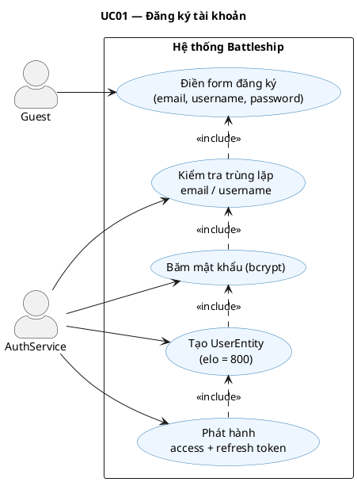

---

### UC02 — Đăng nhập

| Thuộc tính               | Mô tả                                                                                                                                                                                          |
| ------------------------ | ---------------------------------------------------------------------------------------------------------------------------------------------------------------------------------------------- |
| **Mã UC**                | UC02                                                                                                                                                                                           |
| **Tên**                  | Đăng nhập                                                                                                                                                                                      |
| **Actor chính**          | Guest / Registered User                                                                                                                                                                        |
| **Actor phụ**            | —                                                                                                                                                                                              |
| **Mô tả**                | Người dùng nhập email và mật khẩu để xác thực danh tính. Hệ thống trả về JWT access token (ngắn hạn) và đặt refresh token trong HTTP-only cookie.                                              |
| **Điều kiện tiên quyết** | Tài khoản đã tồn tại trong hệ thống.                                                                                                                                                           |
| **Điều kiện hậu quyết**  | Phiên làm việc được khởi tạo. Client lưu access token; cookie lưu refresh token.                                                                                                               |
| **Luồng chính**          | 1. Nhập email + password → 2. Tìm user theo email → 3. So sánh bcrypt → 4. Ký JWT access + refresh → 5. Lưu hash refresh vào DB → 6. Set cookie HTTP-only → 7. Trả về `{ accessToken, user }`. |
| **Ngoại lệ**             | Email không tồn tại hoặc mật khẩu sai: `INVALID_CREDENTIALS`.                                                                                                                                  |

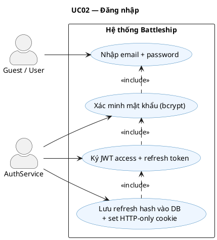

---

### UC03 — Làm mới token (Token Refresh)

| Thuộc tính               | Mô tả                                                                                                                                                                                           |
| ------------------------ | ----------------------------------------------------------------------------------------------------------------------------------------------------------------------------------------------- |
| **Mã UC**                | UC03                                                                                                                                                                                            |
| **Tên**                  | Làm mới token                                                                                                                                                                                   |
| **Actor chính**          | Client App (axios interceptor)                                                                                                                                                                  |
| **Actor phụ**            | —                                                                                                                                                                                               |
| **Mô tả**                | Khi access token hết hạn, client tự động gửi yêu cầu làm mới. Hệ thống xác minh refresh token trong cookie, xoay vòng sang token mới (rotate) và vô hiệu token cũ để phòng chống replay attack. |
| **Điều kiện tiên quyết** | Refresh token hợp lệ tồn tại trong cookie. Chưa vượt quá `refreshTokenAbsoluteExpiry`.                                                                                                          |
| **Điều kiện hậu quyết**  | Access token mới được phát hành. Refresh token cũ bị vô hiệu; token mới được lưu vào DB.                                                                                                        |
| **Luồng chính**          | 1. Interceptor bắt lỗi 401 → 2. Gọi `POST /api/auth/refresh` → 3. Đọc cookie → 4. Xác minh + kiểm tra hết hạn → 5. Phát hành cặp token mới → 6. Retry request gốc.                              |
| **Ngoại lệ**             | Refresh token hết hạn tuyệt đối hoặc không hợp lệ → force logout (`UC05`).                                                                                                                      |

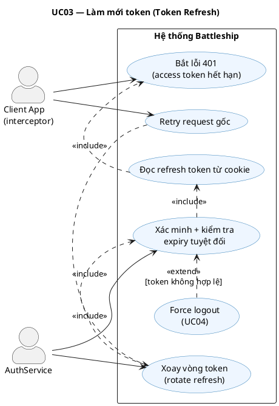

---

### UC04 — Đăng xuất

| Thuộc tính               | Mô tả                                                                                                                                                           |
| ------------------------ | --------------------------------------------------------------------------------------------------------------------------------------------------------------- |
| **Mã UC**                | UC04                                                                                                                                                            |
| **Tên**                  | Đăng xuất                                                                                                                                                       |
| **Actor chính**          | Registered User                                                                                                                                                 |
| **Actor phụ**            | —                                                                                                                                                               |
| **Mô tả**                | Người dùng chủ động kết thúc phiên làm việc. Hệ thống vô hiệu refresh token phía server và xóa cookie phía client.                                              |
| **Điều kiện tiên quyết** | Người dùng đang đăng nhập.                                                                                                                                      |
| **Điều kiện hậu quyết**  | `refreshTokenHash = null` trong DB. Cookie bị xóa. Access token còn hiệu lực đến khi hết hạn tự nhiên (stateless).                                              |
| **Luồng chính**          | 1. Nhấn Đăng xuất → 2. Gọi `POST /api/auth/logout` → 3. Đọc cookie → 4. Set `refreshTokenHash = null` → 5. Xóa cookie → 6. Client xóa access token khỏi memory. |
| **Ngoại lệ**             | Không có refresh token trong cookie: hệ thống vẫn xóa cookie và trả về 200.                                                                                     |

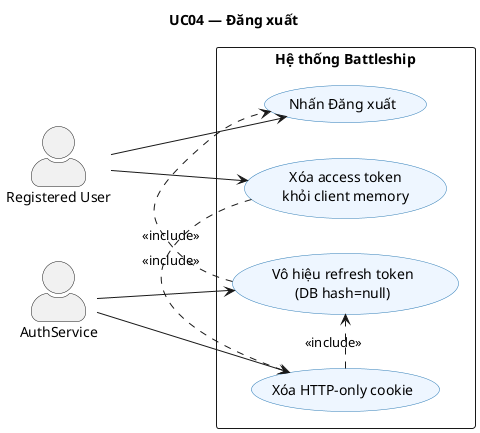

---

### UC05 — Đổi mật khẩu

| Thuộc tính               | Mô tả                                                                                                                      |
| ------------------------ | -------------------------------------------------------------------------------------------------------------------------- |
| **Mã UC**                | UC05                                                                                                                       |
| **Tên**                  | Đổi mật khẩu                                                                                                               |
| **Actor chính**          | Registered User                                                                                                            |
| **Actor phụ**            | —                                                                                                                          |
| **Mô tả**                | Người dùng nhập mật khẩu hiện tại để xác minh danh tính trước khi đặt mật khẩu mới. Mật khẩu mới được băm lại bằng bcrypt. |
| **Điều kiện tiên quyết** | Người dùng đã đăng nhập.                                                                                                   |
| **Điều kiện hậu quyết**  | `passwordHash` được cập nhật trong DB. Tất cả phiên cũ nên được vô hiệu (tuỳ cấu hình).                                    |
| **Luồng chính**          | 1. Nhập mật khẩu cũ + mới → 2. Xác minh mật khẩu cũ với bcrypt → 3. Băm mật khẩu mới → 4. Lưu vào DB.                      |
| **Ngoại lệ**             | Mật khẩu hiện tại sai: `INVALID_CURRENT_PASSWORD`. Mật khẩu mới quá ngắn: lỗi validation DTO.                              |

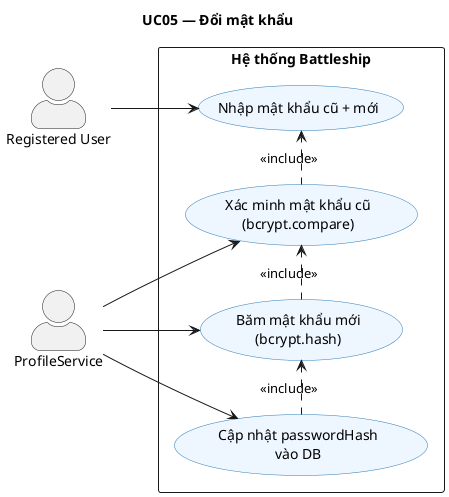

---

### UC06 — Cập nhật hồ sơ

| Thuộc tính               | Mô tả                                                                                                                                                                               |
| ------------------------ | ----------------------------------------------------------------------------------------------------------------------------------------------------------------------------------- |
| **Mã UC**                | UC06                                                                                                                                                                                |
| **Tên**                  | Cập nhật hồ sơ cá nhân                                                                                                                                                              |
| **Actor chính**          | Registered User                                                                                                                                                                     |
| **Actor phụ**            | —                                                                                                                                                                                   |
| **Mô tả**                | Người dùng chỉnh sửa thông tin cá nhân: username, chữ ký (signature) và ảnh đại diện (avatar). Upload avatar dưới dạng multipart/form-data; file được lưu trong thư mục `/uploads`. |
| **Điều kiện tiên quyết** | Người dùng đã đăng nhập (`JwtAuthGuard`).                                                                                                                                           |
| **Điều kiện hậu quyết**  | `UserEntity` được cập nhật. Avatar cũ bị thay thế bởi đường dẫn file mới.                                                                                                           |
| **Luồng chính**          | 1. Mở modal hồ sơ → 2. Chỉnh sửa các trường → 3. Gọi `PATCH /api/users/me` → 4. Validate → 5. Lưu DB → 6. Trả về thông tin mới.                                                     |
| **Ngoại lệ**             | Username mới đã tồn tại: `USERNAME_ALREADY_EXISTS`. File quá lớn hoặc sai định dạng: lỗi upload.                                                                                    |

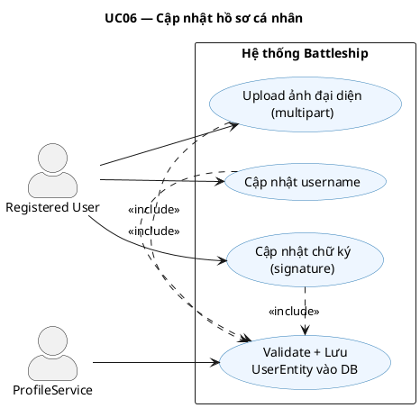

---

### UC07 — Tạo phòng

| Thuộc tính               | Mô tả                                                                                                                                                                      |
| ------------------------ | -------------------------------------------------------------------------------------------------------------------------------------------------------------------------- |
| **Mã UC**                | UC07                                                                                                                                                                       |
| **Tên**                  | Tạo phòng chơi                                                                                                                                                             |
| **Actor chính**          | Registered User (Owner)                                                                                                                                                    |
| **Actor phụ**            | —                                                                                                                                                                          |
| **Mô tả**                | Người chơi tạo một phòng chơi mới với tuỳ chọn công khai (public) hoặc riêng tư (private). Hệ thống sinh mã phòng 6 ký tự ngẫu nhiên duy nhất.                             |
| **Điều kiện tiên quyết** | Người dùng đã đăng nhập và không đang ở trong một phòng khác đang hoạt động.                                                                                               |
| **Điều kiện hậu quyết**  | `RoomEntity` mới được tạo với `status = 'waiting'`, `ownerId = userId`. Client tham gia room channel qua Socket.IO.                                                        |
| **Luồng chính**          | 1. Nhấn Tạo phòng → 2. Gửi `room:create` qua WebSocket → 3. Sinh mã phòng duy nhất → 4. Lưu `RoomEntity` → 5. Client `join('room:roomId')` → 6. Phát `server:roomUpdated`. |
| **Ngoại lệ**             | Người dùng đang ở phòng khác: `USER_ALREADY_IN_ACTIVE_ROOM` (trả về roomId và code của phòng cũ).                                                                          |

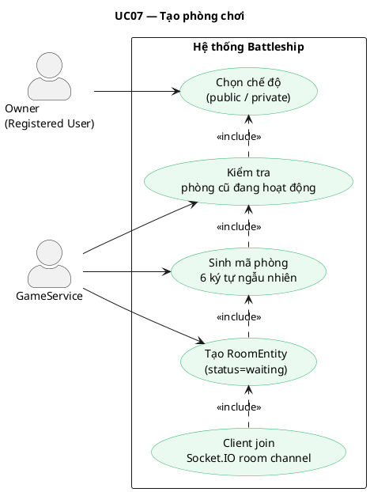

---

### UC08 — Tham gia phòng

| Thuộc tính               | Mô tả                                                                                                                                                |
| ------------------------ | ---------------------------------------------------------------------------------------------------------------------------------------------------- |
| **Mã UC**                | UC08                                                                                                                                                 |
| **Tên**                  | Tham gia phòng chơi                                                                                                                                  |
| **Actor chính**          | Registered User (Guest)                                                                                                                              |
| **Actor phụ**            | —                                                                                                                                                    |
| **Mô tả**                | Người chơi tham gia phòng đang chờ bằng ID phòng hoặc mã code 6 ký tự. Một phòng tối đa 2 người chơi.                                                |
| **Điều kiện tiên quyết** | Phòng tồn tại và có `status = 'waiting'`. Phòng chưa có Guest (slot còn trống).                                                                      |
| **Điều kiện hậu quyết**  | `RoomEntity.guestId = userId`. Cả hai người chơi nhận `server:roomUpdated`.                                                                          |
| **Luồng chính**          | 1. Nhập mã phòng hoặc chọn từ danh sách → 2. Gửi `room:join` → 3. Kiểm tra slot → 4. Cập nhật `guestId` → 5. Phát `server:roomUpdated` đến cả phòng. |
| **Ngoại lệ**             | Phòng đầy: `ROOM_FULL`. Phòng không tồn tại hoặc đã đóng: `ROOM_NOT_FOUND`.                                                                          |

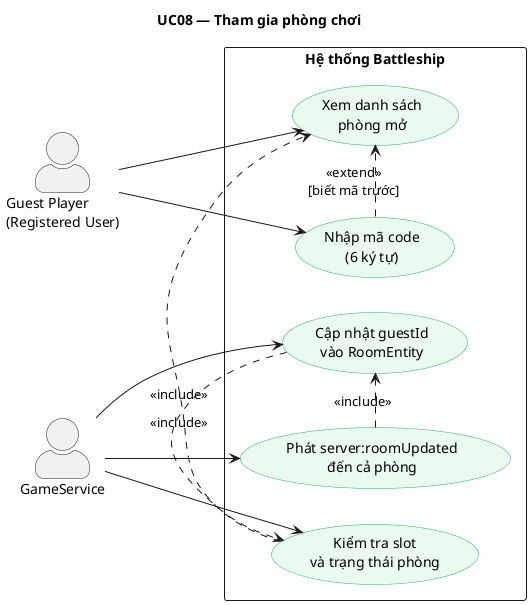

---

### UC09 — Xếp tàu & Bắt đầu trận

| Thuộc tính               | Mô tả                                                                                                                                                                                                                 |
| ------------------------ | --------------------------------------------------------------------------------------------------------------------------------------------------------------------------------------------------------------------- |
| **Mã UC**                | UC09                                                                                                                                                                                                                  |
| **Tên**                  | Xếp tàu và Bắt đầu trận đấu                                                                                                                                                                                           |
| **Actor chính**          | Registered User (cả Owner và Guest)                                                                                                                                                                                   |
| **Actor phụ**            | Hệ thống (Timer)                                                                                                                                                                                                      |
| **Mô tả**                | Sau khi phòng đủ 2 người, chủ phòng cấu hình bảng rồi khởi động giai đoạn xếp tàu. Mỗi người chơi bố trí hạm đội trong thời hạn quy định, sau đó xác nhận sẵn sàng. Khi cả hai sẵn sàng, trận đấu chính thức bắt đầu. |
| **Điều kiện tiên quyết** | `RoomEntity.status = 'waiting'`, đủ 2 người chơi.                                                                                                                                                                     |
| **Điều kiện hậu quyết**  | `MatchEntity` mới với `status = 'in_progress'`. Placements của cả hai đã lưu. `turnPlayerId` được thiết lập.                                                                                                          |
| **Luồng chính**          | 1. Owner gửi `room:configureSetup` → 2. Tạo `MatchEntity` (status=setup) → 3. Mỗi người xếp tàu → 4. Gửi `room:ready` kèm placements → 5. Cả hai ready → 6. `status = 'in_progress'` → 7. Phát `server:matchUpdated`. |
| **Ngoại lệ**             | Hết giờ xếp tàu (`setupDeadlineAt`): người chưa xong thua. Tàu đặt chồng nhau / ra ngoài bảng: `BadRequestException`.                                                                                                 |

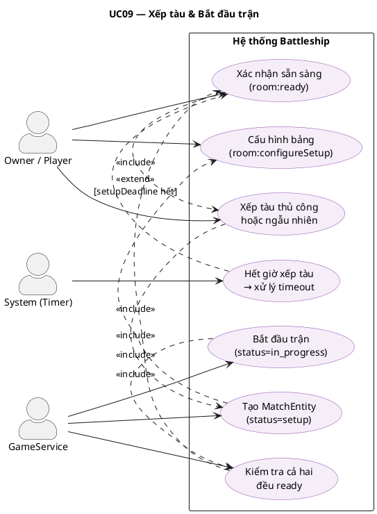

---

### UC10 — Thực hiện nước đi (Bắn)

| Thuộc tính               | Mô tả                                                                                                                                                                                                        |
| ------------------------ | ------------------------------------------------------------------------------------------------------------------------------------------------------------------------------------------------------------ |
| **Mã UC**                | UC10                                                                                                                                                                                                         |
| **Tên**                  | Thực hiện nước đi — Bắn vào tọa độ                                                                                                                                                                           |
| **Actor chính**          | Registered User (người đến lượt)                                                                                                                                                                             |
| **Actor phụ**            | Hệ thống (Timer), EloMatchService                                                                                                                                                                            |
| **Mô tả**                | Người chơi đến lượt chọn ô tọa độ `(x, y)` trên bảng đối thủ để bắn. Hệ thống xác định kết quả, cập nhật trạng thái, chuyển lượt (hoặc kết thúc trận nếu thắng) và phát sóng ngay đến tất cả.                |
| **Điều kiện tiên quyết** | `match.status = 'in_progress'`. `match.turnPlayerId = userId`. Tọa độ `(x, y)` hợp lệ và chưa bị bắn.                                                                                                        |
| **Điều kiện hậu quyết**  | `MoveEntity` được lưu. `playerShots[]` được cập nhật. Lượt chuyển hoặc trận kết thúc.                                                                                                                        |
| **Luồng chính**          | 1. Chọn ô → 2. Gửi `match:move` → 3. Validate lượt + tọa độ → 4. Xác định kết quả → 5. Lưu `MoveEntity` → 6. Kiểm tra thắng → 7a. Chuyển lượt / 7b. Kết thúc + cập nhật Elo → 8. Phát `server:matchUpdated`. |
| **Ngoại lệ**             | Sai lượt: `NOT_YOUR_TURN`. Ô đã bắn: `CELL_ALREADY_SHOT`. Hết giờ lượt: tự động chuyển lượt.                                                                                                                 |

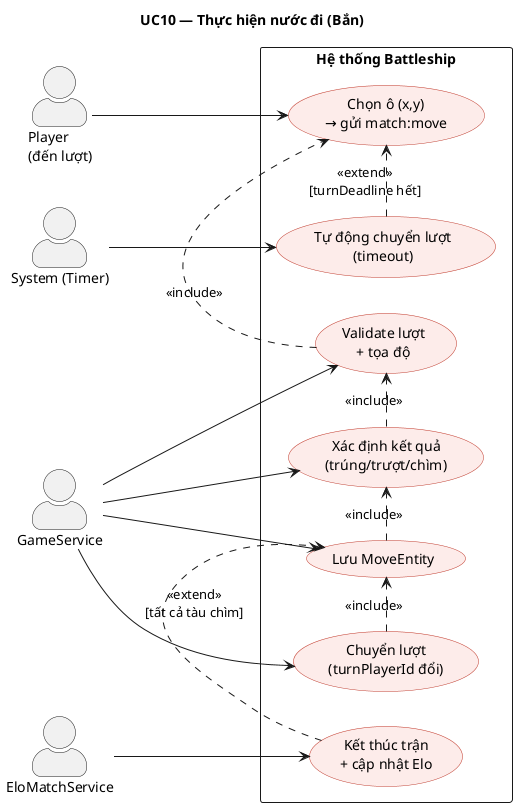

---

### UC11 — Đầu hàng (Forfeit)

| Thuộc tính               | Mô tả                                                                                                                                                                           |
| ------------------------ | ------------------------------------------------------------------------------------------------------------------------------------------------------------------------------- |
| **Mã UC**                | UC11                                                                                                                                                                            |
| **Tên**                  | Đầu hàng                                                                                                                                                                        |
| **Actor chính**          | Registered User                                                                                                                                                                 |
| **Actor phụ**            | EloMatchService                                                                                                                                                                 |
| **Mô tả**                | Người chơi chủ động kết thúc trận bằng cách đầu hàng. Đối thủ được tuyên bố thắng. Elo vẫn được cập nhật như trận thua thông thường.                                            |
| **Điều kiện tiên quyết** | `match.status = 'in_progress'`.                                                                                                                                                 |
| **Điều kiện hậu quyết**  | `match.status = 'finished'`. `match.winnerId = đối thủ`. Elo được cập nhật.                                                                                                     |
| **Luồng chính**          | 1. Nhấn Đầu hàng → 2. Gửi `match:forfeit` → 3. Set `winnerId = đối thủ` → 4. `status = 'finished'` → 5. Gọi `EloMatchService.settleMatchElo()` → 6. Phát `server:matchUpdated`. |
| **Ngoại lệ**             | Trận đã kết thúc: bỏ qua.                                                                                                                                                       |

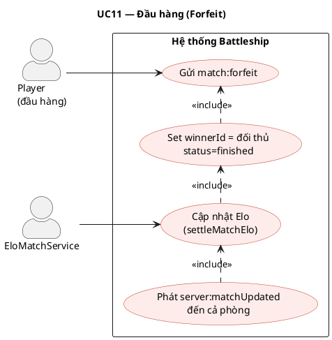

---

### UC12 — Tái đấu (Rematch)

| Thuộc tính               | Mô tả                                                                                                                                                                         |
| ------------------------ | ----------------------------------------------------------------------------------------------------------------------------------------------------------------------------- |
| **Mã UC**                | UC12                                                                                                                                                                          |
| **Tên**                  | Bỏ phiếu tái đấu (Rematch Vote)                                                                                                                                               |
| **Actor chính**          | Registered User (cả hai)                                                                                                                                                      |
| **Actor phụ**            | —                                                                                                                                                                             |
| **Mô tả**                | Sau khi trận kết thúc, mỗi người chơi có thể bỏ phiếu đồng ý hoặc từ chối tái đấu. Nếu cả hai đồng ý, một trận mới được khởi tạo ngay trong cùng phòng.                       |
| **Điều kiện tiên quyết** | `match.status = 'finished'`.                                                                                                                                                  |
| **Điều kiện hậu quyết**  | Nếu cả hai đồng ý: `MatchEntity` mới được tạo. Nếu có người từ chối: phòng đóng.                                                                                              |
| **Luồng chính**          | 1. Gửi `match:rematchVote { accept: true/false }` → 2. Ghi nhận vote → 3a. Cả hai đồng ý → tạo Match mới → 3b. Có người từ chối → đóng phòng → 4. Phát `server:matchUpdated`. |
| **Ngoại lệ**             | Người chơi rời phòng trước khi vote: coi như từ chối.                                                                                                                         |

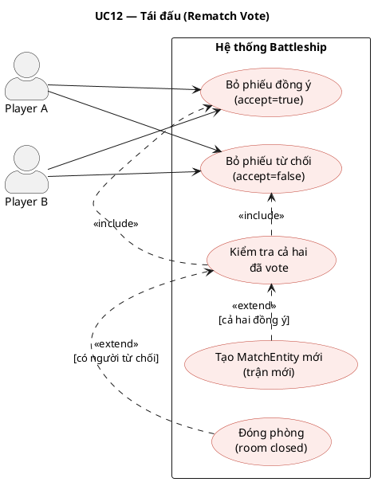

---

### UC13 — Kết nối lại (Reconnect)

| Thuộc tính               | Mô tả                                                                                                                                                                                    |
| ------------------------ | ---------------------------------------------------------------------------------------------------------------------------------------------------------------------------------------- |
| **Mã UC**                | UC13                                                                                                                                                                                     |
| **Tên**                  | Kết nối lại sau khi mất kết nối                                                                                                                                                          |
| **Actor chính**          | Registered User                                                                                                                                                                          |
| **Actor phụ**            | —                                                                                                                                                                                        |
| **Mô tả**                | Khi người chơi mất kết nối mạng trong lúc đang thi đấu, họ có thể kết nối lại và tiếp tục trận đấu. Trận vẫn tiếp tục chạy phía server trong thời gian ngắt kết nối.                     |
| **Điều kiện tiên quyết** | Phòng và trận vẫn đang tồn tại (chưa kết thúc hoặc hết hạn).                                                                                                                             |
| **Điều kiện hậu quyết**  | Client nhận snapshot đầy đủ trạng thái hiện tại của phòng và trận.                                                                                                                       |
| **Luồng chính**          | 1. Client kết nối lại WebSocket → 2. Gửi `match:reconnect { roomId, matchId }` → 3. Server trả về `RoomSnapshot + MatchSnapshot` → 4. Client `join('room:roomId')` → 5. UI được đồng bộ. |
| **Ngoại lệ**             | Trận đã kết thúc trong lúc ngắt kết nối: nhận snapshot `finished`. Phòng đã đóng: `ROOM_NOT_FOUND`.                                                                                      |

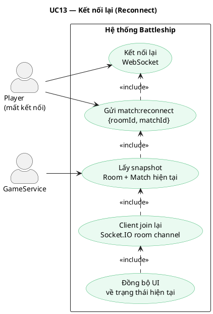

---

### UC14 — Xem trận đấu (Spectate)

| Thuộc tính               | Mô tả                                                                                                                                                                                            |
| ------------------------ | ------------------------------------------------------------------------------------------------------------------------------------------------------------------------------------------------ |
| **Mã UC**                | UC14                                                                                                                                                                                             |
| **Tên**                  | Xem trận đấu với tư cách khán giả                                                                                                                                                                |
| **Actor chính**          | Spectator (Registered User)                                                                                                                                                                      |
| **Actor phụ**            | —                                                                                                                                                                                                |
| **Mô tả**                | Người dùng đã đăng nhập tham gia xem trận đấu đang diễn ra theo thời gian thực. Thông tin vị trí tàu của cả hai người chơi bị ẩn hoàn toàn; khán giả chỉ thấy kết quả các lần bắn.               |
| **Điều kiện tiên quyết** | Phòng có trận đang diễn ra (`status = 'in_game'`). Người xem đã đăng nhập.                                                                                                                       |
| **Điều kiện hậu quyết**  | Client `join('room:roomId:spectators')`. Nhận `MatchSnapshot` với dữ liệu ẩn tàu.                                                                                                                |
| **Luồng chính**          | 1. Vào `/game/spectate/:roomId` → 2. Gửi `match:spectateJoin` → 3. Server trả `SpectatorMatchSnapshot` → 4. Client join spectator channel → 5. Nhận cập nhật realtime qua `server:matchUpdated`. |
| **Ngoại lệ**             | Phòng không tồn tại hoặc chưa bắt đầu trận: `ROOM_NOT_FOUND`.                                                                                                                                    |

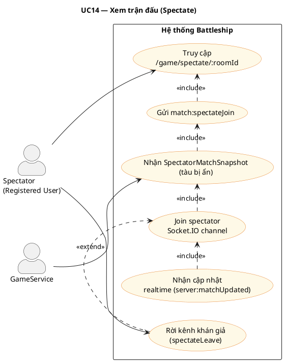

---

### UC15 — Chat kênh khán giả

| Thuộc tính               | Mô tả                                                                                                                                                                            |
| ------------------------ | -------------------------------------------------------------------------------------------------------------------------------------------------------------------------------- |
| **Mã UC**                | UC15                                                                                                                                                                             |
| **Tên**                  | Chat trong kênh khán giả                                                                                                                                                         |
| **Actor chính**          | Spectator                                                                                                                                                                        |
| **Actor phụ**            | ChatService (Redis)                                                                                                                                                              |
| **Mô tả**                | Khán giả sử dụng kênh chat riêng, tách biệt hoàn toàn với chat của người trong phòng. Lịch sử tin nhắn được lưu trong Redis với TTL và giới hạn số lượng.                        |
| **Điều kiện tiên quyết** | Người dùng đã tham gia spectator channel.                                                                                                                                        |
| **Điều kiện hậu quyết**  | Tin nhắn được phát đến tất cả khán giả đang online trong cùng phòng.                                                                                                             |
| **Luồng chính**          | 1. Nhập tin nhắn → 2. Gửi `spectator:sendMessage` → 3. `ChatService.sendSpectatorMessage()` → 4. Lưu Redis → 5. Phát `server:spectatorChatMessage` đến `room:roomId:spectators`. |
| **Ngoại lệ**             | Nội dung rỗng hoặc quá dài: lỗi validation.                                                                                                                                      |

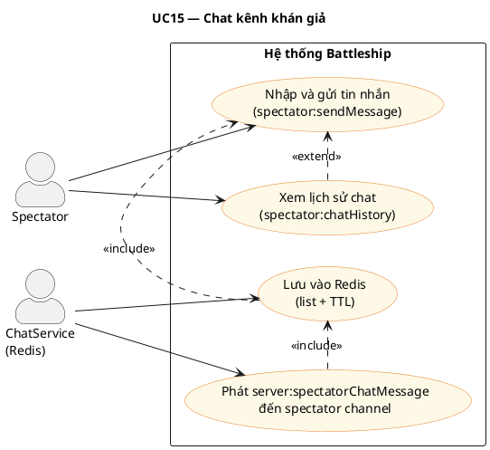

---

### UC16 — Xem bảng xếp hạng Elo

| Thuộc tính               | Mô tả                                                                                                                               |
| ------------------------ | ----------------------------------------------------------------------------------------------------------------------------------- |
| **Mã UC**                | UC16                                                                                                                                |
| **Tên**                  | Xem bảng xếp hạng Elo                                                                                                               |
| **Actor chính**          | Guest / Registered User                                                                                                             |
| **Actor phụ**            | —                                                                                                                                   |
| **Mô tả**                | Bất kỳ ai cũng có thể xem danh sách top người chơi được sắp xếp giảm dần theo điểm Elo. Endpoint công khai, không yêu cầu xác thực. |
| **Điều kiện tiên quyết** | — (không yêu cầu đăng nhập)                                                                                                         |
| **Điều kiện hậu quyết**  | Trả về danh sách người chơi với `username`, `avatar`, `elo` theo thứ tự.                                                            |
| **Luồng chính**          | 1. Vào `/leaderboard` → 2. Gọi `GET /api/leaderboard?limit=N` → 3. Query DB sắp xếp theo `elo DESC` → 4. Trả về danh sách.          |
| **Ngoại lệ**             | Không có dữ liệu: trả về mảng rỗng.                                                                                                 |

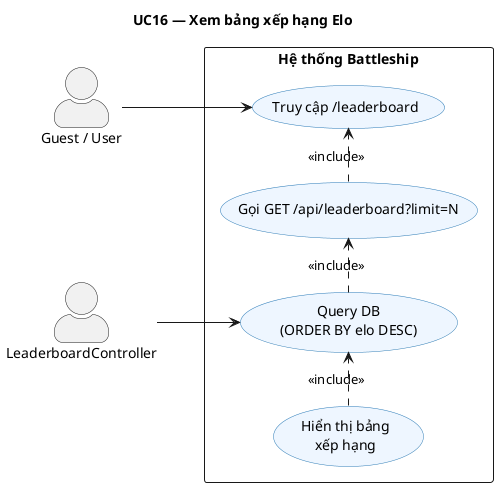

---

### UC17 — Xem lịch sử trận đấu

| Thuộc tính               | Mô tả                                                                                                                                                                          |
| ------------------------ | ------------------------------------------------------------------------------------------------------------------------------------------------------------------------------ |
| **Mã UC**                | UC17                                                                                                                                                                           |
| **Tên**                  | Xem lịch sử trận đấu cá nhân                                                                                                                                                   |
| **Actor chính**          | Registered User                                                                                                                                                                |
| **Actor phụ**            | —                                                                                                                                                                              |
| **Mô tả**                | Người chơi xem lại danh sách các trận đấu đã tham gia với thống kê chi tiết: số lần bắn, tỉ lệ chính xác, kết quả thắng/thua, thay đổi Elo.                                    |
| **Điều kiện tiên quyết** | Người dùng đã đăng nhập.                                                                                                                                                       |
| **Điều kiện hậu quyết**  | Danh sách trận được trả về, phân trang theo `limit`.                                                                                                                           |
| **Luồng chính**          | 1. Mở modal lịch sử → 2. Gọi `GET /api/game/matches/history?limit=N` → 3. Query các `MatchEntity` có `player1Id` hoặc `player2Id = userId` → 4. Tính toán stats → 5. Hiển thị. |
| **Ngoại lệ**             | Chưa có trận nào: trả về mảng rỗng.                                                                                                                                            |

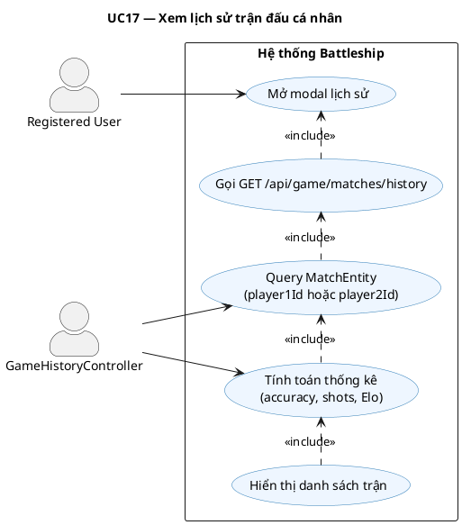

---

### UC18 — Đăng bài & Bình luận diễn đàn

| Thuộc tính               | Mô tả                                                                                                                                                                                                           |
| ------------------------ | --------------------------------------------------------------------------------------------------------------------------------------------------------------------------------------------------------------- |
| **Mã UC**                | UC18                                                                                                                                                                                                            |
| **Tên**                  | Đăng bài viết và bình luận trên diễn đàn                                                                                                                                                                        |
| **Actor chính**          | Registered User                                                                                                                                                                                                 |
| **Actor phụ**            | —                                                                                                                                                                                                               |
| **Mô tả**                | Người dùng tạo bài viết mới với tiêu đề và nội dung, hoặc bình luận dưới bài viết có sẵn. Nội dung được sanitize trước khi lưu để phòng chống XSS. Tác giả có thể chỉnh sửa và xóa (archive) nội dung của mình. |
| **Điều kiện tiên quyết** | Người dùng đã đăng nhập (`JwtAuthGuard`).                                                                                                                                                                       |
| **Điều kiện hậu quyết**  | `ForumPostEntity` hoặc `ForumCommentEntity` mới với `status = 'published'`.                                                                                                                                     |
| **Luồng chính**          | 1. Điền form → 2. Gọi `POST /api/forum/posts` → 3. Sanitize nội dung → 4. Lưu DB → 5. Trả về `ForumPostDto` → 6. Render bài mới.                                                                                |
| **Ngoại lệ**             | Nội dung rỗng: lỗi validation. Sửa/xóa bài của người khác: `ForbiddenException`. Bình luận vào bài đã archive: `BadRequestException`.                                                                           |

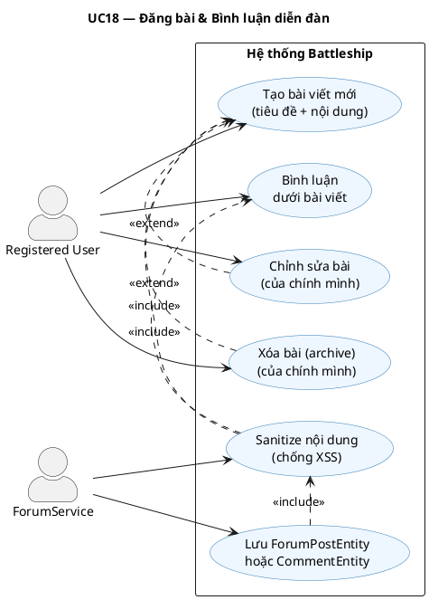

---

### UC19 — Bình chọn (Vote)

| Thuộc tính               | Mô tả                                                                                                                                                                          |
| ------------------------ | ------------------------------------------------------------------------------------------------------------------------------------------------------------------------------ |
| **Mã UC**                | UC19                                                                                                                                                                           |
| **Tên**                  | Bình chọn bài viết / bình luận                                                                                                                                                 |
| **Actor chính**          | Registered User                                                                                                                                                                |
| **Actor phụ**            | —                                                                                                                                                                              |
| **Mô tả**                | Người dùng upvote (+1) hoặc downvote (-1) bài viết hoặc bình luận. Bình chọn lại cùng chiều sẽ hủy vote. Bình chọn ngược chiều sẽ đổi giá trị. `voteScore` được cập nhật ngay. |
| **Điều kiện tiên quyết** | Người dùng đã đăng nhập. Bài viết / bình luận tồn tại và `status = 'published'`.                                                                                               |
| **Điều kiện hậu quyết**  | `ForumPostVoteEntity` hoặc `ForumCommentVoteEntity` được upsert. `voteScore` của bài/bình luận được cập nhật.                                                                  |
| **Luồng chính**          | 1. Nhấn nút vote → 2. Gọi `POST /api/forum/posts/:id/vote { value: 1 \| -1 }` → 3. Upsert vote record → 4. Tính lại `voteScore` → 5. Trả về score mới.                         |
| **Ngoại lệ**             | Bài không tồn tại: `NotFoundException`. Vote trùng giá trị: hủy vote (trả về 0).                                                                                               |

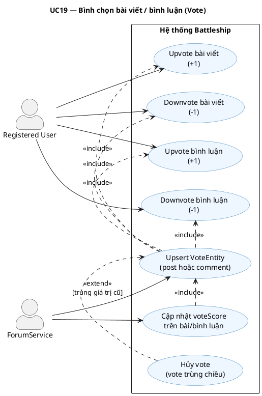

---

### UC20 — Chơi với Bot (Offline)

| Thuộc tính               | Mô tả                                                                                                                                                                                                    |
| ------------------------ | -------------------------------------------------------------------------------------------------------------------------------------------------------------------------------------------------------- |
| **Mã UC**                | UC20                                                                                                                                                                                                     |
| **Tên**                  | Chơi với Bot (Offline Mode)                                                                                                                                                                              |
| **Actor chính**          | Registered User                                                                                                                                                                                          |
| **Actor phụ**            | Bot AI (client-side)                                                                                                                                                                                     |
| **Mô tả**                | Người chơi thi đấu với Bot AI ngay trên trình duyệt mà không cần kết nối server game. Bot có hai mức độ: Easy (bắn ngẫu nhiên) và Hard (thuật toán Hunt & Target). Kết quả không ảnh hưởng đến điểm Elo. |
| **Điều kiện tiên quyết** | Người dùng đã đăng nhập (để vào trang game). Không cần kết nối WebSocket game.                                                                                                                           |
| **Điều kiện hậu quyết**  | Trận offline kết thúc. Elo không thay đổi. Không có dữ liệu lưu server.                                                                                                                                  |
| **Luồng chính**          | 1. Chọn "Chơi với Bot" → 2. Chọn mức độ → 3. Xếp tàu (bot-setup) → 4. Lần lượt bắn → 5. Bot tự tính nước đáp → 6. Kết thúc → 7. Chọn chơi lại hoặc thoát.                                                |
| **Ngoại lệ**             | — (toàn bộ xử lý phía client, không có lỗi server).                                                                                                                                                      |

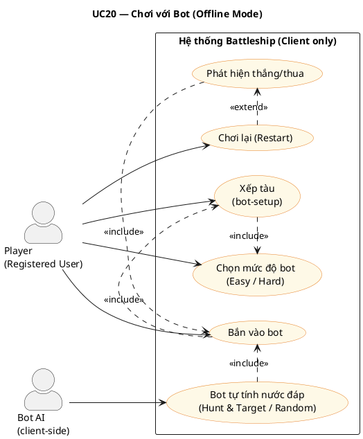

---

## 1. Tổng quan toàn hệ thống

> Biểu đồ tổng hợp toàn bộ nhóm chức năng của nền tảng, phân theo ba actor chính. Đây là biểu đồ nên trình bày đầu tiên trong báo cáo.

```plantuml
@startuml UC-00-TongQuan
title Biểu đồ Use Case Tổng quan — Hệ thống Battleship Online

skinparam actorStyle awesome
skinparam usecaseBorderColor #2C7BB6
skinparam usecaseBackgroundColor #EEF6FF
skinparam rectangleBorderColor #666
skinparam ArrowColor #444
skinparam defaultFontName Arial

left to right direction

actor "Khách vãng lai\n(Guest)" as Guest
actor "Người chơi\n(Registered User)" as User
actor "Khán giả\n(Spectator)" as Spectator
actor "Hệ thống\n(System)" as System

rectangle "Hệ thống Battleship Online" {

    package "Xác thực" {
        usecase "Đăng ký tài khoản"       as UC01
        usecase "Đăng nhập"               as UC02
        usecase "Đăng xuất"               as UC04
        usecase "Làm mới token"           as UC03
    }

    package "Hồ sơ & Cài đặt" {
        usecase "Cập nhật hồ sơ"          as UC06
        usecase "Đổi mật khẩu"            as UC05
        usecase "Cài đặt giao diện/âm thanh" as UC_SET
    }

    package "Phòng chơi" {
        usecase "Tạo phòng"               as UC07
        usecase "Tham gia phòng"          as UC08
        usecase "Xem danh sách phòng"     as UC_LIST
        usecase "Rời phòng"               as UC_LEAVE
    }

    package "Trận đấu Online" {
        usecase "Xếp tàu & Bắt đầu"      as UC09
        usecase "Thực hiện nước đi (Bắn)" as UC10
        usecase "Đầu hàng"               as UC11
        usecase "Tái đấu (Rematch)"       as UC12
        usecase "Kết nối lại"            as UC13
    }

    package "Khán giả" {
        usecase "Xem trận đấu trực tiếp"  as UC14
        usecase "Chat kênh khán giả"      as UC15
    }

    package "Xếp hạng & Cộng đồng" {
        usecase "Xem bảng xếp hạng Elo"  as UC16
        usecase "Xem lịch sử trận"       as UC17
        usecase "Đăng bài diễn đàn"      as UC18
        usecase "Bình luận & Bình chọn"  as UC19
    }

    package "Bot (Offline)" {
        usecase "Chơi với Bot"            as UC20
    }

    ' Quan hệ include/extend
    UC03 .> UC02  : <<extend>>
    UC09 .> UC07  : <<include>>
    UC10 .> UC09  : <<include>>
    UC11 .> UC10  : <<extend>>
    UC12 .> UC10  : <<extend>>
    UC19 .> UC18  : <<include>>
}

' Guest
Guest --> UC01
Guest --> UC02
Guest --> UC16

' Registered User
User --> UC02
User --> UC03
User --> UC04
User --> UC05
User --> UC06
User --> UC_SET
User --> UC07
User --> UC08
User --> UC_LIST
User --> UC_LEAVE
User --> UC09
User --> UC10
User --> UC11
User --> UC12
User --> UC13
User --> UC16
User --> UC17
User --> UC18
User --> UC19
User --> UC20

' Spectator
Spectator --> UC14
Spectator --> UC15

' System
System --> UC03
System --> UC10 : tự động chuyển lượt
System --> UC09 : hết giờ xếp tàu
System --> UC16 : cập nhật Elo sau trận

@enduml
```

---

## 2. Trận đấu Online (Match Lifecycle)

> **Use Case cốt lõi nhất** của hệ thống — mô tả toàn bộ luồng tương tác của hai người chơi trong một ván đấu PvP theo thời gian thực.

```plantuml
@startuml UC-07-OnlineMatch
title Biểu đồ Use Case — Trận đấu Online (Match Lifecycle)

skinparam actorStyle awesome
skinparam usecaseBorderColor #C0392B
skinparam usecaseBackgroundColor #FDECEA
skinparam rectangleBorderColor #888
skinparam ArrowColor #444
skinparam defaultFontName Arial

left to right direction

actor "Player A"        as PA
actor "Player B"        as PB
actor "Hệ thống (Timer)" as SYS

rectangle "Online Match System" {

    usecase "Thực hiện nước đi\n(Bắn vào tọa độ)"  as UC1
    usecase "Nhận kết quả bắn\n(trúng / trượt / chìm)" as UC1b
    usecase "Đầu hàng (Forfeit)"                    as UC2
    usecase "Kết nối lại\n(Reconnect)"              as UC3
    usecase "Bình chọn tái đấu\n(Rematch Vote)"     as UC4
    usecase "Tự động chuyển lượt\n(Timeout)"        as UC5
    usecase "Xác định thắng / thua"                 as UC6
    usecase "Cập nhật điểm Elo"                     as UC7

    ' Quan hệ
    UC1b .> UC1  : <<include>>
    UC5  .> UC1  : <<extend>>
    UC6  .> UC1  : <<include>>
    UC7  .> UC6  : <<include>>
    UC4  .> UC6  : <<extend>>
}

PA  --> UC1
PB  --> UC1
PA  --> UC2
PB  --> UC2
PA  --> UC3
PB  --> UC3
PA  --> UC4
PB  --> UC4
SYS --> UC5
SYS --> UC6
SYS --> UC7

@enduml
```

**Quan hệ chính:**

- `Nhận kết quả` `<<include>>` `Thực hiện nước đi` — mỗi lần bắn đều trả về kết quả tức thì.
- `Tự động chuyển lượt` `<<extend>>` `Nước đi` — xảy ra khi hết `turnDeadlineAt`.
- `Xác định thắng/thua` `<<include>>` `Nước đi` — hệ thống kiểm tra sau mỗi nước bắn.
- `Cập nhật Elo` `<<include>>` `Xác định thắng/thua` — bắt buộc ngay sau khi trận kết thúc.

---

## 3. Quản lý Phòng Chơi (Room Lifecycle)

> Mô tả luồng tương tác giữa chủ phòng (Owner) và người vào phòng (Guest) để thiết lập một trận đấu.

```plantuml
@startuml UC-06-RoomLifecycle
title Biểu đồ Use Case — Quản lý Phòng Chơi (Room Lifecycle)

skinparam actorStyle awesome
skinparam usecaseBorderColor #27AE60
skinparam usecaseBackgroundColor #EAFAF1
skinparam rectangleBorderColor #888
skinparam ArrowColor #444
skinparam defaultFontName Arial

left to right direction

actor "Chủ phòng (Owner)"   as Owner
actor "Người vào (Guest)"   as GuestP
actor "Hệ thống (Timer)"    as SYS

rectangle "Online Room System" {

    usecase "Tạo phòng\n(public / private)"    as UC1
    usecase "Xem danh sách phòng mở"           as UC2
    usecase "Tham gia phòng\n(ID hoặc code)"   as UC3
    usecase "Đánh dấu sẵn sàng\n(Mark Ready)"  as UC4
    usecase "Bắt đầu trận\n(Start Room)"       as UC5
    usecase "Đóng phòng\n(Close Room)"         as UC6
    usecase "Phòng tự động hết hạn"            as UC7
    usecase "Chat trong phòng"                 as UC8
    usecase "Kết nối lại vào phòng"            as UC9

    ' Quan hệ
    UC3 .> UC2   : <<include>>
    UC5 .> UC4   : <<include>>
    UC7 .> UC6   : <<extend>>
    UC8 .> UC3   : <<extend>>
}

Owner  --> UC1
Owner  --> UC4
Owner  --> UC5
Owner  --> UC6
Owner  --> UC8
Owner  --> UC9

GuestP --> UC2
GuestP --> UC3
GuestP --> UC4
GuestP --> UC8
GuestP --> UC9

SYS    --> UC7

@enduml
```

**Quan hệ chính:**

- `Tham gia phòng` `<<include>>` `Xem danh sách` — người chơi phải xem/tìm phòng trước khi tham gia.
- `Bắt đầu trận` `<<include>>` `Đánh dấu sẵn sàng` — phải có ít nhất một bên ready trước khi Owner start.
- `Phòng hết hạn` `<<extend>>` `Đóng phòng` — kích hoạt khi `expiresAt` đến hạn.

---

## 4. Xếp tàu & Cấu hình (Setup & Placement)

> Mô tả giai đoạn bố trí hạm đội trước mỗi trận — từ lúc Owner cấu hình bảng đến khi cả hai xác nhận sẵn sàng.

```plantuml
@startuml UC-04-GameSetup
title Biểu đồ Use Case — Xếp tàu & Cấu hình (Setup & Placement)

skinparam actorStyle awesome
skinparam usecaseBorderColor #8E44AD
skinparam usecaseBackgroundColor #F5EEF8
skinparam rectangleBorderColor #888
skinparam ArrowColor #444
skinparam defaultFontName Arial

left to right direction

actor "Chủ phòng (Owner)"  as Owner
actor "Người chơi (Player)" as Player
actor "Hệ thống (Timer)"   as SYS

rectangle "Game Setup & Placement System" {

    usecase "Cấu hình bảng\n(kích thước, số tàu, timer)"   as UC1
    usecase "Chọn preset bảng mặc định"                     as UC1b
    usecase "Xếp tàu thủ công\n(kéo thả)"                  as UC2
    usecase "Xếp tàu ngẫu nhiên\n(auto-random)"            as UC3
    usecase "Xoay tàu\n(ngang / dọc)"                      as UC4
    usecase "Đặt lại toàn bộ\n(Reset board)"               as UC5
    usecase "Xác nhận sẵn sàng\n(room:ready)"              as UC6
    usecase "Hết thời gian xếp tàu\n(Setup Timeout)"       as UC7

    ' Quan hệ
    UC1b .> UC1 : <<extend>>
    UC2  .> UC6 : <<include>>
    UC3  .> UC6 : <<include>>
    UC4  .> UC2 : <<include>>
    UC5  .> UC2 : <<extend>>
    UC7  .> UC6 : <<extend>>
}

Owner  --> UC1
Owner  --> UC1b
Owner  --> UC2
Owner  --> UC3
Owner  --> UC4
Owner  --> UC5
Owner  --> UC6

Player --> UC2
Player --> UC3
Player --> UC4
Player --> UC5
Player --> UC6

SYS    --> UC7

@enduml
```

**Quan hệ chính:**

- `Xếp tàu thủ công / ngẫu nhiên` đều `<<include>>` `Xác nhận sẵn sàng` — sau khi xếp xong thì gửi ready.
- `Xoay tàu` `<<include>>` `Xếp thủ công` — thao tác xoay là một phần của quá trình đặt tay.
- `Hết giờ` `<<extend>>` `Xác nhận sẵn sàng` — nếu chưa ready, hệ thống tự xử lý khi hết `setupDeadlineAt`.

---

## 5. Xác thực & Phiên đăng nhập (Auth & Session)

```plantuml
@startuml UC-01-Auth
title Biểu đồ Use Case — Xác thực & Phiên đăng nhập

skinparam actorStyle awesome
skinparam usecaseBorderColor #2C7BB6
skinparam usecaseBackgroundColor #EEF6FF
skinparam rectangleBorderColor #888
skinparam ArrowColor #444
skinparam defaultFontName Arial

left to right direction

actor "Khách vãng lai (Guest)"      as Guest
actor "Người dùng đã đăng ký"      as User
actor "Client App\n(interceptor)"   as Client

rectangle "Auth & Session System" {

    usecase "Đăng ký tài khoản\n(email + username + password)" as UC1
    usecase "Đăng nhập\n(trả về access token + refresh cookie)" as UC2
    usecase "Đăng xuất\n(revoke refresh token)"                 as UC3
    usecase "Làm mới token\n(rotate refresh token)"             as UC4
    usecase "Ép đăng xuất\n(khi refresh token lỗi)"            as UC5

    ' Quan hệ
    UC4 .> UC2  : <<extend>>
    UC5 .> UC4  : <<extend>>
}

Guest  --> UC1
Guest  --> UC2
User   --> UC2
User   --> UC3
Client --> UC4
Client --> UC5

@enduml
```

---

## 6. Hồ sơ cá nhân (Profile)

```plantuml
@startuml UC-02-Profile
title Biểu đồ Use Case — Quản lý Hồ sơ Cá nhân

skinparam actorStyle awesome
skinparam usecaseBorderColor #1ABC9C
skinparam usecaseBackgroundColor #E8F8F5
skinparam rectangleBorderColor #888
skinparam ArrowColor #444
skinparam defaultFontName Arial

left to right direction

actor "Người dùng đã đăng nhập" as User
actor "Người dùng khác / Guest" as Viewer

rectangle "Profile System" {

    usecase "Xem hồ sơ công khai\n(theo userId)"    as UC1
    usecase "Cập nhật username"                     as UC2
    usecase "Cập nhật chữ ký (signature)"           as UC3
    usecase "Upload ảnh đại diện (avatar)"          as UC4
    usecase "Đổi mật khẩu\n(xác minh mật khẩu cũ)" as UC5
    usecase "Xem lịch sử trận đấu cá nhân"         as UC6

    ' Quan hệ
    UC2 .> UC1 : <<extend>>
    UC3 .> UC1 : <<extend>>
    UC4 .> UC1 : <<extend>>
}

User   --> UC1
User   --> UC2
User   --> UC3
User   --> UC4
User   --> UC5
User   --> UC6

Viewer --> UC1

@enduml
```

---

## 7. Chơi với Bot (Bot Gameplay)

```plantuml
@startuml UC-05-BotGameplay
title Biểu đồ Use Case — Chơi với Bot (Offline Mode)

skinparam actorStyle awesome
skinparam usecaseBorderColor #E67E22
skinparam usecaseBackgroundColor #FEF9E7
skinparam rectangleBorderColor #888
skinparam ArrowColor #444
skinparam defaultFontName Arial

left to right direction

actor "Người chơi" as Player
actor "Bot AI"     as Bot

rectangle "Bot Gameplay System" {

    usecase "Chọn mức độ bot\n(Easy / Hard)"       as UC1
    usecase "Bắt đầu trận offline"                 as UC2
    usecase "Xếp tàu (bot-setup)"                  as UC3
    usecase "Thực hiện nước bắn\nvào bot"          as UC4
    usecase "Bot tự động bắn lại"                  as UC5
    usecase "Xem trạng thái hạm đội"              as UC6
    usecase "Xem log các lần bắn"                  as UC7
    usecase "Chơi lại (Restart)"                   as UC8

    ' Quan hệ
    UC2 .> UC1  : <<include>>
    UC3 .> UC2  : <<include>>
    UC4 .> UC3  : <<include>>
    UC5 .> UC4  : <<include>>
    UC6 .> UC4  : <<extend>>
    UC7 .> UC4  : <<extend>>
    UC8 .> UC2  : <<extend>>
}

Player --> UC1
Player --> UC2
Player --> UC3
Player --> UC4
Player --> UC6
Player --> UC7
Player --> UC8

Bot    --> UC5

@enduml
```

**Ghi chú:** Trận bot không ảnh hưởng đến điểm Elo. Bot AI tự động tính toán nước bắn theo thuật toán (Easy: ngẫu nhiên; Hard: hunt & target).

---

## 8. Cài đặt Hệ thống (Settings)

```plantuml
@startuml UC-03-Settings
title Biểu đồ Use Case — Cài đặt Hệ thống (Settings)

skinparam actorStyle awesome
skinparam usecaseBorderColor #95A5A6
skinparam usecaseBackgroundColor #F2F3F4
skinparam rectangleBorderColor #888
skinparam ArrowColor #444
skinparam defaultFontName Arial

left to right direction

actor "Người chơi" as Player

rectangle "Settings System (Client-side)" {

    usecase "Đổi ngôn ngữ\n(i18n)"                 as UC1
    usecase "Chuyển chủ đề\n(Sáng / Tối)"          as UC2
    usecase "Điều chỉnh âm lượng\nnhạc nền"        as UC3
    usecase "Điều chỉnh âm lượng\nhiệu ứng (SFX)"  as UC4
    usecase "Tắt tiếng từng kênh\n(Mute)"          as UC5
    usecase "Lưu cấu hình\n(localStorage)"         as UC6

    ' Quan hệ
    UC1 .> UC6 : <<include>>
    UC2 .> UC6 : <<include>>
    UC3 .> UC6 : <<include>>
    UC4 .> UC6 : <<include>>
    UC5 .> UC4 : <<extend>>
}

Player --> UC1
Player --> UC2
Player --> UC3
Player --> UC4
Player --> UC5

@enduml
```

**Ghi chú:** Toàn bộ Settings được lưu phía client (localStorage), không đồng bộ server. Thay đổi áp dụng ngay lập tức mà không cần reload trang.

---

## Phần II — Biểu đồ trạng thái (State) theo use case

> **Mục đích:** mô hình hóa vòng đời / luồng trạng thái cho từng UC — phục vụ **đặc tả hành vi** trước khi cài đặt. Mỗi UC một sơ đồ (nhúng ngay dưới đây).
>
> **Công cụ vẽ:** [PlantUML state](https://plantuml.com/state-diagram).

Mỗi **UC** có **một** biểu đồ trạng thái (luồng chính + nhánh lỗi/ngoại lệ theo mô tả Phần I). **Cài đặt (mục 8)** nằm ngoài UC01–UC20; cuối Phần II có **thêm một sơ đồ state cho Settings** (ST-Settings).

### Bảng tra cứu: UC ↔ sơ đồ state

| UC | Tên | Ký hiệu trong báo cáo |
| --- | --- | --- |
| UC01 | Đăng ký tài khoản | ST-UC01 |
| UC02 | Đăng nhập | ST-UC02 |
| UC03 | Làm mới token (Token Refresh) | ST-UC03 |
| UC04 | Đăng xuất | ST-UC04 |
| UC05 | Đổi mật khẩu | ST-UC05 |
| UC06 | Cập nhật hồ sơ | ST-UC06 |
| UC07 | Tạo phòng | ST-UC07 |
| UC08 | Tham gia phòng | ST-UC08 |
| UC09 | Xếp tàu & bắt đầu trận | ST-UC09 |
| UC10 | Thực hiện nước đi (bắn) | ST-UC10 |
| UC11 | Đầu hàng (Forfeit) | ST-UC11 |
| UC12 | Tái đấu (Rematch) | ST-UC12 |
| UC13 | Kết nối lại (Reconnect) | ST-UC13 |
| UC14 | Xem trận đấu (Spectate) | ST-UC14 |
| UC15 | Chat kênh khán giả | ST-UC15 |
| UC16 | Xem bảng xếp hạng Elo | ST-UC16 |
| UC17 | Xem lịch sử trận đấu | ST-UC17 |
| UC18 | Đăng bài & bình luận diễn đàn | ST-UC18 |
| UC19 | Bình chọn (Vote) | ST-UC19 |
| UC20 | Chơi với Bot (Offline) | ST-UC20 |
| Settings (mục 8) | Cài đặt client | ST-Settings |

### State machine — UC01 — Đăng ký tài khoản

```plantuml
@startuml State_UC01
title UC01 — State machine: Đăng ký tài khoản

skinparam state {
  BackgroundColor #EEF6FF
  BorderColor #2C7BB6
  FontName Arial
  FontSize 11
}
skinparam ArrowColor #444
skinparam noteBackgroundColor #FFFFEE

[*] --> DienForm : Mở form đăng ký

state DienForm : Nhập email, username, password

DienForm --> KiemTraTrungLap : Submit

KiemTraTrungLap --> DienForm : EMAIL_ALREADY_EXISTS\n/ USERNAME_ALREADY_EXISTS

KiemTraTrungLap --> BamMatKhau : Email & username hợp lệ

state BamMatKhau : bcrypt.hash(password)

BamMatKhau --> LuuUser : Hash xong

state LuuUser : UserEntity\nelo = 800

LuuUser --> PhatHanhToken : INSERT DB thành công

state PhatHanhToken : access + refresh\n(JWT + cookie)

PhatHanhToken --> DaDangNhapThanhCong : Phát hành xong

DaDangNhapThanhCong --> [*] : Redirect trang chủ

note right of KiemTraTrungLap
  Luồng chính spec diagram.md
end note

@enduml
```

### State machine — UC02 — Đăng nhập

```plantuml
@startuml State_UC02
title UC02 — State machine: Đăng nhập

skinparam state {
  BackgroundColor #EEF6FF
  BorderColor #2C7BB6
  FontName Arial
  FontSize 11
}
skinparam ArrowColor #444
skinparam noteBackgroundColor #FFFFEE

[*] --> NhapCredential : Mở form đăng nhập

state NhapCredential : email + password

NhapCredential --> TimUserTheoEmail : Submit

TimUserTheoEmail --> NhapCredential : INVALID_CREDENTIALS\n(user không tồn tại)

TimUserTheoEmail --> SoSanhBcrypt : User tồn tại

SoSanhBcrypt --> NhapCredential : INVALID_CREDENTIALS\n(mật khẩu sai)

SoSanhBcrypt --> KyJWT : bcrypt.compare OK

state KyJWT : Ký access + refresh

KyJWT --> LuuRefreshHash : JWT đã ký

state LuuRefreshHash : Lưu hash refresh\nvào DB

LuuRefreshHash --> SetCookie : UPDATE OK

state SetCookie : HTTP-only cookie

SetCookie --> PhienHoatDong : Trả accessToken + user

PhienHoatDong --> [*]

@enduml
```

### State machine — UC03 — Làm mới token (Token Refresh)

```plantuml
@startuml State_UC03
title UC03 — State machine: Làm mới token (interceptor + AuthService)

skinparam state {
  BackgroundColor #EEF6FF
  BorderColor #2C7BB6
  FontName Arial
  FontSize 11
}
skinparam ArrowColor #444
skinparam noteBackgroundColor #FFFFEE

[*] --> ChoRequestGoc : Đang gọi API\nvới access token

ChoRequestGoc --> BatLoi401 : HTTP 401\n(access hết hạn)

BatLoi401 --> GoiRefresh : POST /api/auth/refresh

GoiRefresh --> DocCookie : Đọc cookie

DocCookie --> XacMinhRefresh : Có / không cookie

XacMinhRefresh --> BuocPhaiDangXuat : Token invalid /\nhết hạn tuyệt đối /\nreplay

BuocPhaiDangXuat --> [*] : Force logout\n(UC04)

XacMinhRefresh --> XoayVongToken : Xác minh OK

state XoayVongToken : Rotate refresh

XoayVongToken --> RetryRequest : Access mới +\ncập nhật cookie

RetryRequest --> ChoRequestGoc : Gọi lại request gốc

note right of BuocPhaiDangXuat
  Spec diagram.md:
  refresh thất bại
end note

@enduml
```

### State machine — UC04 — Đăng xuất

```plantuml
@startuml State_UC04
title UC04 — State machine: Đăng xuất

skinparam state {
  BackgroundColor #EEF6FF
  BorderColor #2C7BB6
  FontName Arial
  FontSize 11
}
skinparam ArrowColor #444
skinparam noteBackgroundColor #FFFFEE

[*] --> DaDangNhap : Đang có phiên

state DaDangNhap : Access + refresh cookie

DaDangNhap --> NhanLogout : Nhấn Đăng xuất

NhanLogout --> GoiAPI : POST /api/auth/logout

GoiAPI --> DocCookie : Server nhận request

DocCookie --> VoHieuRefresh : refreshTokenHash := null\n(kể cả không có cookie)

VoHieuRefresh --> XoaCookie : Xóa HTTP-only cookie

XoaCookie --> XoaAccessClient : Client xóa access\nkhỏi memory

XoaAccessClient --> Khach : Phiên kết thúc

Khach --> [*]

note right of VoHieuRefresh
  Ngoại lệ: không có refresh
  vẫn 200 + xóa cookie
end note

@enduml
```

### State machine — UC05 — Đổi mật khẩu

```plantuml
@startuml State_UC05
title UC05 — State machine: Đổi mật khẩu

skinparam state {
  BackgroundColor #E8F4FC
  BorderColor #2C7BB6
  FontName Arial
  FontSize 11
}
skinparam ArrowColor #444
skinparam noteBackgroundColor #FFFFEE

[*] --> FormDoiMK : Mở form\nMK cũ + MK mới

FormDoiMK --> ValidateDTO : Submit

ValidateDTO --> FormDoiMK : MK mới quá ngắn\n(validation client/DTO)

ValidateDTO --> XacMinhCu : DTO hợp lệ

XacMinhCu --> FormDoiMK : INVALID_CURRENT_PASSWORD

XacMinhCu --> BamMKMoi : bcrypt.compare OK

state BamMKMoi : bcrypt.hash(MK mới)

BamMKMoi --> CapNhatDB : Hash xong

CapNhatDB --> ThanhCong : passwordHash\nđã UPDATE

ThanhCong --> [*] : (Tuỳ policy:\nvô hiệu phiên khác)

@enduml
```

### State machine — UC06 — Cập nhật hồ sơ

```plantuml
@startuml State_UC06
title UC06 — State machine: Cập nhật hồ sơ cá nhân

skinparam state {
  BackgroundColor #E8F4FC
  BorderColor #2C7BB6
  FontName Arial
  FontSize 11
}
skinparam ArrowColor #444
skinparam noteBackgroundColor #FFFFEE

[*] --> ModalDong : Ngoài modal

ModalDong --> ChinhSua : Mở modal hồ sơ

state ChinhSua : Sửa username /\nsignature /\navatar

ChinhSua --> DangGui : PATCH /api/users/me

state DangGui : Đang xử lý

DangGui --> ChinhSua : USERNAME_ALREADY_EXISTS\n/ lỗi upload file

DangGui --> HienThiMoi : UserEntity đã cập nhật

HienThiMoi --> ChinhSua : Tiếp tục sửa

HienThiMoi --> ModalDong : Đóng modal

ModalDong --> [*]

@enduml
```

### State machine — UC07 — Tạo phòng

```plantuml
@startuml State_UC07
title UC07 — State machine: Tạo phòng chơi

skinparam state {
  BackgroundColor #EAFAF1
  BorderColor #27AE60
  FontName Arial
  FontSize 11
}
skinparam ArrowColor #444
skinparam noteBackgroundColor #FFFFEE

[*] --> ChonCheDo : Nhấn Tạo phòng

ChonCheDo --> KiemTraPhongCu : public / private

KiemTraPhongCu --> BaoLoiPhongCu : USER_ALREADY_IN_ACTIVE_ROOM

BaoLoiPhongCu --> [*] : Hiện roomId cũ\n(ngoại lệ)

KiemTraPhongCu --> SinhMa : Không còn phòng active

state SinhMa : Mã 6 ký tự\nduy nhất

SinhMa --> LuuRoom : INSERT RoomEntity\nstatus = waiting

LuuRoom --> JoinSocket : room:create OK

JoinSocket --> ChoDoiKhach : join room:roomId +\nserver:roomUpdated

ChoDoiKhach --> [*] : Chờ UC08

@enduml
```

### State machine — UC08 — Tham gia phòng

```plantuml
@startuml State_UC08
title UC08 — State machine: Tham gia phòng chơi

skinparam state {
  BackgroundColor #EAFAF1
  BorderColor #27AE60
  FontName Arial
  FontSize 11
}
skinparam ArrowColor #444
skinparam noteBackgroundColor #FFFFEE

[*] --> TimPhong : Danh sách /\nnhập mã 6 ký tự

TimPhong --> GuiJoin : room:join

GuiJoin --> KiemTraSlot : Server nhận

KiemTraSlot --> TimPhong : ROOM_FULL /\nROOM_NOT_FOUND

KiemTraSlot --> GanGuest : Slot OK,\nstatus = waiting

state GanGuest : guestId := userId

GanGuest --> PhatCapNhat : UPDATE RoomEntity

PhatCapNhat --> TrongPhong : server:roomUpdated\ncả phòng

TrongPhong --> [*] : Chờ UC09

@enduml
```

### State machine — UC09 — Xếp tàu & bắt đầu trận

```plantuml
@startuml State_UC09
title UC09 — State machine: Xếp tàu & bắt đầu trận

skinparam state {
  BackgroundColor #F5EEF8
  BorderColor #8E44AD
  FontName Arial
  FontSize 11
}
skinparam ArrowColor #444
skinparam noteBackgroundColor #FFFFEE

[*] --> PhongDoiHaiNguoi : Đủ Owner + Guest\nstatus waiting

PhongDoiHaiNguoi --> CauHinhBang : Owner:\nroom:configureSetup

CauHinhBang --> MatchSetup : Tạo MatchEntity\nstatus = setup

state MatchSetup : Mỗi player\nxếp tàu + random

MatchSetup --> ChoReady : Gửi room:ready\nkèm placement

ChoReady --> MatchSetup : BadRequest\n(chồng tàu / ngoài bảng)

ChoReady --> HetGioXepTau : setupDeadlineAt\n(Timer)

HetGioXepTau --> KetThucSom : Người chưa xong\nthua (spec)

KetThucSom --> [*]

ChoReady --> CaHaiReady : Cả hai ready hợp lệ

CaHaiReady --> TranDangChay : status = in_progress\n+ server:matchUpdated

TranDangChay --> [*] : Sang UC10

@enduml
```

### State machine — UC10 — Thực hiện nước đi (bắn)

```plantuml
@startuml State_UC10
title UC10 — State machine: Thực hiện nước đi (bắn)

skinparam state {
  BackgroundColor #FDECEA
  BorderColor #C0392B
  FontName Arial
  FontSize 11
}
skinparam ArrowColor #444
skinparam noteBackgroundColor #FFFFEE

[*] --> TrongTran : match.in_progress

state TrongTran : turnPlayerId\nluân phiên

TrongTran --> ChonO : Đến lượt user

ChonO --> Validate : match:move (x,y)

Validate --> ChonO : NOT_YOUR_TURN /\nCELL_ALREADY_SHOT

Validate --> TinhKetQua : Hợp lệ

state TinhKetQua : trúng / trượt / chìm

TinhKetQua --> LuuMove : Lưu MoveEntity

LuuMove --> KiemTraThang : Cập nhật shots

KiemTraThang --> TrongTran : Chưa thắng\n→ đổi lượt

KiemTraThang --> KetThucThang : Tất cả tàu đối thủ chìm\n+ Elo (online)

TrongTran --> TuDongDoiLuot : turnDeadline\nhết hạn

TuDongDoiLuot --> TrongTran : Đổi lượt tự động

KetThucThang --> [*]

@enduml
```

### State machine — UC11 — Đầu hàng (Forfeit)

```plantuml
@startuml State_UC11
title UC11 — State machine: Đầu hàng (forfeit)

skinparam state {
  BackgroundColor #FDECEA
  BorderColor #C0392B
  FontName Arial
  FontSize 11
}
skinparam ArrowColor #444
skinparam noteBackgroundColor #FFFFEE

[*] --> DangDau : in_progress

DangDau --> NhanForfeit : match:forfeit

NhanForfeit --> BoQua : Đã finished\n(trận kết thúc rồi)

BoQua --> [*]

NhanForfeit --> SetWinner : winnerId := đối thủ

SetWinner --> Finished : status = finished

Finished --> SettleElo : settleMatchElo()

SettleElo --> PhatSuKien : server:matchUpdated

PhatSuKien --> [*]

@enduml
```

### State machine — UC12 — Tái đấu (Rematch)

```plantuml
@startuml State_UC12
title UC12 — State machine: Tái đấu (rematch vote)

skinparam state {
  BackgroundColor #FDECEA
  BorderColor #C0392B
  FontName Arial
  FontSize 11
}
skinparam ArrowColor #444
skinparam noteBackgroundColor #FFFFEE

[*] --> TranKetThuc : match.finished

TranKetThuc --> ChoPhieu : rematchVote\naccept true/false

state ChoPhieu : Ghi nhận từng\nplayer

ChoPhieu --> TuChoi : Một người false\n/ rời phòng

TuChoi --> DongPhong : Đóng phòng

DongPhong --> [*]

ChoPhieu --> CaHaiDongY : Cả hai true

CaHaiDongY --> TaoMatchMoi : MatchEntity mới\ntrong cùng room

TaoMatchMoi --> [*] : Sang UC09\n(setup lại)

@enduml
```

### State machine — UC13 — Kết nối lại (Reconnect)

```plantuml
@startuml State_UC13
title UC13 — State machine: Kết nối lại (reconnect)

skinparam state {
  BackgroundColor #EAFAF1
  BorderColor #27AE60
  FontName Arial
  FontSize 11
}
skinparam ArrowColor #444
skinparam noteBackgroundColor #FFFFEE

[*] --> MatKetNoi : WebSocket drop /\nreload

MatKetNoi --> KetNoiLaiWS : Client mở lại

KetNoiLaiWS --> GuiReconnect : match:reconnect\n{ roomId, matchId }

GuiReconnect --> LaySnapshot : Server hợp lệ

LaySnapshot --> JoinLaiPhong : RoomSnapshot +\nMatchSnapshot

JoinLaiPhong --> DongBoUI : join room:roomId

DongBoUI --> DangChoiTiep : UI đồng bộ\n(in_progress hoặc finished)

GuiReconnect --> LoiPhong : ROOM_NOT_FOUND /\ntrận đã hủy

LoiPhong --> [*]

DangChoiTiep --> [*]

note bottom of DangChoiTiep
  Server **không** thêm state mới:
  trận vẫn chạy trên server
end note

@enduml
```

### State machine — UC14 — Xem trận đấu (Spectate)

```plantuml
@startuml State_UC14
title UC14 — State machine: Xem trận đấu (spectate)

skinparam state {
  BackgroundColor #FEF9E7
  BorderColor #E67E22
  FontName Arial
  FontSize 11
}
skinparam ArrowColor #444
skinparam noteBackgroundColor #FFFFEE

[*] --> ChuaVao : Đã đăng nhập

ChuaVao --> TruyCapURL : /game/spectate/:roomId

TruyCapURL --> GuiSpectateJoin : match:spectateJoin

GuiSpectateJoin --> LoiPhong : ROOM_NOT_FOUND /\nchưa in_game

LoiPhong --> [*]

GuiSpectateJoin --> NhanSnapshot : SpectatorMatchSnapshot\n(tàu ẩn)

NhanSnapshot --> JoinKenh : room:...:spectators

JoinKenh --> DangXem : server:matchUpdated\nrealtime

DangXem --> RoiKenh : spectateLeave /\nđóng tab

RoiKenh --> [*]

@enduml
```

### State machine — UC15 — Chat kênh khán giả

```plantuml
@startuml State_UC15
title UC15 — State machine: Chat kênh khán giả

skinparam state {
  BackgroundColor #FEF9E7
  BorderColor #E67E22
  FontName Arial
  FontSize 11
}
skinparam ArrowColor #444
skinparam noteBackgroundColor #FFFFEE

[*] --> TrongKenh : Đã join\nspectator channel

TrongKenh --> NhapTin : Gõ nội dung

NhapTin --> Validate : spectator:sendMessage

Validate --> NhapTin : Rỗng / quá dài

Validate --> LuuRedis : ChatService\nlist + TTL

LuuRedis --> PhatBroadcast : server:spectatorChatMessage

PhatBroadcast --> TrongKenh : Mọi spectator\nnhận tin

TrongKenh --> XemHistory : spectator:chatHistory\n(optional)

XemHistory --> TrongKenh

TrongKenh --> [*] : Rời kênh UC14

@enduml
```

### State machine — UC16 — Xem bảng xếp hạng Elo

```plantuml
@startuml State_UC16
title UC16 — State machine: Xem bảng xếp hạng Elo

skinparam state {
  BackgroundColor #EEF6FF
  BorderColor #2C7BB6
  FontName Arial
  FontSize 11
}
skinparam ArrowColor #444
skinparam noteBackgroundColor #FFFFEE

[*] --> TrangLeaderboard : Vào /leaderboard

TrangLeaderboard --> DangTai : GET /api/leaderboard?limit=N

state DangTai : Đang query

DangTai --> LoiMang : Lỗi mạng /\n5xx (ngoài spec,\nUI xử lý)

LoiMang --> TrangLeaderboard : Retry

DangTai --> CoDuLieu : 200 + JSON

CoDuLieu --> HienThiBang : ORDER BY elo DESC

state HienThiBang : Render danh sách\n(username, avatar, elo)

HienThiBang --> TrangLeaderboard : Đổi limit /\nrefresh

HienThiBang --> [*] : Rời trang

note right of CoDuLieu
  Mảng rỗng: vẫn state\nHiển thị bảng (empty)
end note

@enduml
```

### State machine — UC17 — Xem lịch sử trận đấu

```plantuml
@startuml State_UC17
title UC17 — State machine: Xem lịch sử trận đấu cá nhân

skinparam state {
  BackgroundColor #EEF6FF
  BorderColor #2C7BB6
  FontName Arial
  FontSize 11
}
skinparam ArrowColor #444
skinparam noteBackgroundColor #FFFFEE

[*] --> DongModal : Ngoài modal

DongModal --> MoModal : Mở lịch sử

MoModal --> DangTai : GET .../matches/history?limit=N

DangTai --> Loi : JWT / lỗi server

Loi --> MoModal : Thử lại

DangTai --> TinhStats : Query MatchEntity\nplayer1Id | player2Id

TinhStats --> HienThi : accuracy, shots,\nElo delta, kết quả

state HienThi : Danh sách + phân trang

HienThi --> MoModal : Load thêm / filter

HienThi --> DongModal : Đóng

DongModal --> [*]

note right of TinhStats
  Mảng rỗng: hiển thị\n"chưa có trận"
end note

@enduml
```

### State machine — UC18 — Đăng bài & bình luận diễn đàn

```plantuml
@startuml State_UC18
title UC18 — State machine: Đăng bài & bình luận diễn đàn

skinparam state {
  BackgroundColor #F4ECF7
  BorderColor #7D3C98
  FontName Arial
  FontSize 11
}
skinparam ArrowColor #444
skinparam noteBackgroundColor #FFFFEE

[*] --> ChonHanhDong : Đã đăng nhập

ChonHanhDong --> TaoBaiMoi : Form bài viết

ChonHanhDong --> BinhLuan : Form comment\ntrên bài published

TaoBaiMoi --> Sanitize : POST post

BinhLuan --> Sanitize : POST comment

Sanitize --> TuChoi : Nội dung rỗng /\nXSS fail

TuChoi --> ChonHanhDong

Sanitize --> LuuPublished : status = published

LuuPublished --> HienThi : ForumPostDto /\nCommentDto

HienThi --> SuaBai : Chỉ tác giả

SuaBai --> Sanitize

HienThi --> XoaArchive : Archive (soft delete)

XoaArchive --> DaArchive : status archived

DaArchive --> [*]

HienThi --> ChonHanhDong : Xem tiếp

note right of BinhLuan
  Bài archived:
  BadRequest (spec)
end note

@enduml
```

### State machine — UC19 — Bình chọn (Vote)

```plantuml
@startuml State_UC19
title UC19 — State machine: Bình chọn (vote) post/comment

skinparam state {
  BackgroundColor #F4ECF7
  BorderColor #7D3C98
  FontName Arial
  FontSize 11
}
skinparam ArrowColor #444
skinparam noteBackgroundColor #FFFFEE

[*] --> ChuaVote : User chưa vote\nhoặc đã hủy

state ChuaVote

state DaUpvote : value = +1

state DaDownvote : value = -1

ChuaVote --> DaUpvote : POST +1

ChuaVote --> DaDownvote : POST -1

DaUpvote --> ChuaVote : POST +1 lại\n(hủy vote)

DaDownvote --> ChuaVote : POST -1 lại\n(hủy vote)

DaUpvote --> DaDownvote : POST -1\n(đổi chiều)

DaDownvote --> DaUpvote : POST +1\n(đổi chiều)

ChuaVote --> Loi : NotFound /\nkhông published

Loi --> [*]

note bottom of ChuaVote
  Mỗi lần chuyển: upsert\nVoteEntity + voteScore
end note

@enduml
```

### State machine — UC20 — Chơi với Bot (Offline)

```plantuml
@startuml State_UC20
title UC20 — State machine: Chơi với Bot (offline, client)

skinparam state {
  BackgroundColor #FEF9E7
  BorderColor #E67E22
  FontName Arial
  FontSize 11
}
skinparam ArrowColor #444
skinparam noteBackgroundColor #FFFFEE

[*] --> ChonDo : Easy / Hard

ChonDo --> BatDauTran : Bắt đầu offline

BatDauTran --> XepTau : Bot + người\nđặt tàu

XepTau --> LuotChoi : Cả hai sẵn sàng

state LuotChoi : Người bắn\n→ bot bắn

LuotChoi --> KetThuc : Một bên\nchìm hết tàu

KetThuc --> XemLog : (extend) xem log /\ntrạng thái hạm đội

XemLog --> KetThuc

KetThuc --> ChonDo : Chơi lại (Restart)

KetThuc --> [*] : Thoát chế độ bot

note right of LuotChoi
  Không Elo server —
  logic client
end note

@enduml
```

### State machine bổ sung — Cài đặt (Settings), không đánh số UC

```plantuml
@startuml ST09_SettingsClient
title ST09 — Trạng thái cài đặt giao diện & âm thanh (client)\nTham chiếu: Mục 8 — Cài đặt Hệ thống (localStorage)

skinparam state {
  BackgroundColor #F2F3F4
  BorderColor #95A5A6
  FontName Arial
  FontSize 11
}
skinparam ArrowColor #444
skinparam noteBackgroundColor #FFFFEE

[*] --> DocCauHinh : Mở app / vào màn Settings

state DocCauHinh : Đọc localStorage\n(hoặc giá trị mặc định)

state SanSang : i18n, theme, nhạc nền, SFX\nđang áp dụng trên UI

DocCauHinh --> SanSang : Load xong

SanSang --> SanSang : Đổi ngôn ngữ / chủ đề /\nâm lượng / mute\n→ ghi localStorage tức thì

note right of SanSang
  Không có vòng đời server —
  không đồng bộ API.
  Mọi UC Settings «include» Lưu cấu hình.
end note

@enduml
```

---

## Phần III — Biểu đồ trình tự (Sequence) theo use case

> **Mục đích:** mô tả **trao đổi thông điệp theo thời gian** giữa người dùng, ứng dụng khách, tầng dịch vụ và kho dữ liệu — phù hợp giai đoạn **đặc tả** (mỗi UC một sơ đồ, nhúng dưới đây).
>
> **Công cụ vẽ:** [PlantUML sequence](https://plantuml.com/sequence-diagram).

**Quy ước thiết kế:** giao tiếp **HTTP** (REST) cho đăng ký, đăng nhập, hồ sơ, forum, bảng xếp hạng…; **WebSocket** (ví dụ Socket.IO) cho phòng chơi, trận, khán giả, chat kênh spectator; **bộ nhớ tạm / hàng đợi** (ví dụ Redis) cho lịch sử chat ngắn hạn. **Settings** chỉ xử lý trên **client** (lưu cục bộ).

### Bảng tra cứu: UC ↔ sơ đồ sequence

| UC | Tên | Ký hiệu trong báo cáo |
| --- | --- | --- |
| UC01 | Đăng ký tài khoản | SQ-UC01 |
| UC02 | Đăng nhập | SQ-UC02 |
| UC03 | Làm mới token (Token Refresh) | SQ-UC03 |
| UC04 | Đăng xuất | SQ-UC04 |
| UC05 | Đổi mật khẩu | SQ-UC05 |
| UC06 | Cập nhật hồ sơ | SQ-UC06 |
| UC07 | Tạo phòng | SQ-UC07 |
| UC08 | Tham gia phòng | SQ-UC08 |
| UC09 | Xếp tàu & bắt đầu trận | SQ-UC09 |
| UC10 | Thực hiện nước đi (bắn) | SQ-UC10 |
| UC11 | Đầu hàng (Forfeit) | SQ-UC11 |
| UC12 | Tái đấu (Rematch) | SQ-UC12 |
| UC13 | Kết nối lại (Reconnect) | SQ-UC13 |
| UC14 | Xem trận đấu (Spectate) | SQ-UC14 |
| UC15 | Chat kênh khán giả | SQ-UC15 |
| UC16 | Xem bảng xếp hạng Elo | SQ-UC16 |
| UC17 | Xem lịch sử trận đấu | SQ-UC17 |
| UC18 | Đăng bài & bình luận diễn đàn | SQ-UC18 |
| UC19 | Bình chọn (Vote) | SQ-UC19 |
| UC20 | Chơi với Bot (Offline) | SQ-UC20 |
| Settings (mục 8) | Cài đặt client | SQ-Settings |

### Sequence — UC01 — Đăng ký tài khoản

```plantuml
@startuml seq_uc01
title UC01 — Sequence: Đăng ký tài khoản

autonumber
skinparam sequenceMessageAlign center
skinparam responseMessageBelowArrow true

actor "Người dùng" as U
participant "Client\n(SPA)" as CL
participant "Auth API" as AUTH
database "PostgreSQL" as DB

U -> CL: Điền form + Submit
CL -> AUTH: **POST** /api/auth/register\n{ email, username, password }

AUTH -> DB: Kiểm tra trùng email/username
DB --> AUTH: Kết quả

alt EMAIL_ALREADY_EXISTS
  AUTH --> CL: **409** + mã lỗi
  CL --> U: Thông báo email đã dùng
else USERNAME_ALREADY_EXISTS
  AUTH --> CL: **409** + mã lỗi
  CL --> U: Thông báo username đã dùng
else Thành công
  AUTH -> AUTH: bcrypt.hash(password)
  AUTH -> DB: **INSERT** UserEntity (elo = 800)
  DB --> AUTH: userId
  AUTH -> AUTH: Ký JWT access + refresh
  AUTH -> DB: Lưu refreshTokenHash
  AUTH --> CL: **201** { accessToken, user }\n**Set-Cookie** refresh (HTTP-only)
  CL -> CL: Lưu accessToken (memory)
  CL --> U: Vào trang chủ (đã đăng nhập)
end

@enduml
```

### Sequence — UC02 — Đăng nhập

```plantuml
@startuml seq_uc02
title UC02 — Sequence: Đăng nhập

autonumber
skinparam sequenceMessageAlign center

actor "Người dùng" as U
participant "Client" as CL
participant "Auth API" as AUTH
database "PostgreSQL" as DB

U -> CL: Nhập email + password + Submit
CL -> AUTH: **POST** /api/auth/login\n{ email, password }

AUTH -> DB: Tìm user theo email
DB --> AUTH: UserEntity hoặc null

alt INVALID_CREDENTIALS\n(không có user / sai MK)
  AUTH --> CL: **401** INVALID_CREDENTIALS
  CL --> U: Thông báo sai thông tin
else Thành công
  AUTH -> AUTH: bcrypt.compare(password, hash)
  AUTH -> AUTH: Ký access + refresh JWT
  AUTH -> DB: Cập nhật refreshTokenHash
  AUTH --> CL: **200** { accessToken, user }\n**Set-Cookie** refresh
  CL -> CL: Lưu accessToken
  CL --> U: Vào ứng dụng
end

@enduml
```

### Sequence — UC03 — Làm mới token (Token Refresh)

```plantuml
@startuml seq_uc03
title UC03 — Sequence: Làm mới token (interceptor)

autonumber
skinparam sequenceMessageAlign center

participant "Client" as CL
participant "HTTP API\n(khác)" as API
participant "Auth API" as AUTH
database "PostgreSQL" as DB

CL -> API: Request kèm **Authorization: Bearer** (access)
API --> CL: **401** Unauthorized\n(access hết hạn)

CL -> CL: Interceptor bắt 401
CL -> AUTH: **POST** /api/auth/refresh\n(Cookie: refresh tự gửi)

AUTH -> AUTH: Đọc + xác minh refresh\n+ kiểm tra expiry tuyệt đối

alt Refresh không hợp lệ / hết hạn
  AUTH --> CL: **401** (hoặc 403)
  CL -> CL: Xóa token, force logout (UC04)
else Rotate thành công
  AUTH -> DB: Lưu refresh hash mới,\nvô hiệu cũ
  AUTH --> CL: **200** { accessToken }\n**Set-Cookie** refresh mới
  CL -> CL: Cập nhật access
  CL -> API: **Lặp lại** request gốc\nBearer mới
  API --> CL: **200** + payload
end

@enduml
```

### Sequence — UC04 — Đăng xuất

```plantuml
@startuml seq_uc04
title UC04 — Sequence: Đăng xuất

autonumber
skinparam sequenceMessageAlign center

actor "Người dùng" as U
participant "Client" as CL
participant "Auth API" as AUTH
database "PostgreSQL" as DB

U -> CL: Nhấn Đăng xuất
CL -> AUTH: **POST** /api/auth/logout\n(Cookie refresh nếu có)

AUTH -> DB: refreshTokenHash := **null**
DB --> AUTH: OK
AUTH --> CL: **200**\n**Set-Cookie** xóa refresh\n(max-age=0)

CL -> CL: Xóa accessToken khỏi memory
CL --> U: Trạng thái khách

note right of AUTH
  Không có cookie: vẫn 200\nvà xóa cookie phía response
end note

@enduml
```

### Sequence — UC05 — Đổi mật khẩu

```plantuml
@startuml seq_uc05
title UC05 — Sequence: Đổi mật khẩu

autonumber
skinparam sequenceMessageAlign center

actor "Người dùng" as U
participant "Client" as CL
participant "Profile API\n(JwtAuthGuard)" as PR
database "PostgreSQL" as DB

U -> CL: Nhập MK cũ + MK mới + Submit
CL -> PR: **PATCH** /api/users/me/password\nAuthorization: Bearer\n{ currentPassword, newPassword }

PR -> PR: Validate DTO (độ dài MK mới)

alt Validation fail
  PR --> CL: **400** Bad Request
  CL --> U: Gợi ý độ dài / format
else INVALID_CURRENT_PASSWORD
  PR -> DB: Load user + bcrypt.compare(current)
  DB --> PR: hash
  PR --> CL: **401** hoặc **400** mã INVALID_CURRENT_PASSWORD
  CL --> U: MK hiện tại sai
else Thành công
  PR -> PR: bcrypt.hash(newPassword)
  PR -> DB: UPDATE passwordHash
  DB --> PR: OK
  PR --> CL: **200** hoặc **204**
  CL --> U: Thông báo đổi MK thành công
end

@enduml
```

### Sequence — UC06 — Cập nhật hồ sơ

```plantuml
@startuml seq_uc06
title UC06 — Sequence: Cập nhật hồ sơ

autonumber
skinparam sequenceMessageAlign center

actor "Người dùng" as U
participant "Client" as CL
participant "Users API" as USR
participant "Storage\n(/uploads)" as FS
database "PostgreSQL" as DB

U -> CL: Mở modal, sửa username / signature /\nchọn avatar + Lưu

alt Chỉ metadata (JSON)
  CL -> USR: **PATCH** /api/users/me\n{ username?, signature? }
else Có avatar (multipart)
  CL -> USR: **PATCH** /api/users/me\nmultipart (fields + file)
  USR -> FS: Ghi file avatar mới
  FS --> USR: path
end

USR -> DB: Kiểm tra username unique\n(nếu đổi)
DB --> USR: conflict?

alt USERNAME_ALREADY_EXISTS
  USR --> CL: **409**
  CL --> U: Username đã có
else File quá lớn / sai định dạng
  USR --> CL: **400** upload error
  CL --> U: Thông báo file
else Thành công
  USR -> DB: UPDATE UserEntity
  DB --> USR: OK
  USR --> CL: **200** UserDto mới
  CL --> U: UI cập nhật
end

@enduml
```

### Sequence — UC07 — Tạo phòng

```plantuml
@startuml seq_uc07
title UC07 — Sequence: Tạo phòng (Socket.IO)

autonumber
skinparam sequenceMessageAlign center

actor "Owner" as O
participant "Client" as CL
participant "Game\nGateway" as GW
database "PostgreSQL" as DB

O -> CL: Chọn public/private +\nTạo phòng
CL -> GW: **emit** room:create\n{ visibility }

GW -> GW: Kiểm tra USER_ALREADY_IN_ACTIVE_ROOM

alt Đang ở phòng khác
  GW --> CL: **ack** lỗi + roomId cũ
  CL --> O: Gợi ý quay lại phòng cũ
else OK
  GW -> GW: Sinh mã 6 ký tự duy nhất
  GW -> DB: **INSERT** RoomEntity\nstatus=waiting, ownerId
  DB --> GW: roomId
  GW --> CL: **ack** { roomId, code, ... }
  CL -> GW: **join** socket room:roomId
  GW -> CL: **server:roomUpdated**
  CL --> O: Hiển thị phòng, chờ khách
end

@enduml
```

### Sequence — UC08 — Tham gia phòng

```plantuml
@startuml seq_uc08
title UC08 — Sequence: Tham gia phòng

autonumber
skinparam sequenceMessageAlign center

actor "Guest" as G
participant "Client" as CL
participant "Game\nGateway" as GW
database "PostgreSQL" as DB

G -> CL: Nhập mã / chọn từ danh sách
CL -> GW: **emit** room:join\n{ code hoặc roomId }

GW -> DB: Load RoomEntity\n+ kiểm tra waiting + guest trống

alt ROOM_NOT_FOUND
  GW --> CL: ack lỗi
  CL --> G: Không tìm thấy phòng
else ROOM_FULL
  GW --> CL: ack lỗi
  CL --> G: Phòng đầy
else Thành công
  GW -> DB: UPDATE guestId
  DB --> GW: OK
  GW -> CL: **server:roomUpdated**\n(tới cả Owner + Guest)
  note over GW, CL: Cả hai client đều nhận
  CL --> G: Vào phòng, chờ cấu hình
end

@enduml
```

### Sequence — UC09 — Xếp tàu & bắt đầu trận

```plantuml
@startuml seq_uc09
title UC09 — Sequence: Xếp tàu & bắt đầu trận

autonumber
skinparam sequenceMessageAlign center

actor "Owner" as O
actor "Guest" as G
participant "Client O" as CLO
participant "Client G" as CLG
participant "Game\nGateway" as GW
database "PostgreSQL" as DB

O -> CLO: Cấu hình bảng + Bắt đầu setup
CLO -> GW: **room:configureSetup**\n{ board options }
GW -> DB: **INSERT** MatchEntity\nstatus = **setup**
DB --> GW: matchId
GW -> CLO: server:roomUpdated /\nserver:matchUpdated
GW -> CLG: (broadcast)

par Mỗi player xếp tàu
  O -> CLO: Kéo thả / random
  G -> CLG: Kéo thả / random
end

O -> CLO: Xác nhận ready + placements
CLO -> GW: **room:ready**\n{ placements }
G -> CLG: Xác nhận ready
CLG -> GW: **room:ready**\n{ placements }

GW -> GW: Validate placement\n(không chồng, trong bảng)

alt Placement sai
  GW --> CLO: **400** / lỗi socket
  GW --> CLG: tương tự
else Hết giờ setupDeadlineAt
  GW -> GW: Xử lý timeout\n(người chưa ready thua)
  GW -> DB: UPDATE match finished
else Cả hai ready hợp lệ
  GW -> DB: Lưu placements,\nstatus = **in_progress**,\nset turnPlayerId
  DB --> GW: OK
  GW -> CLO: **server:matchUpdated**
  GW -> CLG: **server:matchUpdated**
end

@enduml
```

### Sequence — UC10 — Thực hiện nước đi (bắn)

```plantuml
@startuml seq_uc10
title UC10 — Sequence: Thực hiện nước đi (bắn)

autonumber
skinparam sequenceMessageAlign center

actor "Player A" as PA
actor "Player B" as PB
participant "Client A" as CA
participant "Client B" as CB
participant "Game\nGateway" as GW
participant "Elo\nService" as ELO
database "PostgreSQL" as DB

PA -> CA: Chọn ô (x,y) + Bắn
CA -> GW: **match:move**\n{ x, y }

GW -> GW: Kiểm tra lượt + ô chưa bắn

alt NOT_YOUR_TURN / CELL_ALREADY_SHOT
  GW --> CA: Lỗi / reject
else Hợp lệ
  GW -> DB: **INSERT** MoveEntity,\ncập nhật shots, kết quả ô
  DB --> GW: hit/miss/sunk
  GW -> GW: Kiểm tra thắng\n(tất cả tàu đối thủ chìm?)

  alt Chưa thắng
    GW -> DB: Đổi turnPlayerId
    GW -> CA: **server:matchUpdated**
    GW -> CB: **server:matchUpdated**
  else Thắng
    GW -> DB: match status = finished,\nwinnerId
    GW -> ELO: **settleMatchElo()**
    ELO -> DB: Cập nhật Elo hai bên
    GW -> CA: **server:matchUpdated**
    GW -> CB: **server:matchUpdated**
  end
end

note over GW
  Timer: hết turnDeadline\n→ tự đổi lượt (cùng luồng validate)
end note

@enduml
```

### Sequence — UC11 — Đầu hàng (Forfeit)

```plantuml
@startuml seq_uc11
title UC11 — Sequence: Đầu hàng (forfeit)

autonumber
skinparam sequenceMessageAlign center

actor "Player A" as PA
actor "Player B" as PB
participant "Client A" as CA
participant "Client B" as CB
participant "Game\nGateway" as GW
participant "Elo\nService" as ELO
database "PostgreSQL" as DB

PA -> CA: Nhấn Đầu hàng
CA -> GW: **match:forfeit**

GW -> DB: Load match\n(in_progress?)

alt Đã finished
  GW --> CA: Bỏ qua / noop
else OK
  GW -> DB: winnerId := đối thủ,\nstatus = finished
  DB --> GW: OK
  GW -> ELO: **settleMatchElo()**
  ELO -> DB: Cập nhật Elo
  GW -> CA: **server:matchUpdated**
  GW -> CB: **server:matchUpdated**
end

@enduml
```

### Sequence — UC12 — Tái đấu (Rematch)

```plantuml
@startuml seq_uc12
title UC12 — Sequence: Tái đấu (rematch vote)

autonumber
skinparam sequenceMessageAlign center

actor "Player A" as PA
actor "Player B" as PB
participant "Client A" as CA
participant "Client B" as CB
participant "Game\nGateway" as GW
database "PostgreSQL" as DB

PA -> CA: Bỏ phiếu accept/reject
CA -> GW: **match:rematchVote**\n{ accept: true/false }
PB -> CB: Bỏ phiếu
CB -> GW: **match:rematchVote**

GW -> GW: Ghi nhận vote từng người

alt Có người từ chối /\nrời phòng (coi reject)
  GW -> DB: Đóng phòng / cleanup
  GW -> CA: **server:roomUpdated** /\nmatchUpdated
  GW -> CB: (broadcast)
else Cả hai accept
  GW -> DB: **INSERT** MatchEntity mới\n(status setup) trong cùng room
  DB --> GW: matchId mới
  GW -> CA: **server:matchUpdated**\n→ quay UC09 setup
  GW -> CB: (broadcast)
end

@enduml
```

### Sequence — UC13 — Kết nối lại (Reconnect)

```plantuml
@startuml seq_uc13
title UC13 — Sequence: Kết nối lại (reconnect)

autonumber
skinparam sequenceMessageAlign center

actor "Player" as P
participant "Client" as CL
participant "Game\nGateway" as GW
database "PostgreSQL" as DB

P -> CL: Mở lại app / WS reconnect
CL -> GW: Kết nối Socket.IO\n+ auth (JWT)

CL -> GW: **match:reconnect**\n{ roomId, matchId }

GW -> DB: Load Room + Match\nhiện tại
DB --> GW: snapshot

alt Phòng đóng / không tồn tại
  GW --> CL: **ROOM_NOT_FOUND** / lỗi
else Trận đã kết thúc khi offline
  GW --> CL: MatchSnapshot\nstatus = **finished**
else OK — tiếp tục chơi
  GW --> CL: **RoomSnapshot +\nMatchSnapshot** đầy đủ
  CL -> GW: **join** room:roomId
  GW -> CL: Có thể bắn **server:matchUpdated**\ntiếp theo như bình thường
  CL --> P: Đồng bộ UI (lưới, lượt, timer)
end

note right of GW
  Server không tạo state mới:\ntrận vẫn **in_progress** trên DB
end note

@enduml
```

### Sequence — UC14 — Xem trận đấu (Spectate)

```plantuml
@startuml seq_uc14
title UC14 — Sequence: Xem trận (Spectate)

autonumber
skinparam sequenceMessageAlign center

actor "Spectator" as S
participant "Client" as CL
participant "Game\nGateway" as GW
database "PostgreSQL" as DB

S -> CL: Truy cập /game/spectate/:roomId
CL -> GW: **match:spectateJoin**\n{ roomId }

GW -> DB: Kiểm tra phòng + match\nđang **in_progress**

alt Chưa có trận / phòng không tồn tại
  GW --> CL: **ROOM_NOT_FOUND** / lỗi
else OK
  GW -> GW: Build **SpectatorMatchSnapshot**\n(ẩn vị trí tàu)
  GW --> CL: ack + snapshot
  CL -> GW: **join** room:roomId:spectators
  loop Realtime
    GW -> CL: **server:matchUpdated**\n(chỉ kết quả bắn công khai)
  end
  S -> CL: Rời trang / spectateLeave
  CL -> GW: **spectateLeave**
end

@enduml
```

### Sequence — UC15 — Chat kênh khán giả

```plantuml
@startuml seq_uc15
title UC15 — Sequence: Chat kênh khán giả

autonumber
skinparam sequenceMessageAlign center

actor "Spectator" as S
participant "Client" as CL
participant "Game\nGateway" as GW
database "Redis\n(ChatService)" as R

S -> CL: Nhập tin + Gửi
CL -> GW: **spectator:sendMessage**\n{ text }

GW -> GW: Validate (không rỗng,\nđộ dài)

alt Validation fail
  GW --> CL: **400**
else OK
  GW -> R: Lưu tin (list + TTL)
  R --> GW: OK
  GW -> CL: **server:spectatorChatMessage**\n(broadcast tới\nroom:...:spectators)
  note over GW, CL: Mọi spectator trong phòng nhận
end

S -> CL: (optional) Xem lịch sử
CL -> GW: **spectator:chatHistory**
GW -> R: Đọc list theo room
R --> GW: messages[]
GW --> CL: history

@enduml
```

### Sequence — UC16 — Xem bảng xếp hạng Elo

```plantuml
@startuml seq_uc16
title UC16 — Sequence: Bảng xếp hạng Elo

autonumber
skinparam sequenceMessageAlign center

actor "Guest / User" as U
participant "Client" as CL
participant "Leaderboard\nAPI" as LB
database "PostgreSQL" as DB

U -> CL: Vào /leaderboard
CL -> LB: **GET** /api/leaderboard?limit=N

LB -> DB: **SELECT** users\nORDER BY elo **DESC**\nLIMIT N
DB --> LB: rows (username, avatar, elo)

alt Không có ai (rỗng)
  LB --> CL: **200** []
else Có dữ liệu
  LB --> CL: **200** [ ... ]
end

CL --> U: Hiển thị bảng

@enduml
```

### Sequence — UC17 — Xem lịch sử trận đấu

```plantuml
@startuml seq_uc17
title UC17 — Sequence: Lịch sử trận đấu cá nhân

autonumber
skinparam sequenceMessageAlign center

actor "User" as U
participant "Client" as CL
participant "Game History\nAPI" as GH
database "PostgreSQL" as DB

U -> CL: Mở modal lịch sử
CL -> GH: **GET** /api/game/matches/history?limit=N\nAuthorization: Bearer

GH -> GH: JwtAuthGuard → userId
GH -> DB: Query MatchEntity\nWHERE player1Id = :uid\nOR player2Id = :uid\nORDER BY endedAt DESC
DB --> GH: matches[]

GH -> GH: Tính stats\n(shots, accuracy, elo delta)

alt Chưa có trận
  GH --> CL: **200** []
else Có dữ liệu
  GH --> CL: **200** DTO + stats
end

CL --> U: Danh sách + phân trang

@enduml
```

### Sequence — UC18 — Đăng bài & bình luận diễn đàn

```plantuml
@startuml seq_uc18
title UC18 — Sequence: Diễn đàn — đăng bài / bình luận / sửa / archive

autonumber
skinparam sequenceMessageAlign center

actor "User" as U
participant "Client" as CL
participant "Forum API" as F
database "PostgreSQL" as DB

U -> CL: Soạn bài hoặc comment +\nSubmit

alt Tạo bài mới
  CL -> F: **POST** /api/forum/posts\n{ title, body }
else Tạo comment
  CL -> F: **POST** /api/forum/posts/:postId/comments\n{ body }
end

F -> F: **Sanitize** (XSS)
F -> F: JwtAuthGuard

alt Nội dung rỗng / invalid
  F --> CL: **400**
else Comment vào bài archived
  F --> CL: **400** BadRequest
else Thành công tạo mới
  F -> DB: INSERT post/comment\nstatus = published
  DB --> F: id
  F --> CL: **201** DTO
  CL --> U: Hiển thị trên UI
end

U -> CL: Sửa bài của mình
CL -> F: **PATCH** /api/forum/posts/:id
F -> DB: Kiểm tra authorId
alt Không phải tác giả
  F --> CL: **403** Forbidden
else OK
  F -> F: Sanitize
  F -> DB: UPDATE
  F --> CL: **200**
end

U -> CL: Xóa (archive) bài
CL -> F: **DELETE** /api/forum/posts/:id
F -> DB: soft delete → **archived**
F --> CL: **200** / **204**

@enduml
```

### Sequence — UC19 — Bình chọn (Vote)

```plantuml
@startuml seq_uc19
title UC19 — Sequence: Vote bài / bình luận

autonumber
skinparam sequenceMessageAlign center

actor "User" as U
participant "Client" as CL
participant "Forum API" as F
database "PostgreSQL" as DB

U -> CL: Nhấn upvote/downvote
CL -> F: **POST** /api/forum/posts/:id/vote\n{ value: 1 | -1 }\n(hoặc endpoint tương tự cho comment)

F -> F: JwtAuthGuard
F -> DB: Load post/comment\nphải **published**

alt Not found
  F --> CL: **404**
else OK
  F -> DB: **Upsert** VoteEntity\n(userId, target, value)
  note over F, DB: Cùng giá trị vote lại → hủy (0)\nKhác giá trị → đổi chiều
  F -> DB: Tính lại **voteScore**
  DB --> F: score mới
  F --> CL: **200** { voteScore, myVote }
  CL --> U: Cập nhật UI
end

@enduml
```

### Sequence — UC20 — Chơi với Bot (Offline)

```plantuml
@startuml seq_uc20
title UC20 — Sequence: Chơi với Bot (offline, client-only)

autonumber
skinparam sequenceMessageAlign center

actor "Người chơi" as U
participant "Client\n(SPA)" as CL
participant "BotEngine\n(Easy/Hard)" as BOT

U -> CL: Chọn độ khó +\nBắt đầu trận
CL -> CL: Khởi tạo 2 bảng cục bộ\n(người + bot)

par Xếp tàu
  U -> CL: Đặt hạm đội người
  CL -> BOT: Bot auto-place\n(theo rule)
  BOT --> CL: placements bot
end

CL -> CL: Cả hai ready →\n**in_progress** local

loop Cho đến khi thắng/thua
  U -> CL: Bắn (x,y)
  CL -> CL: Tính hit/miss/sunk\n(trên bảng bot)
  CL -> BOT: **bot:nextShot**\n(trạng thái hiện tại)
  BOT --> CL: (x,y) theo thuật toán
  CL -> CL: Áp dụng lên bảng người
  CL --> U: Cập nhật UI cả hai bên
end

U -> CL: Chơi lại / Thoát
alt Restart
  CL -> CL: Reset state →\nchọn độ lại (optional)
else Thoát
  CL --> U: Về menu
end

note over CL
  **Không** gọi API game server,\n**không** cập nhật Elo server
end note

@enduml
```

### Sequence bổ sung — Settings (không đánh số UC)

```plantuml
@startuml seq_settings
title Sequence bổ sung: Cài đặt giao diện & âm thanh (client)

autonumber
skinparam sequenceMessageAlign center

actor "Người chơi" as U
participant "Client\n(SPA)" as CL
participant "localStorage" as LS

U -> CL: Mở Settings /\nthay đổi ngôn ngữ, theme,\nnhạc nền, SFX, mute

CL -> CL: Áp dụng ngay lên UI\n(i18n / CSS vars / Audio)

CL -> LS: **setItem**(key, value)\ncho từng preference

LS --> CL: OK

CL --> U: Không cần reload trang

note over CL, LS
  Không có HTTP request tới server\n(trừ khi sau này đồng bộ cloud —\nngoài phạm vi mục 8 hiện tại)
end note

@enduml
```

---

## Phần IV — Thiết kế lớp (Class diagram) & CRC

> Phần này **trình bày theo bố cục mục 2.5** trong báo cáo đồ án phần mềm (2.5.1 → 2.5.5): mục tiêu → các lớp chính theo **nhóm chức năng** → quan hệ → **thẻ CRC từng lớp** (bảng 2 cột) → hình sơ đồ minh họa. Nội dung mang tính **đặc tả thiết kế** (trước triển khai), không đóng vai trò tài liệu tra cứu mã nguồn.

### 2.5.1 Mục tiêu của sơ đồ lớp

- **Phân tích và mô hình hóa** các thực thể nghiệp vụ chính của hệ thống Battleship Online (người chơi, phòng, trận, nước đi, diễn đàn, khán giả…).
- **Làm rõ quan hệ** giữa người dùng và các đối tượng trung tâm (phòng, trận, bài viết, phiếu bầu, tin chat…), tránh chồng chéo trách nhiệm.
- **Làm cơ sở** cho giai đoạn lập trình theo hướng **hướng đối tượng** (OOP), đồng bộ với 20 use case và các sơ đồ trạng thái / trình tự ở Phần I–III.
- **Hỗ trợ mở rộng và bảo trì** sau này (thêm chế độ chơi, luật Elo, module cộng đồng…) nhờ ranh giới lớp rõ ràng.

### 2.5.2 Các lớp chính của hệ thống

Hệ thống được thiết kế với **11 lớp nghiệp vụ** tiêu biểu, gom theo **nhóm chức năng** (mỗi lớp có vai trò tương ứng một phần use case).

#### Nhóm người chơi & tài khoản

| Lớp | Mô tả |
| --- | --- |
| **User** | Người dùng đã đăng ký: thông tin đăng nhập, hồ sơ (biệt danh, avatar, chữ ký), **điểm Elo**; tham gia phòng/trận, forum, bảng xếp hạng. |

#### Nhóm phòng và trận đấu trực tuyến

| Lớp | Mô tả |
| --- | --- |
| **GameRoom** | Phòng chơi: mã phòng, chế độ công khai/riêng tư, **chủ phòng** và **khách**, trạng thái phòng; tham chiếu tới trận đang diễn ra. |
| **GameMatch** | Một ván đấu: cấu hình bảng, đội tàu, lượt chơi, lịch sử bắn hai phía, người thắng, phiếu **tái đấu**; gắn chặt với một phòng. |
| **GameMove** | Một **nước bắn** trong trận: tọa độ, kết quả trúng/trượt, thứ tự; đảm bảo không trùng lặp nước đi (theo thiết kế client/server). |

#### Nhóm diễn đàn cộng đồng

| Lớp | Mô tả |
| --- | --- |
| **ForumPost** | Bài viết: tiêu đề, nội dung, trạng thái (đang hiển thị / đã lưu trữ), điểm bình chọn, số bình luận. |
| **ForumComment** | Bình luận thuộc một bài viết; nội dung đã qua xử lý an toàn (chống XSS theo yêu cầu). |
| **PostVote** | Phiếu **upvote/downvote** của một người dùng lên một **bài** (một người — một bản ghi trạng thái vote). |
| **CommentVote** | Phiếu **upvote/downvote** của một người dùng lên một **bình luận**. |

#### Nhóm khán giả & trò chuyện

| Lớp | Mô tả |
| --- | --- |
| **SpectatorSession** | Phiên **xem trận** của người đã đăng nhập: gắn với phòng/trận, chỉ nhận thông tin công khai (không lộ vị trí tàu). |
| **SpectatorChatMessage** | Một tin nhắn trên **kênh chat khán giả**; lưu tạm thời hạn (TTL) để hiển thị lịch sử ngắn. |

#### Nhóm chơi với Bot (ngoại tuyến)

| Lớp | Mô tả |
| --- | --- |
| **BotOpponent** | Đối thủ AI trên **client** (Easy/Hard); quản lý bàn cờ cục bộ và nước bắn bot; **không** cập nhật Elo server. |

*Ngoài các lớp trên, giai đoạn triển khai có thể bổ sung các **lớp điều phối** (controller, gateway, dịch vụ ứng dụng) — minh họa ở **Hình 2.5-3**.*

### 2.5.3 Quan hệ giữa các lớp

- **User — GameRoom:** một **User** làm **chủ phòng** hoặc **khách**; một người không nên đồng thời ở hai phòng đang hoạt động (theo quy tắc nghiệp vụ UC).
- **GameRoom — GameMatch:** một phòng có thể có **nhiều trận** theo thời gian (ví dụ sau **tái đấu**); phòng giữ tham chiếu tới **trận hiện tại**.
- **GameMatch — GameMove:** một trận gồm **nhiều** `GameMove` có thứ tự; mỗi nước thuộc một người chơi và một trận xác định.
- **User — ForumPost / ForumComment:** tác giả bài hoặc bình luận là `User`; chỉ tác giả (hoặc quyền admin nếu có) được sửa/xóa theo thiết kế UC.
- **ForumPost — ForumComment:** một bài có **nhiều** bình luận; bài **đã lưu trữ** không nhận comment mới.
- **PostVote / CommentVote:** mỗi cặp (người dùng, bài) hoặc (người dùng, bình luận) có **một** trạng thái vote; bầu lại cùng chiều có thể **hủy** vote theo UC.
- **SpectatorSession — GameRoom / GameMatch:** khán giả gắn với phòng đang có trận; nhận cập nhật realtime và **SpectatorChatMessage** trên cùng ngữ cảnh phòng.
- **BotOpponent — User:** chỉ tương tác phía **client** với người chơi; không tạo `GameMatch` server cho chế độ này.

### 2.5.4 Thẻ CRC (Class — Responsibility — Collaborators)

Mỗi bảng sau mô tả **một lớp** theo đúng định dạng thẻ CRC: **Lớp** — **Trách nhiệm** — **Cộng tác**.

*Bảng 2.5.4-1 — Thẻ CRC mô tả User*

| | |
| :--- | :--- |
| **Lớp** | User |
| **Trách nhiệm** | Đăng ký, đăng nhập, duy trì phiên (access/refresh); cập nhật hồ sơ và mật khẩu; lưu và hiển thị **Elo** sau trận PvP; là tác giả nội dung forum. |
| **Cộng tác** | GameRoom, GameMatch, ForumPost, ForumComment, PostVote, CommentVote |

*Bảng 2.5.4-2 — Thẻ CRC mô tả GameRoom*

| | |
| :--- | :--- |
| **Lớp** | GameRoom |
| **Trách nhiệm** | Tạo mã phòng, quản lý chủ/khách và trạng thái phòng; khởi tạo/kết thúc giai đoạn chờ, setup, trong trận; liên kết tới trận hiện tại; hỗ trợ tái đấu hoặc đóng phòng. |
| **Cộng tác** | User, GameMatch, SpectatorSession |

*Bảng 2.5.4-3 — Thẻ CRC mô tả GameMatch*

| | |
| :--- | :--- |
| **Lớp** | GameMatch |
| **Trách nhiệm** | Quản lý setup tàu, lượt bắn, kết quả ô; xác định thắng/thua, đầu hàng; ghi nhận phiếu rematch; kết thúc trận và kích hoạt cập nhật Elo (PvP). |
| **Cộng tác** | GameRoom, GameMove, User |

*Bảng 2.5.4-4 — Thẻ CRC mô tả GameMove*

| | |
| :--- | :--- |
| **Lớp** | GameMove |
| **Trách nhiệm** | Ghi nhận một nước bắn hợp lệ; cập nhật trạng thái bàn cờ logic; phục vụ lịch sử trận và reconnect. |
| **Cộng tác** | GameMatch, User |

*Bảng 2.5.4-5 — Thẻ CRC mô tả ForumPost*

| | |
| :--- | :--- |
| **Lớp** | ForumPost |
| **Trách nhiệm** | Tạo, sửa (tác giả), lưu trữ bài; hiển thị danh sách và tìm kiếm; tổng hợp điểm vote và số comment. |
| **Cộng tác** | User, ForumComment, PostVote |

*Bảng 2.5.4-6 — Thẻ CRC mô tả ForumComment*

| | |
| :--- | :--- |
| **Lớp** | ForumComment |
| **Trách nhiệm** | Thêm/sửa bình luận dưới bài đang hiển thị; gắn với tác giả và thời điểm. |
| **Cộng tác** | User, ForumPost, CommentVote |

*Bảng 2.5.4-7 — Thẻ CRC mô tả PostVote*

| | |
| :--- | :--- |
| **Lớp** | PostVote |
| **Trách nhiệm** | Ghi nhận up/down vote; hủy khi bầu trùng chiều; đổi chiều khi bầu ngược; cập nhật điểm tổng trên bài. |
| **Cộng tác** | User, ForumPost |

*Bảng 2.5.4-8 — Thẻ CRC mô tả CommentVote*

| | |
| :--- | :--- |
| **Lớp** | CommentVote |
| **Trách nhiệm** | Tương tự PostVote nhưng áp dụng cho **bình luận**. |
| **Cộng tác** | User, ForumComment |

*Bảng 2.5.4-9 — Thẻ CRC mô tả SpectatorSession*

| | |
| :--- | :--- |
| **Lớp** | SpectatorSession |
| **Trách nhiệm** | Cho phép user đã đăng nhập xem trận realtime; nhận snapshot ẩn tàu; rời kênh khi đóng trang hoặc hết trận. |
| **Cộng tác** | User, GameRoom, GameMatch, SpectatorChatMessage |

*Bảng 2.5.4-10 — Thẻ CRC mô tả SpectatorChatMessage*

| | |
| :--- | :--- |
| **Lớp** | SpectatorChatMessage |
| **Trách nhiệm** | Gửi/nhận tin trên kênh khán giả; giới hạn độ dài; lưu lịch sử ngắn có TTL. |
| **Cộng tác** | SpectatorSession, GameRoom |

*Bảng 2.5.4-11 — Thẻ CRC mô tả BotOpponent*

| | |
| :--- | :--- |
| **Lớp** | BotOpponent |
| **Trách nhiệm** | Sinh nước bắn theo mức Easy/Hard; duy trì trạng thái bàn bot; không ghi nhận Elo server. |
| **Cộng tác** | User (người chơi, phía client) |

### 2.5.5 Sơ đồ lớp (PlantUML) — minh họa kiến trúc

Các hình sau bổ sung **chi tiết kỹ thuật** (thực thể ánh xạ CSDL, cổng lưu người dùng, lớp điều phối REST/WebSocket) — có thể đặt trong báo cáo như **phụ lục hình** hoặc **mức triển khai**.

*Hình 2.5-1 — Sơ đồ thực thể dữ liệu và quan hệ (CSDL quan hệ)*

#### CD-01 — Thực thể dữ liệu (CSDL quan hệ)

```plantuml
@startuml cd_persistence_entities
title CD-01 — Tầng lưu trữ: thực thể dữ liệu (CSDL quan hệ)\nThiết kế — báo cáo phân tích

skinparam classAttributeIconSize 0
skinparam packageStyle rectangle
hide empty members

package "auth" {
  class UserEntity <<Entity>> {
    +id: UUID
    +email, username: string
    +passwordHash: string
    +avatar, signature: string?
    +elo: int
    +refreshTokenHash: string?
    +refreshTokenAbsoluteExpiry: bigint?
    +createdAt, updatedAt: timestamptz
  }
}

package "game" {
  class RoomEntity <<Entity>> {
    +id: UUID
    +code: string(6)
    +status: waiting|setup|in_game|finished|closed
    +visibility: public|private
    +ownerId: UUID
    +guestId: UUID?
    +currentMatchId: UUID?
    +ownerReady, guestReady: bool
    +expiresAt: timestamptz?
  }

  class MatchEntity <<Entity>> {
    +id: UUID
    +roomId: UUID
    +status: setup|in_progress|finished
    +boardConfig, ships: jsonb
    +player1Id, player2Id: UUID
    +player1Placements, player2Placements: jsonb?
    +player1Shots, player2Shots: jsonb
    +turnPlayerId, winnerId: UUID?
    +setupDeadlineAt, turnDeadlineAt: timestamptz?
    +version: int
    +rematchVotes: jsonb
    +eloSettled: bool
  }

  class MoveEntity <<Entity>> {
    +id: UUID
    +matchId: UUID
    +playerId: UUID
    +x, y: int
    +isHit: bool
    +sequence: int
    +clientMoveId: string
    +createdAt: timestamptz
  }
}

package "forum" {
  class ForumPostEntity <<Entity>> {
    +id: UUID
    +authorId: UUID
    +title: string
    +content: text
    +voteScore, commentCount: int
    +status: published|archived
  }

  class ForumCommentEntity <<Entity>> {
    +id: UUID
    +postId: UUID
    +authorId: UUID
    +content: text
    +voteScore: int
  }

  class ForumPostVoteEntity <<Entity>> {
    +postId: UUID <<PK>>
    +userId: UUID <<PK>>
    +value: smallint (±1)
  }

  class ForumCommentVoteEntity <<Entity>> {
    +commentId: UUID <<PK>>
    +userId: UUID <<PK>>
    +value: smallint (±1)
  }
}

UserEntity "1" <-- "n" RoomEntity : ownerId\n<<FK logic>>
UserEntity "1" <-- "0..1" RoomEntity : guestId\n<<FK logic>>
RoomEntity "1" *-- "n" MatchEntity : roomId\n<<FK logic>>
MatchEntity "1" *-- "n" MoveEntity : matchId\n<<FK logic>>
UserEntity "1" <-- "n" ForumPostEntity : authorId
UserEntity "1" <-- "n" ForumCommentEntity : authorId
ForumPostEntity "1" *-- "n" ForumCommentEntity : postId
ForumPostEntity "1" *-- "n" ForumPostVoteEntity : postId
UserEntity "1" *-- "n" ForumPostVoteEntity : userId
ForumCommentEntity "1" *-- "n" ForumCommentVoteEntity : commentId
UserEntity "1" *-- "n" ForumCommentVoteEntity : userId

note bottom of MatchEntity
  Thiết kế: quan hệ thể hiện chủ yếu qua\ncột định danh (UUID) + truy vấn,\nkhông bắt buộc mô hình ORM hướng đối tượng đầy đủ.
end note

@enduml
```

*Hình 2.5-2 — Miền người dùng (auth) và cổng truy cập kho lưu*

#### CD-02 — Domain `User` & repository port

```plantuml
@startuml cd_domain_auth
title CD-02 — Miền người dùng (auth) & cổng kho lưu\nThiết kế — báo cáo phân tích

skinparam classAttributeIconSize 0
hide empty members

class User <<Domain>> {
  +id: UUID
  +email, username: string
  +passwordHash: string
  +avatar, signature: string?
  +elo: int
  +refreshTokenHash: string?
  +updateUsername()
  +updatePasswordHash()
  +setRefreshToken() / clearRefreshToken()
  +toPlainObject()
}

interface IUserRepository <<port>> {
  +findByEmail(email): User?
  +findByUsername(username): User?
  +findById(id): User?
  +save(user): User
}

class PostgresUserRepository <<adapter>> {
  +truy vấn / ghi UserEntity
}

class UserEntity <<ORM>> {
  (cột DB)
}

PostgresUserRepository ..|> IUserRepository
PostgresUserRepository ..> UserEntity : map ↔\nUser domain

note right of User
  AuthService thao tác **User** domain,\nkhông dùng trực tiếp UserEntity.
end note

@enduml
```

*Hình 2.5-3 — Lớp điều phối: API REST, WebSocket và dịch vụ ứng dụng*

#### CD-03 — Controller / Gateway / Service & DI

```plantuml
@startuml cd_application_layer
title CD-03 — Lớp ứng dụng: REST, WebSocket, nghiệp vụ\nThiết kế — báo cáo phân tích

skinparam packageStyle rectangle
hide empty members

package "HTTP (REST)" {
  class AuthController
  class ProfileController
  class ForumController
  class LeaderboardController
  class GameHistoryController
}

package "WebSocket" {
  class GameGateway <<namespace /game>> {
    +handleConnection (JWT)
    +room:*, match:*, spectate:*, chat
  }
}

package "Services" {
  class AuthService
  class ProfileService
  class ForumService
  class LeaderboardService
  class GameService
  class ChatService
  class EloMatchService
}

package "Hạ tầng chung" {
  class RedisService
}

package "Ports / infra (Auth)" {
  interface IUserRepository
  interface ITokenRepository
  interface IPasswordHasherRepository
}

AuthController --> AuthService : inject
ProfileController --> ProfileService
ForumController --> ForumService
LeaderboardController --> LeaderboardService
GameHistoryController --> GameService

GameGateway --> GameService
GameGateway --> ChatService
GameGateway ..> ITokenRepository : validate\naccess token

AuthService --> IUserRepository
AuthService --> ITokenRepository
AuthService --> IPasswordHasherRepository

ProfileService --> IUserRepository
ProfileService --> ITokenRepository
ProfileService --> IPasswordHasherRepository

GameService ..> IUserRepository
GameService --> EloMatchService : settle Elo\nkhi trận xong

ChatService --> RedisService
note right of ForumService
  Truy cập dữ liệu forum\n(Post/Comment/Vote)\nvà thông tin tác giả User
end note

note right of LeaderboardService
  Truy vấn người chơi\ntheo Elo (bảng xếp hạng)
end note

note bottom of GameService
  Truy cập phòng, trận,\nnước đi qua lớp\nánh xạ dữ liệu
end note

@enduml
```

---

## Phần V — Kết quả, kết luận và hướng phát triển

Phần này khép lại giai đoạn **phân tích và thiết kế hướng đối tượng** cho đề tài *Xây dựng hệ thống Battleship Online*: nền tảng chơi cờ tàu chiến **đa người chơi**, có **phòng — trận — realtime**, **xếp hạng Elo**, **diễn đàn cộng đồng** và **chế độ chơi với bot** ngoại tuyến. Nội dung phản ánh đúng phạm vi **20 use case (UC01–UC20)** và bộ sơ đồ UML đã trình bày ở các phần trước.

### 3.1 Kết quả và kết luận

Trong khuôn khổ đề tài, nhóm đã áp dụng **phương pháp phân tích và thiết kế hướng đối tượng** để mô hình hóa một hệ thống **tương tác thời gian thực** và **có trạng thái phức tạp** (vòng đời phòng, setup tàu, lượt bắn, kết thúc trận, tái đấu, khán giả, chat), chứ không dừng ở giao diện tĩnh hay CRUD đơn giản. Thiết kế bao trùm **người chơi đã đăng ký**, **khách xem trận**, và các **dịch vụ nền** (xác thực, lưu trữ, đồng bộ realtime, bảng xếp hạng, forum).

Quá trình thực hiện đã giúp nhóm:

- **Nắm vững yêu cầu nghiệp vụ** của một game chiến thuật online: luật lượt, đồng bộ trạng thái, chống gian lận nước đi, xử lý ngắt kết nối — từ đó chuyển hóa thành use case, state và sequence **có thể kiểm chứng chéo** với nhau.
- **Hoàn thiện bộ sơ đồ UML** (Use Case tổng quan + 20 UC chi tiết, State theo từng UC, Sequence, Class & CRC) — thể hiện **hành vi**, **trạng thái**, **tương tác tác nhân–hệ thống** và **cấu trúc lớp dự kiến** một cách nhất quán.
- **Thiết kế kiến trúc lớp linh hoạt**: tách **miền người dùng**, **thực thể lưu trữ**, **dịch vụ nghiệp vụ** và **lớp giao tiếp (REST / WebSocket)** — hướng tới dễ mở rộng (thêm chế độ chơi, giải đấu, kiểm duyệt nội dung) mà không phá vỡ ranh giới trách nhiệm.
- **Hình dung luồng tích hợp thực tế**: client ↔ API xác thực, **cổng game realtime**, lưu tạm **chat khán giả** (TTL), cập nhật **Elo** sau trận PvP, và mô hình **forum** (bài — bình luận — vote).

Ngoài kiến thức chuyên môn về **phân tích — thiết kế hệ thống**, đề tài củng cố **tư duy hệ thống** (nhất quán giữa yêu cầu, mô hình và triển khai sau này) và **kỹ năng làm việc nhóm** trong việc chuẩn hóa tài liệu. Báo cáo này là **tiền đề** để bước sang giai đoạn **lập trình, kiểm thử và triển khai** trong các môn học hoặc đồ án tiếp theo.

### 3.2 Hướng phát triển trong tương lai

Để hoàn thiện sản phẩm và nâng trải nghiệm người chơi, nhóm đề xuất các hướng phát triển sau (ưu tiên có thể sắp xếp theo từng sprint hoặc phiên bản phát hành):

- **Bảng điều khiển quản trị (web):** Theo dõi phòng/trận đang hoạt động, người dùng, nội dung forum cần kiểm duyệt, log sự kiện quan trọng và chỉ số vận hành — giảm thao tác thủ công trên CSDL.
- **Đa nền tảng & API mở:** Hoàn thiện **PWA / ứng dụng mobile** cùng một backend; cân nhắc **API công khai có kiểm soát** (khóa, hạn mức) cho bảng xếp hạng, lịch sử trận hoặc tích hợp bên thứ ba (streamer, cộng đồng).
- **Giải đấu & ghép cặp thông minh:** Hàng đợi theo **Elo** hoặc bucket trình độ, vòng loại — tránh chênh lệch quá lớn; tích hợp **lịch thi đấu** và bảng bracket cho sự kiện ngắn hạn.
- **Phân tích & báo cáo:** Dashboard thống kê (số trận/ngày, thời gian trung bình, tỷ lệ bỏ cuộc, nội dung forum tương tác cao) phục vụ cân bằng game và quyết định sản phẩm.
- **Hiệu năng & độ tin cậy:** **Caching** snapshot phòng/trận, **Redis** theo pattern đã gợi ý, giới hạn tốc độ gửi sự kiện; khi tải tăng — **mở rộng theo chiều ngang** (nhiều instance) và cân bằng tải kết nối WebSocket.
- **Bảo mật & an toàn:** **MFA** cho tài khoản quan trọng, **rate limit** đăng nhập / vote / chat, làm sạch nội dung forum (đã nêu trong UC), **audit log** hành động nhạy cảm; chống **bot** và spam vote/chat.
- **Trải nghiệm cộng đồng:** Chatbot / FAQ cho luật chơi & tài khoản; kênh hỗ trợ đồng bộ (email, ticket); **moderation** (báo cáo bài viết, cảnh báo tự động).
- **Chơi nâng cao:** **Replay / xem lại trận** (ghi sequence nước đi), **anti-cheat** phía server (xác thực từng nước trong biên hợp lệ), mở rộng **bot** (độ khó, opening book) và **chế độ đặc biệt** (bảng lớn, fog of war — nếu phù hợp phạm vi).

---

## Tóm tắt quan hệ «include» / «extend» toàn hệ thống