# Biểu đồ Use Case — Hệ thống Battleship Online

> **Công cụ render:** [PlantUML](https://plantuml.com) — dán code vào [plantuml.com/plantuml](https://www.plantuml.com/plantuml/uml/) hoặc dùng extension PlantUML trong VS Code.

**Phạm vi use case:** tài liệu có **đúng 20 use case chi tiết** (**UC01–UC20**) — mỗi UC một mục riêng trong [Bảng mô tả các Use Case](#bảng-mô-tả-các-use-case). **Mục lục 1–8** chỉ là **tám nhóm biểu đồ Use Case tổng quan** (gói chức năng để vẽ package diagram), **không** phải số lượng UC. Ngoài ra có thêm mục **Cài đặt (Settings)** ở cuối Phần I — không đánh số UC21; state tương ứng là **ST09**.

---

## Mục lục

### Phần I — Tám nhóm biểu đồ Use Case (tổng quan)

| #   | Biểu đồ                                                                                   | Mức độ             |
| --- | ----------------------------------------------------------------------------------------- | ------------------ |
| 1   | [Tổng quan toàn hệ thống](#1-tổng-quan-toàn-hệ-thống)                                     | ⭐ Quan trọng nhất |
| 2   | [Trận đấu online (Match Lifecycle)](#2-trận-đấu-online-match-lifecycle)                   | ⭐ Quan trọng nhất |
| 3   | [Quản lý phòng chơi (Room Lifecycle)](#3-quản-lý-phòng-chơi-room-lifecycle)               | ⭐ Quan trọng nhất |
| 4   | [Xếp tàu & Cấu hình (Setup & Placement)](#4-xếp-tàu--cấu-hình-setup--placement)           | ⭐ Quan trọng      |
| 5   | [Xác thực & Phiên đăng nhập (Auth & Session)](#5-xác-thực--phiên-đăng-nhập-auth--session) | Cơ bản             |
| 6   | [Hồ sơ cá nhân (Profile)](#6-hồ-sơ-cá-nhân-profile)                                       | Cơ bản             |
| 7   | [Chơi với Bot (Bot Gameplay)](#7-chơi-với-bot-bot-gameplay)                               | Mở rộng            |
| 8   | [Cài đặt hệ thống (Settings)](#8-cài-đặt-hệ-thống-settings)                               | Mở rộng            |

### 20 use case chi tiết (UC01–UC20)

| UC   | Tên (rút gọn)              | Nhóm tổng quan (mục 1–8) gợi ý |
| ---- | -------------------------- | ------------------------------ |
| UC01 | Đăng ký tài khoản          | 5 — Auth                       |
| UC02 | Đăng nhập                  | 5 — Auth                       |
| UC03 | Làm mới token              | 5 — Auth                       |
| UC04 | Đăng xuất                  | 5 — Auth                       |
| UC05 | Đổi mật khẩu               | 6 — Profile                    |
| UC06 | Cập nhật hồ sơ             | 6 — Profile                    |
| UC07 | Tạo phòng                  | 3 — Room                       |
| UC08 | Tham gia phòng             | 3 — Room                       |
| UC09 | Xếp tàu & bắt đầu trận     | 3, 4 — Room + Setup            |
| UC10 | Thực hiện nước đi (bắn)    | 2 — Match                      |
| UC11 | Đầu hàng                   | 2 — Match                      |
| UC12 | Tái đấu (rematch)          | 2, 3 — Match + Room            |
| UC13 | Kết nối lại                | 2 — Match                      |
| UC14 | Xem trận (spectate)        | 2 — Match                      |
| UC15 | Chat kênh khán giả         | 2 — Match                      |
| UC16 | Bảng xếp hạng Elo          | 1 — Tổng quan                  |
| UC17 | Lịch sử trận               | 1 — Tổng quan                  |
| UC18 | Đăng bài & bình luận forum | 1 — Tổng quan                  |
| UC19 | Bình chọn (vote)           | 1 — Tổng quan                  |
| UC20 | Chơi với Bot               | 7 — Bot                        |

**Phần II — State diagram:** [Biểu đồ trạng thái](#phần-ii--biểu-đồ-trạng-thái-state-theo-use-case) gom theo thực thể / luồng (**ST01–ST09**), bám **20 UC** ở bảng ánh xạ bên dưới.

---

## Bảng mô tả các Use Case

### UC01 — Đăng ký tài khoản

| Thuộc tính               | Mô tả                                                                                                                                                                                 |
| ------------------------ | ------------------------------------------------------------------------------------------------------------------------------------------------------------------------------------- |
| **Mã UC**                | UC01                                                                                                                                                                                  |
| **Tên**                  | Đăng ký tài khoản                                                                                                                                                                     |
| **Actor chính**          | Khách vãng lai (Guest)                                                                                                                                                                |
| **Actor phụ**            | —                                                                                                                                                                                     |
| **Mô tả**                | Người dùng chưa có tài khoản nhập email, username và mật khẩu để tạo tài khoản mới. Hệ thống kiểm tra trùng lặp và khởi tạo điểm Elo mặc định là 800.                                 |
| **Điều kiện tiên quyết** | Người dùng chưa đăng nhập. Email và username chưa tồn tại trong hệ thống.                                                                                                             |
| **Điều kiện hậu quyết**  | Tài khoản mới được tạo. Hệ thống tự động đăng nhập và trả về access token + refresh cookie.                                                                                           |
| **Luồng chính**          | 1. Người dùng điền form đăng ký → 2. Hệ thống kiểm tra trùng lặp → 3. Băm mật khẩu bcrypt → 4. Lưu `UserEntity` với `elo = 800` → 5. Phát hành token → 6. Chuyển hướng vào trang chủ. |
| **Ngoại lệ**             | Email đã tồn tại: `EMAIL_ALREADY_EXISTS`. Username đã tồn tại: `USERNAME_ALREADY_EXISTS`.                                                                                             |

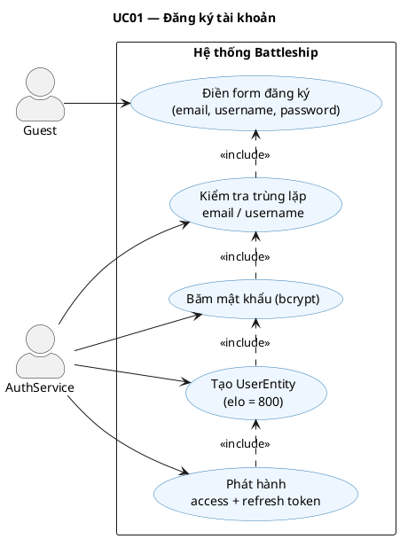

---

### UC02 — Đăng nhập

| Thuộc tính               | Mô tả                                                                                                                                                                                          |
| ------------------------ | ---------------------------------------------------------------------------------------------------------------------------------------------------------------------------------------------- |
| **Mã UC**                | UC02                                                                                                                                                                                           |
| **Tên**                  | Đăng nhập                                                                                                                                                                                      |
| **Actor chính**          | Guest / Registered User                                                                                                                                                                        |
| **Actor phụ**            | —                                                                                                                                                                                              |
| **Mô tả**                | Người dùng nhập email và mật khẩu để xác thực danh tính. Hệ thống trả về JWT access token (ngắn hạn) và đặt refresh token trong HTTP-only cookie.                                              |
| **Điều kiện tiên quyết** | Tài khoản đã tồn tại trong hệ thống.                                                                                                                                                           |
| **Điều kiện hậu quyết**  | Phiên làm việc được khởi tạo. Client lưu access token; cookie lưu refresh token.                                                                                                               |
| **Luồng chính**          | 1. Nhập email + password → 2. Tìm user theo email → 3. So sánh bcrypt → 4. Ký JWT access + refresh → 5. Lưu hash refresh vào DB → 6. Set cookie HTTP-only → 7. Trả về `{ accessToken, user }`. |
| **Ngoại lệ**             | Email không tồn tại hoặc mật khẩu sai: `INVALID_CREDENTIALS`.                                                                                                                                  |

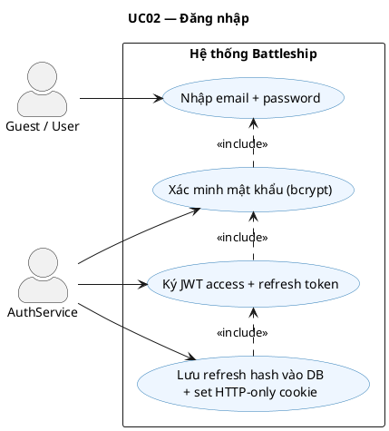

---

### UC03 — Làm mới token (Token Refresh)

| Thuộc tính               | Mô tả                                                                                                                                                                                           |
| ------------------------ | ----------------------------------------------------------------------------------------------------------------------------------------------------------------------------------------------- |
| **Mã UC**                | UC03                                                                                                                                                                                            |
| **Tên**                  | Làm mới token                                                                                                                                                                                   |
| **Actor chính**          | Client App (axios interceptor)                                                                                                                                                                  |
| **Actor phụ**            | —                                                                                                                                                                                               |
| **Mô tả**                | Khi access token hết hạn, client tự động gửi yêu cầu làm mới. Hệ thống xác minh refresh token trong cookie, xoay vòng sang token mới (rotate) và vô hiệu token cũ để phòng chống replay attack. |
| **Điều kiện tiên quyết** | Refresh token hợp lệ tồn tại trong cookie. Chưa vượt quá `refreshTokenAbsoluteExpiry`.                                                                                                          |
| **Điều kiện hậu quyết**  | Access token mới được phát hành. Refresh token cũ bị vô hiệu; token mới được lưu vào DB.                                                                                                        |
| **Luồng chính**          | 1. Interceptor bắt lỗi 401 → 2. Gọi `POST /api/auth/refresh` → 3. Đọc cookie → 4. Xác minh + kiểm tra hết hạn → 5. Phát hành cặp token mới → 6. Retry request gốc.                              |
| **Ngoại lệ**             | Refresh token hết hạn tuyệt đối hoặc không hợp lệ → force logout (`UC05`).                                                                                                                      |

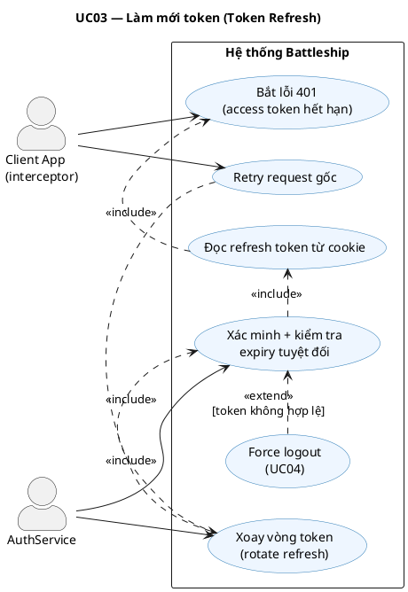

---

### UC04 — Đăng xuất

| Thuộc tính               | Mô tả                                                                                                                                                           |
| ------------------------ | --------------------------------------------------------------------------------------------------------------------------------------------------------------- |
| **Mã UC**                | UC04                                                                                                                                                            |
| **Tên**                  | Đăng xuất                                                                                                                                                       |
| **Actor chính**          | Registered User                                                                                                                                                 |
| **Actor phụ**            | —                                                                                                                                                               |
| **Mô tả**                | Người dùng chủ động kết thúc phiên làm việc. Hệ thống vô hiệu refresh token phía server và xóa cookie phía client.                                              |
| **Điều kiện tiên quyết** | Người dùng đang đăng nhập.                                                                                                                                      |
| **Điều kiện hậu quyết**  | `refreshTokenHash = null` trong DB. Cookie bị xóa. Access token còn hiệu lực đến khi hết hạn tự nhiên (stateless).                                              |
| **Luồng chính**          | 1. Nhấn Đăng xuất → 2. Gọi `POST /api/auth/logout` → 3. Đọc cookie → 4. Set `refreshTokenHash = null` → 5. Xóa cookie → 6. Client xóa access token khỏi memory. |
| **Ngoại lệ**             | Không có refresh token trong cookie: hệ thống vẫn xóa cookie và trả về 200.                                                                                     |

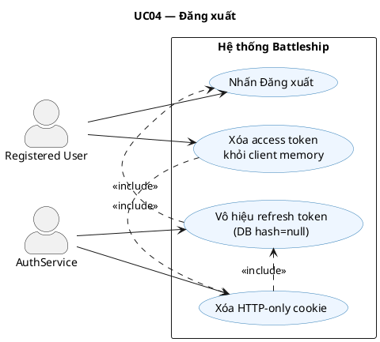

---

### UC05 — Đổi mật khẩu

| Thuộc tính               | Mô tả                                                                                                                      |
| ------------------------ | -------------------------------------------------------------------------------------------------------------------------- |
| **Mã UC**                | UC05                                                                                                                       |
| **Tên**                  | Đổi mật khẩu                                                                                                               |
| **Actor chính**          | Registered User                                                                                                            |
| **Actor phụ**            | —                                                                                                                          |
| **Mô tả**                | Người dùng nhập mật khẩu hiện tại để xác minh danh tính trước khi đặt mật khẩu mới. Mật khẩu mới được băm lại bằng bcrypt. |
| **Điều kiện tiên quyết** | Người dùng đã đăng nhập.                                                                                                   |
| **Điều kiện hậu quyết**  | `passwordHash` được cập nhật trong DB. Tất cả phiên cũ nên được vô hiệu (tuỳ cấu hình).                                    |
| **Luồng chính**          | 1. Nhập mật khẩu cũ + mới → 2. Xác minh mật khẩu cũ với bcrypt → 3. Băm mật khẩu mới → 4. Lưu vào DB.                      |
| **Ngoại lệ**             | Mật khẩu hiện tại sai: `INVALID_CURRENT_PASSWORD`. Mật khẩu mới quá ngắn: lỗi validation DTO.                              |

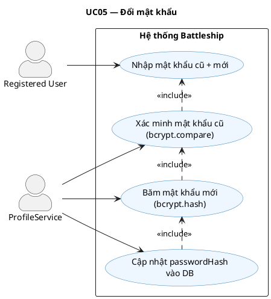

---

### UC06 — Cập nhật hồ sơ

| Thuộc tính               | Mô tả                                                                                                                                                                               |
| ------------------------ | ----------------------------------------------------------------------------------------------------------------------------------------------------------------------------------- |
| **Mã UC**                | UC06                                                                                                                                                                                |
| **Tên**                  | Cập nhật hồ sơ cá nhân                                                                                                                                                              |
| **Actor chính**          | Registered User                                                                                                                                                                     |
| **Actor phụ**            | —                                                                                                                                                                                   |
| **Mô tả**                | Người dùng chỉnh sửa thông tin cá nhân: username, chữ ký (signature) và ảnh đại diện (avatar). Upload avatar dưới dạng multipart/form-data; file được lưu trong thư mục `/uploads`. |
| **Điều kiện tiên quyết** | Người dùng đã đăng nhập (`JwtAuthGuard`).                                                                                                                                           |
| **Điều kiện hậu quyết**  | `UserEntity` được cập nhật. Avatar cũ bị thay thế bởi đường dẫn file mới.                                                                                                           |
| **Luồng chính**          | 1. Mở modal hồ sơ → 2. Chỉnh sửa các trường → 3. Gọi `PATCH /api/users/me` → 4. Validate → 5. Lưu DB → 6. Trả về thông tin mới.                                                     |
| **Ngoại lệ**             | Username mới đã tồn tại: `USERNAME_ALREADY_EXISTS`. File quá lớn hoặc sai định dạng: lỗi upload.                                                                                    |

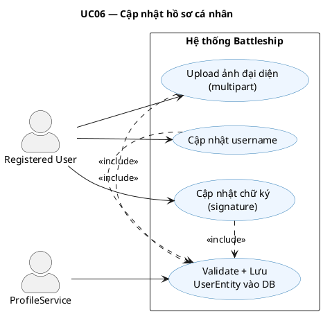

---

### UC07 — Tạo phòng

| Thuộc tính               | Mô tả                                                                                                                                                                      |
| ------------------------ | -------------------------------------------------------------------------------------------------------------------------------------------------------------------------- |
| **Mã UC**                | UC07                                                                                                                                                                       |
| **Tên**                  | Tạo phòng chơi                                                                                                                                                             |
| **Actor chính**          | Registered User (Owner)                                                                                                                                                    |
| **Actor phụ**            | —                                                                                                                                                                          |
| **Mô tả**                | Người chơi tạo một phòng chơi mới với tuỳ chọn công khai (public) hoặc riêng tư (private). Hệ thống sinh mã phòng 6 ký tự ngẫu nhiên duy nhất.                             |
| **Điều kiện tiên quyết** | Người dùng đã đăng nhập và không đang ở trong một phòng khác đang hoạt động.                                                                                               |
| **Điều kiện hậu quyết**  | `RoomEntity` mới được tạo với `status = 'waiting'`, `ownerId = userId`. Client tham gia room channel qua Socket.IO.                                                        |
| **Luồng chính**          | 1. Nhấn Tạo phòng → 2. Gửi `room:create` qua WebSocket → 3. Sinh mã phòng duy nhất → 4. Lưu `RoomEntity` → 5. Client `join('room:roomId')` → 6. Phát `server:roomUpdated`. |
| **Ngoại lệ**             | Người dùng đang ở phòng khác: `USER_ALREADY_IN_ACTIVE_ROOM` (trả về roomId và code của phòng cũ).                                                                          |

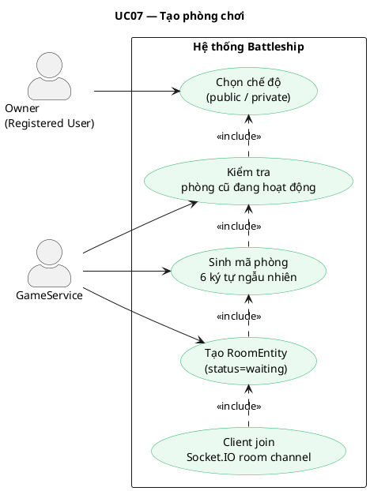

---

### UC08 — Tham gia phòng

| Thuộc tính               | Mô tả                                                                                                                                                |
| ------------------------ | ---------------------------------------------------------------------------------------------------------------------------------------------------- |
| **Mã UC**                | UC08                                                                                                                                                 |
| **Tên**                  | Tham gia phòng chơi                                                                                                                                  |
| **Actor chính**          | Registered User (Guest)                                                                                                                              |
| **Actor phụ**            | —                                                                                                                                                    |
| **Mô tả**                | Người chơi tham gia phòng đang chờ bằng ID phòng hoặc mã code 6 ký tự. Một phòng tối đa 2 người chơi.                                                |
| **Điều kiện tiên quyết** | Phòng tồn tại và có `status = 'waiting'`. Phòng chưa có Guest (slot còn trống).                                                                      |
| **Điều kiện hậu quyết**  | `RoomEntity.guestId = userId`. Cả hai người chơi nhận `server:roomUpdated`.                                                                          |
| **Luồng chính**          | 1. Nhập mã phòng hoặc chọn từ danh sách → 2. Gửi `room:join` → 3. Kiểm tra slot → 4. Cập nhật `guestId` → 5. Phát `server:roomUpdated` đến cả phòng. |
| **Ngoại lệ**             | Phòng đầy: `ROOM_FULL`. Phòng không tồn tại hoặc đã đóng: `ROOM_NOT_FOUND`.                                                                          |

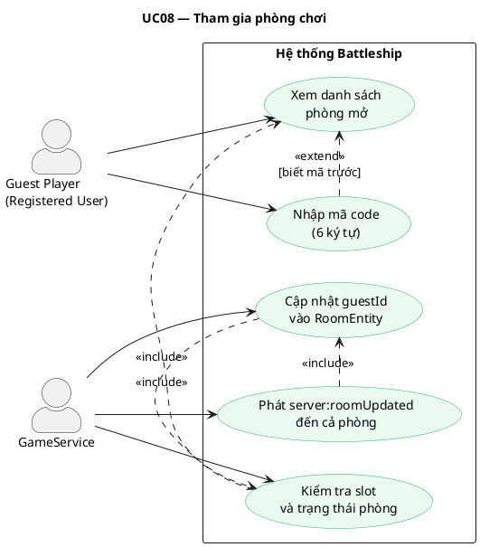

---

### UC09 — Xếp tàu & Bắt đầu trận

| Thuộc tính               | Mô tả                                                                                                                                                                                                                 |
| ------------------------ | --------------------------------------------------------------------------------------------------------------------------------------------------------------------------------------------------------------------- |
| **Mã UC**                | UC09                                                                                                                                                                                                                  |
| **Tên**                  | Xếp tàu và Bắt đầu trận đấu                                                                                                                                                                                           |
| **Actor chính**          | Registered User (cả Owner và Guest)                                                                                                                                                                                   |
| **Actor phụ**            | Hệ thống (Timer)                                                                                                                                                                                                      |
| **Mô tả**                | Sau khi phòng đủ 2 người, chủ phòng cấu hình bảng rồi khởi động giai đoạn xếp tàu. Mỗi người chơi bố trí hạm đội trong thời hạn quy định, sau đó xác nhận sẵn sàng. Khi cả hai sẵn sàng, trận đấu chính thức bắt đầu. |
| **Điều kiện tiên quyết** | `RoomEntity.status = 'waiting'`, đủ 2 người chơi.                                                                                                                                                                     |
| **Điều kiện hậu quyết**  | `MatchEntity` mới với `status = 'in_progress'`. Placements của cả hai đã lưu. `turnPlayerId` được thiết lập.                                                                                                          |
| **Luồng chính**          | 1. Owner gửi `room:configureSetup` → 2. Tạo `MatchEntity` (status=setup) → 3. Mỗi người xếp tàu → 4. Gửi `room:ready` kèm placements → 5. Cả hai ready → 6. `status = 'in_progress'` → 7. Phát `server:matchUpdated`. |
| **Ngoại lệ**             | Hết giờ xếp tàu (`setupDeadlineAt`): người chưa xong thua. Tàu đặt chồng nhau / ra ngoài bảng: `BadRequestException`.                                                                                                 |

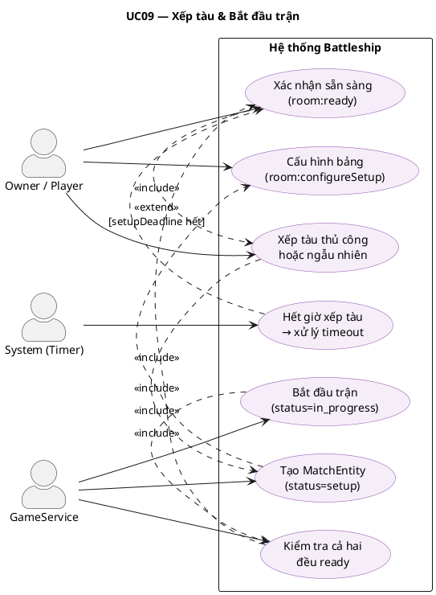

---

### UC10 — Thực hiện nước đi (Bắn)

| Thuộc tính               | Mô tả                                                                                                                                                                                                        |
| ------------------------ | ------------------------------------------------------------------------------------------------------------------------------------------------------------------------------------------------------------ |
| **Mã UC**                | UC10                                                                                                                                                                                                         |
| **Tên**                  | Thực hiện nước đi — Bắn vào tọa độ                                                                                                                                                                           |
| **Actor chính**          | Registered User (người đến lượt)                                                                                                                                                                             |
| **Actor phụ**            | Hệ thống (Timer), EloMatchService                                                                                                                                                                            |
| **Mô tả**                | Người chơi đến lượt chọn ô tọa độ `(x, y)` trên bảng đối thủ để bắn. Hệ thống xác định kết quả, cập nhật trạng thái, chuyển lượt (hoặc kết thúc trận nếu thắng) và phát sóng ngay đến tất cả.                |
| **Điều kiện tiên quyết** | `match.status = 'in_progress'`. `match.turnPlayerId = userId`. Tọa độ `(x, y)` hợp lệ và chưa bị bắn.                                                                                                        |
| **Điều kiện hậu quyết**  | `MoveEntity` được lưu. `playerShots[]` được cập nhật. Lượt chuyển hoặc trận kết thúc.                                                                                                                        |
| **Luồng chính**          | 1. Chọn ô → 2. Gửi `match:move` → 3. Validate lượt + tọa độ → 4. Xác định kết quả → 5. Lưu `MoveEntity` → 6. Kiểm tra thắng → 7a. Chuyển lượt / 7b. Kết thúc + cập nhật Elo → 8. Phát `server:matchUpdated`. |
| **Ngoại lệ**             | Sai lượt: `NOT_YOUR_TURN`. Ô đã bắn: `CELL_ALREADY_SHOT`. Hết giờ lượt: tự động chuyển lượt.                                                                                                                 |

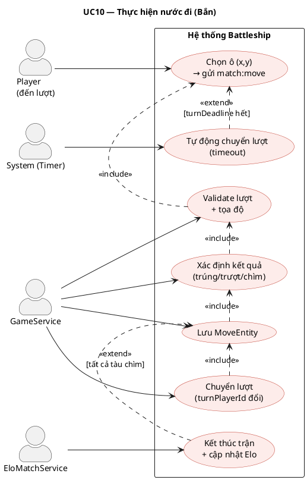

---

### UC11 — Đầu hàng (Forfeit)

| Thuộc tính               | Mô tả                                                                                                                                                                           |
| ------------------------ | ------------------------------------------------------------------------------------------------------------------------------------------------------------------------------- |
| **Mã UC**                | UC11                                                                                                                                                                            |
| **Tên**                  | Đầu hàng                                                                                                                                                                        |
| **Actor chính**          | Registered User                                                                                                                                                                 |
| **Actor phụ**            | EloMatchService                                                                                                                                                                 |
| **Mô tả**                | Người chơi chủ động kết thúc trận bằng cách đầu hàng. Đối thủ được tuyên bố thắng. Elo vẫn được cập nhật như trận thua thông thường.                                            |
| **Điều kiện tiên quyết** | `match.status = 'in_progress'`.                                                                                                                                                 |
| **Điều kiện hậu quyết**  | `match.status = 'finished'`. `match.winnerId = đối thủ`. Elo được cập nhật.                                                                                                     |
| **Luồng chính**          | 1. Nhấn Đầu hàng → 2. Gửi `match:forfeit` → 3. Set `winnerId = đối thủ` → 4. `status = 'finished'` → 5. Gọi `EloMatchService.settleMatchElo()` → 6. Phát `server:matchUpdated`. |
| **Ngoại lệ**             | Trận đã kết thúc: bỏ qua.                                                                                                                                                       |

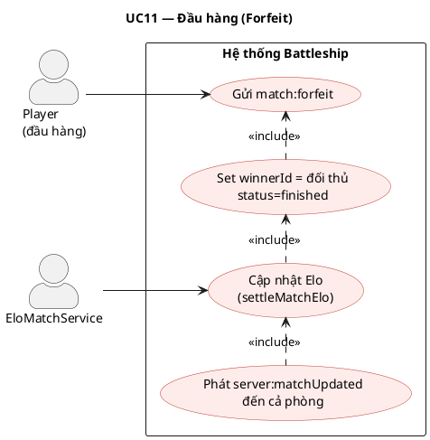

---

### UC12 — Tái đấu (Rematch)

| Thuộc tính               | Mô tả                                                                                                                                                                         |
| ------------------------ | ----------------------------------------------------------------------------------------------------------------------------------------------------------------------------- |
| **Mã UC**                | UC12                                                                                                                                                                          |
| **Tên**                  | Bỏ phiếu tái đấu (Rematch Vote)                                                                                                                                               |
| **Actor chính**          | Registered User (cả hai)                                                                                                                                                      |
| **Actor phụ**            | —                                                                                                                                                                             |
| **Mô tả**                | Sau khi trận kết thúc, mỗi người chơi có thể bỏ phiếu đồng ý hoặc từ chối tái đấu. Nếu cả hai đồng ý, một trận mới được khởi tạo ngay trong cùng phòng.                       |
| **Điều kiện tiên quyết** | `match.status = 'finished'`.                                                                                                                                                  |
| **Điều kiện hậu quyết**  | Nếu cả hai đồng ý: `MatchEntity` mới được tạo. Nếu có người từ chối: phòng đóng.                                                                                              |
| **Luồng chính**          | 1. Gửi `match:rematchVote { accept: true/false }` → 2. Ghi nhận vote → 3a. Cả hai đồng ý → tạo Match mới → 3b. Có người từ chối → đóng phòng → 4. Phát `server:matchUpdated`. |
| **Ngoại lệ**             | Người chơi rời phòng trước khi vote: coi như từ chối.                                                                                                                         |

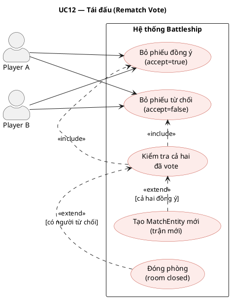

---

### UC13 — Kết nối lại (Reconnect)

| Thuộc tính               | Mô tả                                                                                                                                                                                    |
| ------------------------ | ---------------------------------------------------------------------------------------------------------------------------------------------------------------------------------------- |
| **Mã UC**                | UC13                                                                                                                                                                                     |
| **Tên**                  | Kết nối lại sau khi mất kết nối                                                                                                                                                          |
| **Actor chính**          | Registered User                                                                                                                                                                          |
| **Actor phụ**            | —                                                                                                                                                                                        |
| **Mô tả**                | Khi người chơi mất kết nối mạng trong lúc đang thi đấu, họ có thể kết nối lại và tiếp tục trận đấu. Trận vẫn tiếp tục chạy phía server trong thời gian ngắt kết nối.                     |
| **Điều kiện tiên quyết** | Phòng và trận vẫn đang tồn tại (chưa kết thúc hoặc hết hạn).                                                                                                                             |
| **Điều kiện hậu quyết**  | Client nhận snapshot đầy đủ trạng thái hiện tại của phòng và trận.                                                                                                                       |
| **Luồng chính**          | 1. Client kết nối lại WebSocket → 2. Gửi `match:reconnect { roomId, matchId }` → 3. Server trả về `RoomSnapshot + MatchSnapshot` → 4. Client `join('room:roomId')` → 5. UI được đồng bộ. |
| **Ngoại lệ**             | Trận đã kết thúc trong lúc ngắt kết nối: nhận snapshot `finished`. Phòng đã đóng: `ROOM_NOT_FOUND`.                                                                                      |

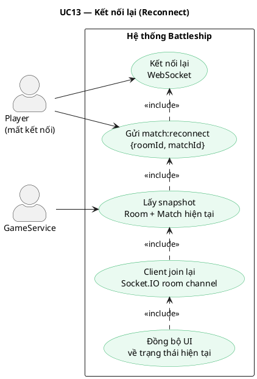

---

### UC14 — Xem trận đấu (Spectate)

| Thuộc tính               | Mô tả                                                                                                                                                                                            |
| ------------------------ | ------------------------------------------------------------------------------------------------------------------------------------------------------------------------------------------------ |
| **Mã UC**                | UC14                                                                                                                                                                                             |
| **Tên**                  | Xem trận đấu với tư cách khán giả                                                                                                                                                                |
| **Actor chính**          | Spectator (Registered User)                                                                                                                                                                      |
| **Actor phụ**            | —                                                                                                                                                                                                |
| **Mô tả**                | Người dùng đã đăng nhập tham gia xem trận đấu đang diễn ra theo thời gian thực. Thông tin vị trí tàu của cả hai người chơi bị ẩn hoàn toàn; khán giả chỉ thấy kết quả các lần bắn.               |
| **Điều kiện tiên quyết** | Phòng có trận đang diễn ra (`status = 'in_game'`). Người xem đã đăng nhập.                                                                                                                       |
| **Điều kiện hậu quyết**  | Client `join('room:roomId:spectators')`. Nhận `MatchSnapshot` với dữ liệu ẩn tàu.                                                                                                                |
| **Luồng chính**          | 1. Vào `/game/spectate/:roomId` → 2. Gửi `match:spectateJoin` → 3. Server trả `SpectatorMatchSnapshot` → 4. Client join spectator channel → 5. Nhận cập nhật realtime qua `server:matchUpdated`. |
| **Ngoại lệ**             | Phòng không tồn tại hoặc chưa bắt đầu trận: `ROOM_NOT_FOUND`.                                                                                                                                    |

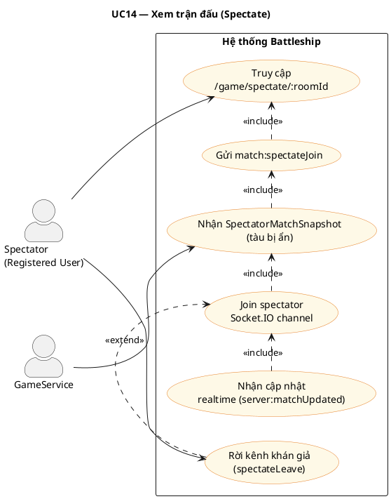

---

### UC15 — Chat kênh khán giả

| Thuộc tính               | Mô tả                                                                                                                                                                            |
| ------------------------ | -------------------------------------------------------------------------------------------------------------------------------------------------------------------------------- |
| **Mã UC**                | UC15                                                                                                                                                                             |
| **Tên**                  | Chat trong kênh khán giả                                                                                                                                                         |
| **Actor chính**          | Spectator                                                                                                                                                                        |
| **Actor phụ**            | ChatService (Redis)                                                                                                                                                              |
| **Mô tả**                | Khán giả sử dụng kênh chat riêng, tách biệt hoàn toàn với chat của người trong phòng. Lịch sử tin nhắn được lưu trong Redis với TTL và giới hạn số lượng.                        |
| **Điều kiện tiên quyết** | Người dùng đã tham gia spectator channel.                                                                                                                                        |
| **Điều kiện hậu quyết**  | Tin nhắn được phát đến tất cả khán giả đang online trong cùng phòng.                                                                                                             |
| **Luồng chính**          | 1. Nhập tin nhắn → 2. Gửi `spectator:sendMessage` → 3. `ChatService.sendSpectatorMessage()` → 4. Lưu Redis → 5. Phát `server:spectatorChatMessage` đến `room:roomId:spectators`. |
| **Ngoại lệ**             | Nội dung rỗng hoặc quá dài: lỗi validation.                                                                                                                                      |

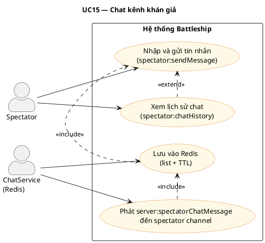

---

### UC16 — Xem bảng xếp hạng Elo

| Thuộc tính               | Mô tả                                                                                                                               |
| ------------------------ | ----------------------------------------------------------------------------------------------------------------------------------- |
| **Mã UC**                | UC16                                                                                                                                |
| **Tên**                  | Xem bảng xếp hạng Elo                                                                                                               |
| **Actor chính**          | Guest / Registered User                                                                                                             |
| **Actor phụ**            | —                                                                                                                                   |
| **Mô tả**                | Bất kỳ ai cũng có thể xem danh sách top người chơi được sắp xếp giảm dần theo điểm Elo. Endpoint công khai, không yêu cầu xác thực. |
| **Điều kiện tiên quyết** | — (không yêu cầu đăng nhập)                                                                                                         |
| **Điều kiện hậu quyết**  | Trả về danh sách người chơi với `username`, `avatar`, `elo` theo thứ tự.                                                            |
| **Luồng chính**          | 1. Vào `/leaderboard` → 2. Gọi `GET /api/leaderboard?limit=N` → 3. Query DB sắp xếp theo `elo DESC` → 4. Trả về danh sách.          |
| **Ngoại lệ**             | Không có dữ liệu: trả về mảng rỗng.                                                                                                 |

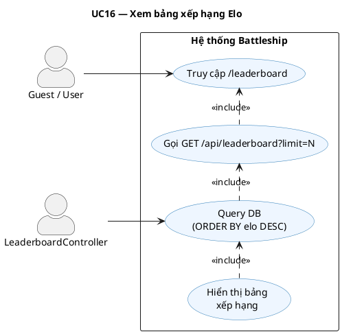

---

### UC17 — Xem lịch sử trận đấu

| Thuộc tính               | Mô tả                                                                                                                                                                          |
| ------------------------ | ------------------------------------------------------------------------------------------------------------------------------------------------------------------------------ |
| **Mã UC**                | UC17                                                                                                                                                                           |
| **Tên**                  | Xem lịch sử trận đấu cá nhân                                                                                                                                                   |
| **Actor chính**          | Registered User                                                                                                                                                                |
| **Actor phụ**            | —                                                                                                                                                                              |
| **Mô tả**                | Người chơi xem lại danh sách các trận đấu đã tham gia với thống kê chi tiết: số lần bắn, tỉ lệ chính xác, kết quả thắng/thua, thay đổi Elo.                                    |
| **Điều kiện tiên quyết** | Người dùng đã đăng nhập.                                                                                                                                                       |
| **Điều kiện hậu quyết**  | Danh sách trận được trả về, phân trang theo `limit`.                                                                                                                           |
| **Luồng chính**          | 1. Mở modal lịch sử → 2. Gọi `GET /api/game/matches/history?limit=N` → 3. Query các `MatchEntity` có `player1Id` hoặc `player2Id = userId` → 4. Tính toán stats → 5. Hiển thị. |
| **Ngoại lệ**             | Chưa có trận nào: trả về mảng rỗng.                                                                                                                                            |

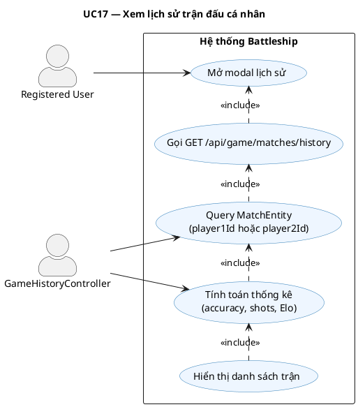

---

### UC18 — Đăng bài & Bình luận diễn đàn

| Thuộc tính               | Mô tả                                                                                                                                                                                                           |
| ------------------------ | --------------------------------------------------------------------------------------------------------------------------------------------------------------------------------------------------------------- |
| **Mã UC**                | UC18                                                                                                                                                                                                            |
| **Tên**                  | Đăng bài viết và bình luận trên diễn đàn                                                                                                                                                                        |
| **Actor chính**          | Registered User                                                                                                                                                                                                 |
| **Actor phụ**            | —                                                                                                                                                                                                               |
| **Mô tả**                | Người dùng tạo bài viết mới với tiêu đề và nội dung, hoặc bình luận dưới bài viết có sẵn. Nội dung được sanitize trước khi lưu để phòng chống XSS. Tác giả có thể chỉnh sửa và xóa (archive) nội dung của mình. |
| **Điều kiện tiên quyết** | Người dùng đã đăng nhập (`JwtAuthGuard`).                                                                                                                                                                       |
| **Điều kiện hậu quyết**  | `ForumPostEntity` hoặc `ForumCommentEntity` mới với `status = 'published'`.                                                                                                                                     |
| **Luồng chính**          | 1. Điền form → 2. Gọi `POST /api/forum/posts` → 3. Sanitize nội dung → 4. Lưu DB → 5. Trả về `ForumPostDto` → 6. Render bài mới.                                                                                |
| **Ngoại lệ**             | Nội dung rỗng: lỗi validation. Sửa/xóa bài của người khác: `ForbiddenException`. Bình luận vào bài đã archive: `BadRequestException`.                                                                           |

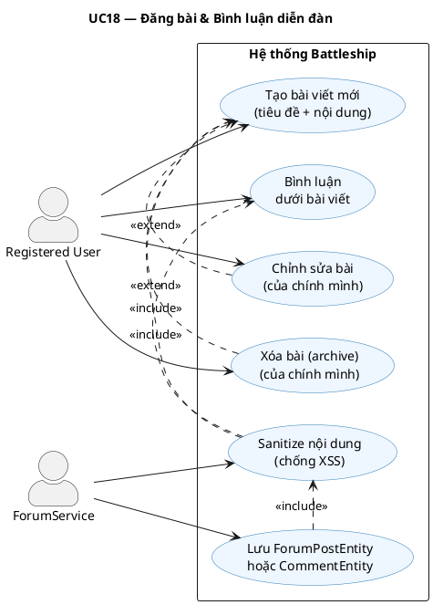

---

### UC19 — Bình chọn (Vote)

| Thuộc tính               | Mô tả                                                                                                                                                                          |
| ------------------------ | ------------------------------------------------------------------------------------------------------------------------------------------------------------------------------ |
| **Mã UC**                | UC19                                                                                                                                                                           |
| **Tên**                  | Bình chọn bài viết / bình luận                                                                                                                                                 |
| **Actor chính**          | Registered User                                                                                                                                                                |
| **Actor phụ**            | —                                                                                                                                                                              |
| **Mô tả**                | Người dùng upvote (+1) hoặc downvote (-1) bài viết hoặc bình luận. Bình chọn lại cùng chiều sẽ hủy vote. Bình chọn ngược chiều sẽ đổi giá trị. `voteScore` được cập nhật ngay. |
| **Điều kiện tiên quyết** | Người dùng đã đăng nhập. Bài viết / bình luận tồn tại và `status = 'published'`.                                                                                               |
| **Điều kiện hậu quyết**  | `ForumPostVoteEntity` hoặc `ForumCommentVoteEntity` được upsert. `voteScore` của bài/bình luận được cập nhật.                                                                  |
| **Luồng chính**          | 1. Nhấn nút vote → 2. Gọi `POST /api/forum/posts/:id/vote { value: 1 \| -1 }` → 3. Upsert vote record → 4. Tính lại `voteScore` → 5. Trả về score mới.                         |
| **Ngoại lệ**             | Bài không tồn tại: `NotFoundException`. Vote trùng giá trị: hủy vote (trả về 0).                                                                                               |

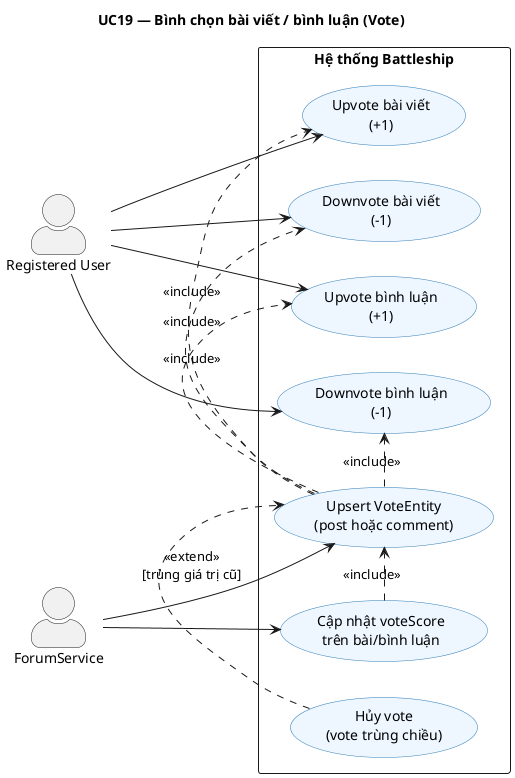

---

### UC20 — Chơi với Bot (Offline)

| Thuộc tính               | Mô tả                                                                                                                                                                                                    |
| ------------------------ | -------------------------------------------------------------------------------------------------------------------------------------------------------------------------------------------------------- |
| **Mã UC**                | UC20                                                                                                                                                                                                     |
| **Tên**                  | Chơi với Bot (Offline Mode)                                                                                                                                                                              |
| **Actor chính**          | Registered User                                                                                                                                                                                          |
| **Actor phụ**            | Bot AI (client-side)                                                                                                                                                                                     |
| **Mô tả**                | Người chơi thi đấu với Bot AI ngay trên trình duyệt mà không cần kết nối server game. Bot có hai mức độ: Easy (bắn ngẫu nhiên) và Hard (thuật toán Hunt & Target). Kết quả không ảnh hưởng đến điểm Elo. |
| **Điều kiện tiên quyết** | Người dùng đã đăng nhập (để vào trang game). Không cần kết nối WebSocket game.                                                                                                                           |
| **Điều kiện hậu quyết**  | Trận offline kết thúc. Elo không thay đổi. Không có dữ liệu lưu server.                                                                                                                                  |
| **Luồng chính**          | 1. Chọn "Chơi với Bot" → 2. Chọn mức độ → 3. Xếp tàu (bot-setup) → 4. Lần lượt bắn → 5. Bot tự tính nước đáp → 6. Kết thúc → 7. Chọn chơi lại hoặc thoát.                                                |
| **Ngoại lệ**             | — (toàn bộ xử lý phía client, không có lỗi server).                                                                                                                                                      |

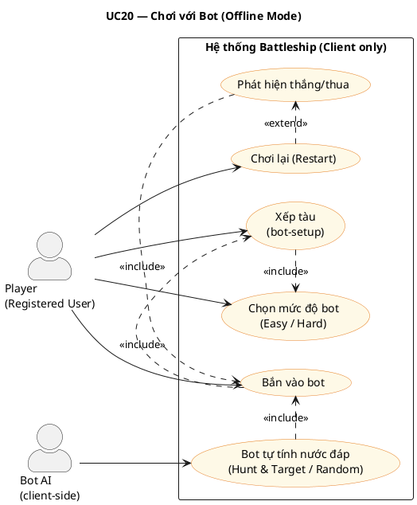

---

## 1. Tổng quan toàn hệ thống

> Biểu đồ tổng hợp toàn bộ nhóm chức năng của nền tảng, phân theo ba actor chính. Đây là biểu đồ nên trình bày đầu tiên trong báo cáo.

```plantuml
@startuml UC-00-TongQuan
title Biểu đồ Use Case Tổng quan — Hệ thống Battleship Online

skinparam actorStyle awesome
skinparam usecaseBorderColor #2C7BB6
skinparam usecaseBackgroundColor #EEF6FF
skinparam rectangleBorderColor #666
skinparam ArrowColor #444
skinparam defaultFontName Arial

left to right direction

actor "Khách vãng lai\n(Guest)" as Guest
actor "Người chơi\n(Registered User)" as User
actor "Khán giả\n(Spectator)" as Spectator
actor "Hệ thống\n(System)" as System

rectangle "Hệ thống Battleship Online" {

    package "Xác thực" {
        usecase "Đăng ký tài khoản"       as UC01
        usecase "Đăng nhập"               as UC02
        usecase "Đăng xuất"               as UC04
        usecase "Làm mới token"           as UC03
    }

    package "Hồ sơ & Cài đặt" {
        usecase "Cập nhật hồ sơ"          as UC06
        usecase "Đổi mật khẩu"            as UC05
        usecase "Cài đặt giao diện/âm thanh" as UC_SET
    }

    package "Phòng chơi" {
        usecase "Tạo phòng"               as UC07
        usecase "Tham gia phòng"          as UC08
        usecase "Xem danh sách phòng"     as UC_LIST
        usecase "Rời phòng"               as UC_LEAVE
    }

    package "Trận đấu Online" {
        usecase "Xếp tàu & Bắt đầu"      as UC09
        usecase "Thực hiện nước đi (Bắn)" as UC10
        usecase "Đầu hàng"               as UC11
        usecase "Tái đấu (Rematch)"       as UC12
        usecase "Kết nối lại"            as UC13
    }

    package "Khán giả" {
        usecase "Xem trận đấu trực tiếp"  as UC14
        usecase "Chat kênh khán giả"      as UC15
    }

    package "Xếp hạng & Cộng đồng" {
        usecase "Xem bảng xếp hạng Elo"  as UC16
        usecase "Xem lịch sử trận"       as UC17
        usecase "Đăng bài diễn đàn"      as UC18
        usecase "Bình luận & Bình chọn"  as UC19
    }

    package "Bot (Offline)" {
        usecase "Chơi với Bot"            as UC20
    }

    ' Quan hệ include/extend
    UC03 .> UC02  : <<extend>>
    UC09 .> UC07  : <<include>>
    UC10 .> UC09  : <<include>>
    UC11 .> UC10  : <<extend>>
    UC12 .> UC10  : <<extend>>
    UC19 .> UC18  : <<include>>
}

' Guest
Guest --> UC01
Guest --> UC02
Guest --> UC16

' Registered User
User --> UC02
User --> UC03
User --> UC04
User --> UC05
User --> UC06
User --> UC_SET
User --> UC07
User --> UC08
User --> UC_LIST
User --> UC_LEAVE
User --> UC09
User --> UC10
User --> UC11
User --> UC12
User --> UC13
User --> UC16
User --> UC17
User --> UC18
User --> UC19
User --> UC20

' Spectator
Spectator --> UC14
Spectator --> UC15

' System
System --> UC03
System --> UC10 : tự động chuyển lượt
System --> UC09 : hết giờ xếp tàu
System --> UC16 : cập nhật Elo sau trận

@enduml
```

---

## 2. Trận đấu Online (Match Lifecycle)

> **Use Case cốt lõi nhất** của hệ thống — mô tả toàn bộ luồng tương tác của hai người chơi trong một ván đấu PvP theo thời gian thực.

```plantuml
@startuml UC-07-OnlineMatch
title Biểu đồ Use Case — Trận đấu Online (Match Lifecycle)

skinparam actorStyle awesome
skinparam usecaseBorderColor #C0392B
skinparam usecaseBackgroundColor #FDECEA
skinparam rectangleBorderColor #888
skinparam ArrowColor #444
skinparam defaultFontName Arial

left to right direction

actor "Player A"        as PA
actor "Player B"        as PB
actor "Hệ thống (Timer)" as SYS

rectangle "Online Match System" {

    usecase "Thực hiện nước đi\n(Bắn vào tọa độ)"  as UC1
    usecase "Nhận kết quả bắn\n(trúng / trượt / chìm)" as UC1b
    usecase "Đầu hàng (Forfeit)"                    as UC2
    usecase "Kết nối lại\n(Reconnect)"              as UC3
    usecase "Bình chọn tái đấu\n(Rematch Vote)"     as UC4
    usecase "Tự động chuyển lượt\n(Timeout)"        as UC5
    usecase "Xác định thắng / thua"                 as UC6
    usecase "Cập nhật điểm Elo"                     as UC7

    ' Quan hệ
    UC1b .> UC1  : <<include>>
    UC5  .> UC1  : <<extend>>
    UC6  .> UC1  : <<include>>
    UC7  .> UC6  : <<include>>
    UC4  .> UC6  : <<extend>>
}

PA  --> UC1
PB  --> UC1
PA  --> UC2
PB  --> UC2
PA  --> UC3
PB  --> UC3
PA  --> UC4
PB  --> UC4
SYS --> UC5
SYS --> UC6
SYS --> UC7

@enduml
```

**Quan hệ chính:**

- `Nhận kết quả` `<<include>>` `Thực hiện nước đi` — mỗi lần bắn đều trả về kết quả tức thì.
- `Tự động chuyển lượt` `<<extend>>` `Nước đi` — xảy ra khi hết `turnDeadlineAt`.
- `Xác định thắng/thua` `<<include>>` `Nước đi` — hệ thống kiểm tra sau mỗi nước bắn.
- `Cập nhật Elo` `<<include>>` `Xác định thắng/thua` — bắt buộc ngay sau khi trận kết thúc.

---

## 3. Quản lý Phòng Chơi (Room Lifecycle)

> Mô tả luồng tương tác giữa chủ phòng (Owner) và người vào phòng (Guest) để thiết lập một trận đấu.

```plantuml
@startuml UC-06-RoomLifecycle
title Biểu đồ Use Case — Quản lý Phòng Chơi (Room Lifecycle)

skinparam actorStyle awesome
skinparam usecaseBorderColor #27AE60
skinparam usecaseBackgroundColor #EAFAF1
skinparam rectangleBorderColor #888
skinparam ArrowColor #444
skinparam defaultFontName Arial

left to right direction

actor "Chủ phòng (Owner)"   as Owner
actor "Người vào (Guest)"   as GuestP
actor "Hệ thống (Timer)"    as SYS

rectangle "Online Room System" {

    usecase "Tạo phòng\n(public / private)"    as UC1
    usecase "Xem danh sách phòng mở"           as UC2
    usecase "Tham gia phòng\n(ID hoặc code)"   as UC3
    usecase "Đánh dấu sẵn sàng\n(Mark Ready)"  as UC4
    usecase "Bắt đầu trận\n(Start Room)"       as UC5
    usecase "Đóng phòng\n(Close Room)"         as UC6
    usecase "Phòng tự động hết hạn"            as UC7
    usecase "Chat trong phòng"                 as UC8
    usecase "Kết nối lại vào phòng"            as UC9

    ' Quan hệ
    UC3 .> UC2   : <<include>>
    UC5 .> UC4   : <<include>>
    UC7 .> UC6   : <<extend>>
    UC8 .> UC3   : <<extend>>
}

Owner  --> UC1
Owner  --> UC4
Owner  --> UC5
Owner  --> UC6
Owner  --> UC8
Owner  --> UC9

GuestP --> UC2
GuestP --> UC3
GuestP --> UC4
GuestP --> UC8
GuestP --> UC9

SYS    --> UC7

@enduml
```

**Quan hệ chính:**

- `Tham gia phòng` `<<include>>` `Xem danh sách` — người chơi phải xem/tìm phòng trước khi tham gia.
- `Bắt đầu trận` `<<include>>` `Đánh dấu sẵn sàng` — phải có ít nhất một bên ready trước khi Owner start.
- `Phòng hết hạn` `<<extend>>` `Đóng phòng` — kích hoạt khi `expiresAt` đến hạn.

---

## 4. Xếp tàu & Cấu hình (Setup & Placement)

> Mô tả giai đoạn bố trí hạm đội trước mỗi trận — từ lúc Owner cấu hình bảng đến khi cả hai xác nhận sẵn sàng.

```plantuml
@startuml UC-04-GameSetup
title Biểu đồ Use Case — Xếp tàu & Cấu hình (Setup & Placement)

skinparam actorStyle awesome
skinparam usecaseBorderColor #8E44AD
skinparam usecaseBackgroundColor #F5EEF8
skinparam rectangleBorderColor #888
skinparam ArrowColor #444
skinparam defaultFontName Arial

left to right direction

actor "Chủ phòng (Owner)"  as Owner
actor "Người chơi (Player)" as Player
actor "Hệ thống (Timer)"   as SYS

rectangle "Game Setup & Placement System" {

    usecase "Cấu hình bảng\n(kích thước, số tàu, timer)"   as UC1
    usecase "Chọn preset bảng mặc định"                     as UC1b
    usecase "Xếp tàu thủ công\n(kéo thả)"                  as UC2
    usecase "Xếp tàu ngẫu nhiên\n(auto-random)"            as UC3
    usecase "Xoay tàu\n(ngang / dọc)"                      as UC4
    usecase "Đặt lại toàn bộ\n(Reset board)"               as UC5
    usecase "Xác nhận sẵn sàng\n(room:ready)"              as UC6
    usecase "Hết thời gian xếp tàu\n(Setup Timeout)"       as UC7

    ' Quan hệ
    UC1b .> UC1 : <<extend>>
    UC2  .> UC6 : <<include>>
    UC3  .> UC6 : <<include>>
    UC4  .> UC2 : <<include>>
    UC5  .> UC2 : <<extend>>
    UC7  .> UC6 : <<extend>>
}

Owner  --> UC1
Owner  --> UC1b
Owner  --> UC2
Owner  --> UC3
Owner  --> UC4
Owner  --> UC5
Owner  --> UC6

Player --> UC2
Player --> UC3
Player --> UC4
Player --> UC5
Player --> UC6

SYS    --> UC7

@enduml
```

**Quan hệ chính:**

- `Xếp tàu thủ công / ngẫu nhiên` đều `<<include>>` `Xác nhận sẵn sàng` — sau khi xếp xong thì gửi ready.
- `Xoay tàu` `<<include>>` `Xếp thủ công` — thao tác xoay là một phần của quá trình đặt tay.
- `Hết giờ` `<<extend>>` `Xác nhận sẵn sàng` — nếu chưa ready, hệ thống tự xử lý khi hết `setupDeadlineAt`.

---

## 5. Xác thực & Phiên đăng nhập (Auth & Session)

```plantuml
@startuml UC-01-Auth
title Biểu đồ Use Case — Xác thực & Phiên đăng nhập

skinparam actorStyle awesome
skinparam usecaseBorderColor #2C7BB6
skinparam usecaseBackgroundColor #EEF6FF
skinparam rectangleBorderColor #888
skinparam ArrowColor #444
skinparam defaultFontName Arial

left to right direction

actor "Khách vãng lai (Guest)"      as Guest
actor "Người dùng đã đăng ký"      as User
actor "Client App\n(interceptor)"   as Client

rectangle "Auth & Session System" {

    usecase "Đăng ký tài khoản\n(email + username + password)" as UC1
    usecase "Đăng nhập\n(trả về access token + refresh cookie)" as UC2
    usecase "Đăng xuất\n(revoke refresh token)"                 as UC3
    usecase "Làm mới token\n(rotate refresh token)"             as UC4
    usecase "Ép đăng xuất\n(khi refresh token lỗi)"            as UC5

    ' Quan hệ
    UC4 .> UC2  : <<extend>>
    UC5 .> UC4  : <<extend>>
}

Guest  --> UC1
Guest  --> UC2
User   --> UC2
User   --> UC3
Client --> UC4
Client --> UC5

@enduml
```

---

## 6. Hồ sơ cá nhân (Profile)

```plantuml
@startuml UC-02-Profile
title Biểu đồ Use Case — Quản lý Hồ sơ Cá nhân

skinparam actorStyle awesome
skinparam usecaseBorderColor #1ABC9C
skinparam usecaseBackgroundColor #E8F8F5
skinparam rectangleBorderColor #888
skinparam ArrowColor #444
skinparam defaultFontName Arial

left to right direction

actor "Người dùng đã đăng nhập" as User
actor "Người dùng khác / Guest" as Viewer

rectangle "Profile System" {

    usecase "Xem hồ sơ công khai\n(theo userId)"    as UC1
    usecase "Cập nhật username"                     as UC2
    usecase "Cập nhật chữ ký (signature)"           as UC3
    usecase "Upload ảnh đại diện (avatar)"          as UC4
    usecase "Đổi mật khẩu\n(xác minh mật khẩu cũ)" as UC5
    usecase "Xem lịch sử trận đấu cá nhân"         as UC6

    ' Quan hệ
    UC2 .> UC1 : <<extend>>
    UC3 .> UC1 : <<extend>>
    UC4 .> UC1 : <<extend>>
}

User   --> UC1
User   --> UC2
User   --> UC3
User   --> UC4
User   --> UC5
User   --> UC6

Viewer --> UC1

@enduml
```

---

## 7. Chơi với Bot (Bot Gameplay)

```plantuml
@startuml UC-05-BotGameplay
title Biểu đồ Use Case — Chơi với Bot (Offline Mode)

skinparam actorStyle awesome
skinparam usecaseBorderColor #E67E22
skinparam usecaseBackgroundColor #FEF9E7
skinparam rectangleBorderColor #888
skinparam ArrowColor #444
skinparam defaultFontName Arial

left to right direction

actor "Người chơi" as Player
actor "Bot AI"     as Bot

rectangle "Bot Gameplay System" {

    usecase "Chọn mức độ bot\n(Easy / Hard)"       as UC1
    usecase "Bắt đầu trận offline"                 as UC2
    usecase "Xếp tàu (bot-setup)"                  as UC3
    usecase "Thực hiện nước bắn\nvào bot"          as UC4
    usecase "Bot tự động bắn lại"                  as UC5
    usecase "Xem trạng thái hạm đội"              as UC6
    usecase "Xem log các lần bắn"                  as UC7
    usecase "Chơi lại (Restart)"                   as UC8

    ' Quan hệ
    UC2 .> UC1  : <<include>>
    UC3 .> UC2  : <<include>>
    UC4 .> UC3  : <<include>>
    UC5 .> UC4  : <<include>>
    UC6 .> UC4  : <<extend>>
    UC7 .> UC4  : <<extend>>
    UC8 .> UC2  : <<extend>>
}

Player --> UC1
Player --> UC2
Player --> UC3
Player --> UC4
Player --> UC6
Player --> UC7
Player --> UC8

Bot    --> UC5

@enduml
```

**Ghi chú:** Trận bot không ảnh hưởng đến điểm Elo. Bot AI tự động tính toán nước bắn theo thuật toán (Easy: ngẫu nhiên; Hard: hunt & target).

---

## 8. Cài đặt Hệ thống (Settings)

```plantuml
@startuml UC-03-Settings
title Biểu đồ Use Case — Cài đặt Hệ thống (Settings)

skinparam actorStyle awesome
skinparam usecaseBorderColor #95A5A6
skinparam usecaseBackgroundColor #F2F3F4
skinparam rectangleBorderColor #888
skinparam ArrowColor #444
skinparam defaultFontName Arial

left to right direction

actor "Người chơi" as Player

rectangle "Settings System (Client-side)" {

    usecase "Đổi ngôn ngữ\n(i18n)"                 as UC1
    usecase "Chuyển chủ đề\n(Sáng / Tối)"          as UC2
    usecase "Điều chỉnh âm lượng\nnhạc nền"        as UC3
    usecase "Điều chỉnh âm lượng\nhiệu ứng (SFX)"  as UC4
    usecase "Tắt tiếng từng kênh\n(Mute)"          as UC5
    usecase "Lưu cấu hình\n(localStorage)"         as UC6

    ' Quan hệ
    UC1 .> UC6 : <<include>>
    UC2 .> UC6 : <<include>>
    UC3 .> UC6 : <<include>>
    UC4 .> UC6 : <<include>>
    UC5 .> UC4 : <<extend>>
}

Player --> UC1
Player --> UC2
Player --> UC3
Player --> UC4
Player --> UC5

@enduml
```

**Ghi chú:** Toàn bộ Settings được lưu phía client (localStorage), không đồng bộ server. Thay đổi áp dụng ngay lập tức mà không cần reload trang.

---

## Phần II — Biểu đồ trạng thái (State) theo use case

> **Công cụ render:** giống Phần I — [PlantUML state](https://plantuml.com/state-diagram). File nguồn tương ứng nằm trong `.report/uml/st*.puml` (có thể chạy `java -jar .report/plantuml.jar -charset UTF-8 .report/uml/st*.puml`).
>
> **Đủ 20 UC:** mỗi **UC01–UC20** đều có dòng trong bảng dưới đây. Số sơ đồ state (**ST01–ST09**) **ít hơn 20** vì nhiều UC cùng chia sẻ một máy trạng thái (ví dụ UC07–UC09 cùng ST01). **ST09** bổ sung cho **Settings** (mục 8), nằm ngoài danh sách UC01–UC20.

### Bảng đủ 20 UC → State diagram

| UC   | State diagram | Ghi chú ngắn                                           |
| ---- | ------------- | ------------------------------------------------------ |
| UC01 | ST03          | Đăng ký → phiên đăng nhập                              |
| UC02 | ST03          | Đăng nhập                                              |
| UC03 | ST03          | Refresh token (xoay vòng)                              |
| UC04 | ST03          | Đăng xuất                                              |
| UC05 | ST06          | Đổi mật khẩu trong modal                               |
| UC06 | ST06          | Cập nhật hồ sơ                                         |
| UC07 | ST01          | Tạo phòng                                              |
| UC08 | ST01          | Tham gia phòng                                         |
| UC09 | ST01, ST02    | Xếp tàu: cả phòng (ST01) và match `setup` (ST02)       |
| UC10 | ST02          | Lượt bắn, `in_progress`                                |
| UC11 | ST02          | Forfeit → `finished`                                   |
| UC12 | ST01          | Rematch vote, vòng phòng sau trận                      |
| UC13 | ST02          | Không thêm state server; reconnect trong `in_progress` |
| UC14 | ST05          | Spectate join                                          |
| UC15 | ST05          | Chat spectator                                         |
| UC16 | —             | Không tách ST: đọc bảng xếp hạng một lần               |
| UC17 | —             | Không tách ST: đọc lịch sử một lần                     |
| UC18 | ST07          | Vòng đời bài forum                                     |
| UC19 | ST08          | Vote user trên post/comment                            |
| UC20 | ST04          | Trận bot offline (client)                              |

### Bảng gom theo ST (cùng nội dung, nhìn từ phía sơ đồ)

| Mã   | Đối tượng / phạm vi                    | UC tham chiếu (20 UC)                                              |
| ---- | -------------------------------------- | ------------------------------------------------------------------ |
| ST01 | Vòng đời **phòng** (`RoomEntity`)      | UC07, UC08, UC09, UC12                                             |
| ST02 | Vòng đời **trận** (`MatchEntity`)      | UC09, UC10, UC11, UC13                                             |
| ST03 | **Phiên đăng nhập** (client + refresh) | UC01, UC02, UC03, UC04                                             |
| ST04 | Trận **offline / bot** (client)        | UC20                                                               |
| ST05 | **Khán giả** (spectate + chat)         | UC14, UC15                                                         |
| ST06 | Luồng UI **hồ sơ & đổi mật khẩu**      | UC05, UC06                                                         |
| ST07 | Vòng đời **bài viết** diễn đàn         | UC18                                                               |
| ST08 | **Vote** của user trên post/comment    | UC19                                                               |
| ST09 | **Cài đặt** client (localStorage)      | [Mục 8 — Settings](#8-cài-đặt-hệ-thống-settings) (ngoài UC01–UC20) |

### ST01 — Vòng đời phòng

```plantuml
@startuml ST01_RoomLifecycle
title ST01 — Vòng đời phòng (RoomEntity)\nTham chiếu: UC07, UC08, UC09, UC12, đóng phòng

skinparam state {
  BackgroundColor #EAFAF1
  BorderColor #27AE60
  FontName Arial
  FontSize 11
}
skinparam ArrowColor #444
skinparam noteBackgroundColor #FFFFEE

[*] --> ChoNguoiChoi : UC07 room:create\n(status=waiting)

state ChoNguoiChoi : Chỉ có Owner hoặc\nchờ Guest tham gia
state ChoCauHinh : Đủ 2 người,\nchờ Owner cấu hình bảng
state GiaiDoanXepTau : MatchEntity\nstatus = setup
state DangDau : MatchEntity\nstatus = in_progress
state SauTran : MatchEntity\nstatus = finished\n(chờ rematch vote)

ChoNguoiChoi --> ChoCauHinh : UC08 room:join\n(guestId được gán)
ChoNguoiChoi --> DongPhong : Owner đóng /\nphòng hết hạn (timer)

ChoCauHinh --> GiaiDoanXepTau : UC09 room:configureSetup\n(tạo Match setup)

GiaiDoanXepTau --> DangDau : UC09 cả hai room:ready\nhợp lệ
GiaiDoanXepTau --> SauTran : UC09 hết giờ xếp tàu\n(setupDeadlineAt)

DangDau --> SauTran : UC10 thắng (chìm hết tàu)\n/ UC11 match:forfeit

SauTran --> GiaiDoanXepTau : UC12 cả hai accept rematch\n(Match mới, setup)
SauTran --> DongPhong : UC12 có người từ chối\n/ rời phòng coi như từ chối

DongPhong --> [*]

note right of ChoNguoiChoi
  Ngoại lệ: USER_ALREADY_IN_ACTIVE_ROOM
end note

@enduml
```

### ST02 — Vòng đời trận

```plantuml
@startuml ST02_MatchLifecycle
title ST02 — Vòng đời trận (MatchEntity)\nTham chiếu: UC09, UC10, UC11, UC13

skinparam state {
  BackgroundColor #FDECEA
  BorderColor #C0392B
  FontName Arial
  FontSize 11
}
skinparam ArrowColor #444
skinparam noteBackgroundColor #FFFFEE

[*] --> setup : UC09 tạo MatchEntity\nsau configureSetup

state setup : Xếp tàu & chờ\nroom:ready
state in_progress : Lượt bắn,\nturnPlayerId luân phiên
state finished : Đã có winnerId /\nkết quả Elo (nếu online)

setup --> in_progress : Cả hai đã gửi\nplacement hợp lệ

setup --> finished : UC09 hết giờ xếp tàu\n(người chưa xong thua)

in_progress --> in_progress : UC10 match:move\n(chưa ai thắng)
in_progress --> finished : UC10 tất cả tàu\nđối thủ đã chìm
in_progress --> finished : UC11 match:forfeit

finished --> [*] : Entity kết thúc\n(rematch = Match mới)

note bottom of in_progress
  UC13: client reconnect nhận snapshot
  Timer: hết lượt → chuyển lượt (UC10)
end note

@enduml
```

### ST03 — Phiên đăng nhập

```plantuml
@startuml ST03_AuthSession
title ST03 — Phiên người dùng (Client + AuthService)\nTham chiếu: UC01–UC04 (UC05/UC06 không đổi trạng thái phiên — xem ST06)

skinparam state {
  BackgroundColor #EEF6FF
  BorderColor #2C7BB6
  FontName Arial
  FontSize 11
}
skinparam ArrowColor #444
skinparam noteBackgroundColor #FFFFEE

[*] --> Khach : Mở app / chưa đăng nhập

state Khach : Không có refresh cookie\nhoặc đã bị xóa

state DaDangNhap : Access token trên client\n+ refresh trong HTTP-only cookie

Khach --> DaDangNhap : UC01 đăng ký thành công\n/ UC02 đăng nhập thành công

DaDangNhap --> Khach : UC04 POST /api/auth/logout\n(refresh vô hiệu + xóa cookie)

DaDangNhap --> Khach : UC03 refresh thất bại\n(cookie hết hạn / replay / invalid)

DaDangNhap --> DaDangNhap : UC03 POST /auth/refresh\nthành công (rotate token)

note right of DaDangNhap
  UC05 đổi MK / UC06 cập nhật hồ sơ:
  vẫn ở **Đã đăng nhập** (luồng chi tiết: ST06)
  --
  Access JWT có thể còn TTL ngắn
  sau logout (stateless) — không thu hồi từ server
end note

@enduml
```

### ST04 — Trận offline với Bot

```plantuml
@startuml ST04_BotOfflineGame
title ST04 — Trạng thái trận offline với Bot (client)\nTham chiếu: UC20 — chọn độ, xếp tàu, bắn, restart

skinparam state {
  BackgroundColor #FEF9E7
  BorderColor #E67E22
  FontName Arial
  FontSize 11
}
skinparam ArrowColor #444
skinparam noteBackgroundColor #FFFFEE

[*] --> ChonMucDo : Vào chế độ Bot

state ChonMucDo : Easy / Hard\n(UC chọn mức)

state XepTauBot : Người + bot\nbố trí hạm đội

state DangDauBot : Lượt người / lượt bot\n(Hunt & Target)

state KetThucBot : Thắng hoặc thua

ChonMucDo --> XepTauBot : Bắt đầu trận offline

XepTauBot --> DangDauBot : Cả hai sẵn sàng\n(bản client)

DangDauBot --> DangDauBot : Người bắn → bot bắn lại

DangDauBot --> KetThucBot : Một bên chìm hết tàu

KetThucBot --> ChonMucDo : UC Chơi lại (Restart)

KetThucBot --> [*] : Thoát chế độ Bot

note bottom of DangDauBot
  Không có Socket.IO / Elo server —
  logic chạy trên client
end note

@enduml
```

### ST05 — Khán giả

```plantuml
@startuml ST05_SpectatorConnection
title ST05 — Kết nối khán giả (Spectator)\nTham chiếu: UC14, UC15

skinparam state {
  BackgroundColor #FEF9E7
  BorderColor #E67E22
  FontName Arial
  FontSize 11
}
skinparam ArrowColor #444
skinparam noteBackgroundColor #FFFFEE

[*] --> NgoaiPhong : Đã đăng nhập,\nchưa spectate

state NgoaiPhong

state DangXem : Join room:roomId:spectators\n+ nhận snapshot ẩn tàu

state RoiKenh : Đã spectateLeave\nhoặc đóng trang

NgoaiPhong --> DangXem : UC14 match:spectateJoin\n+ snapshot hợp lệ

NgoaiPhong --> NgoaiPhong : UC14 phòng không tồn tại /\nchưa in_game → lỗi

DangXem --> DangXem : UC15 gửi / nhận chat\nspectator channel

DangXem --> RoiKenh : spectateLeave /\nmatch kết thúc (UI rời)

RoiKenh --> [*]

note right of DangXem
  Chỉ thấy kết quả bắn,
  không thấy vị trí tàu
end note

@enduml
```

### ST06 — Hồ sơ & đổi mật khẩu (UI)

```plantuml
@startuml ST06_ProfilePasswordFlow
title ST06 — Luồng UI: Hồ sơ & đổi mật khẩu (Client)\nTham chiếu: UC05, UC06

skinparam state {
  BackgroundColor #E8F4FC
  BorderColor #2C7BB6
  FontName Arial
  FontSize 11
}
skinparam ArrowColor #444
skinparam noteBackgroundColor #FFFFEE

[*] --> DongModal

state DongModal : Modal hồ sơ đóng

state ChinhSuaThongTin : UC06 — xem/sửa\nusername, signature, avatar

state DangLuuHoSo : PATCH /api/users/me\nđang chờ

state NhapDoiMK : UC05 — form\nMK cũ + MK mới

state DangXuLyMK : Verify bcrypt +\nhash MK mới + UPDATE

DongModal --> ChinhSuaThongTin : Mở modal hồ sơ

ChinhSuaThongTin --> DangLuuHoSo : Gửi cập nhật hồ sơ
DangLuuHoSo --> ChinhSuaThongTin : Thành công
DangLuuHoSo --> ChinhSuaThongTin : Lỗi\n(username trùng / upload)

ChinhSuaThongTin --> NhapDoiMK : Mở đổi mật khẩu
NhapDoiMK --> DangXuLyMK : Submit
DangXuLyMK --> NhapDoiMK : INVALID_CURRENT_PASSWORD\n/ validation
DangXuLyMK --> ChinhSuaThongTin : Đổi MK thành công

ChinhSuaThongTin --> DongModal : Đóng modal
NhapDoiMK --> ChinhSuaThongTin : Hủy (quay lại)

note bottom of DangXuLyMK
  ST03: thường vẫn trạng thái **Đã đăng nhập**
  (tuỳ policy có thể buộc đăng nhập lại)
end note

@enduml
```

### ST07 — Bài viết diễn đàn

```plantuml
@startuml ST07_ForumPostLifecycle
title ST07 — Vòng đời bài viết diễn đàn (ForumPostEntity)\nTham chiếu: UC18

skinparam state {
  BackgroundColor #F4ECF7
  BorderColor #7D3C98
  FontName Arial
  FontSize 11
}
skinparam ArrowColor #444
skinparam noteBackgroundColor #FFFFEE

[*] --> published : UC18 POST\nsanitize + lưu\n(status=published)

state published : Hiển thị công khai\ncho đọc / comment / vote

state archived : Đã archive (soft delete)\nkhông cho comment mới

published --> published : UC18 chỉnh sửa\n(tác giả, sanitize)

published --> archived : UC18 xóa bài\n(archive — chủ sở hữu)

archived --> [*]

note right of published
  Bình luận: chỉ khi bài **published**
  Sửa/xóa bài người khác: Forbidden
end note

@enduml
```

### ST08 — Vote trên post/comment

```plantuml
@startuml ST08_ForumVoteUser
title ST08 — Trạng thái bình chọn của user trên một bài / comment\nTham chiếu: UC19

skinparam state {
  BackgroundColor #F4ECF7
  BorderColor #7D3C98
  FontName Arial
  FontSize 11
}
skinparam ArrowColor #444
skinparam noteBackgroundColor #FFFFEE

[*] --> ChuaVote : Chưa có vote\nhoặc score = 0 sau hủy

state ChuaVote

state DaUpvote : VoteEntity value = +1

state DaDownvote : VoteEntity value = -1

ChuaVote --> DaUpvote : POST vote +1

ChuaVote --> DaDownvote : POST vote -1

DaUpvote --> ChuaVote : POST +1 lại\n(trùng chiều → hủy, UC19)

DaDownvote --> ChuaVote : POST -1 lại\n(trùng chiều → hủy)

DaUpvote --> DaDownvote : POST -1\n(đổi chiều)

DaDownvote --> DaUpvote : POST +1\n(đổi chiều)

note bottom of ChuaVote
  Điều kiện: bài/comment **published**
  Server: upsert VoteEntity +\ncập nhật voteScore
end note

@enduml
```

### ST09 — Cài đặt client (Settings)

```plantuml
@startuml ST09_SettingsClient
title ST09 — Trạng thái cài đặt giao diện & âm thanh (client)\nTham chiếu: Mục 8 — Cài đặt Hệ thống (localStorage)

skinparam state {
  BackgroundColor #F2F3F4
  BorderColor #95A5A6
  FontName Arial
  FontSize 11
}
skinparam ArrowColor #444
skinparam noteBackgroundColor #FFFFEE

[*] --> DocCauHinh : Mở app / vào màn Settings

state DocCauHinh : Đọc localStorage\n(hoặc giá trị mặc định)

state SanSang : i18n, theme, nhạc nền, SFX\nđang áp dụng trên UI

DocCauHinh --> SanSang : Load xong

SanSang --> SanSang : Đổi ngôn ngữ / chủ đề /\nâm lượng / mute\n→ ghi localStorage tức thì

note right of SanSang
  Không có vòng đời server —
  không đồng bộ API.
  Mọi UC Settings «include» Lưu cấu hình.
end note

@enduml
```

---

## Tóm tắt quan hệ «include» / «extend» toàn hệ thống

| Use Case con        |   Quan hệ   | Use Case cha         | Giải thích                         |
| ------------------- | :---------: | -------------------- | ---------------------------------- |
| Làm mới token       | `«extend»`  | Đăng nhập            | Tự động khi access token hết hạn   |
| Nhận kết quả bắn    | `«include»` | Thực hiện nước đi    | Bắt buộc sau mỗi lần bắn           |
| Xác định thắng/thua | `«include»` | Thực hiện nước đi    | Kiểm tra sau mỗi nước              |
| Cập nhật Elo        | `«include»` | Xác định thắng/thua  | Bắt buộc sau khi trận kết thúc     |
| Tự động chuyển lượt | `«extend»`  | Thực hiện nước đi    | Khi `turnDeadlineAt` hết hạn       |
| Tham gia phòng      | `«include»` | Xem danh sách phòng  | Phải tìm phòng trước khi tham gia  |
| Bắt đầu trận        | `«include»` | Mark Ready           | Phải có ready flag trước khi start |
| Xếp tàu             | `«include»` | Xác nhận sẵn sàng    | Phải đặt tàu trước khi gửi ready   |
| Bình chọn           | `«include»` | Đăng bài / Bình luận | Phải có nội dung để vote           |
| Bot tự bắn          | `«include»` | Người chơi bắn       | Xen kẽ lượt sau mỗi nước của người |
