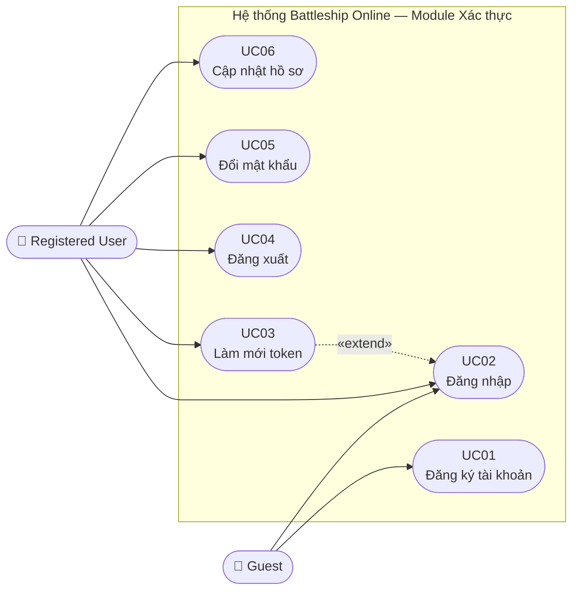
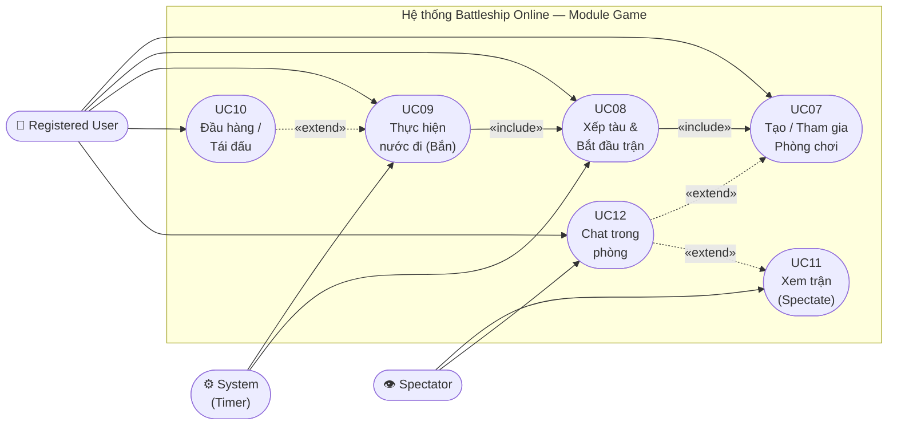
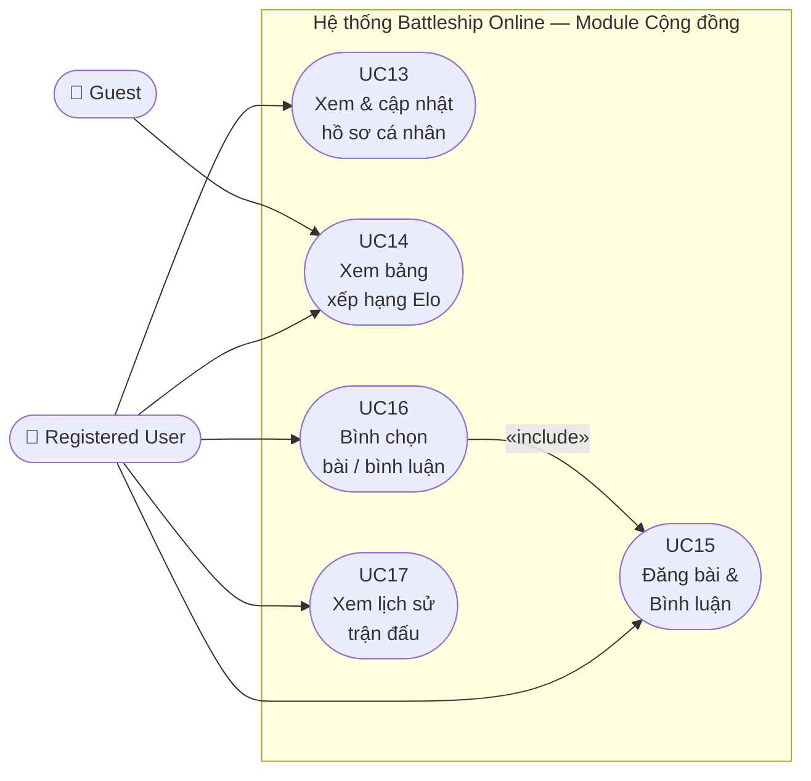

# BÁO CÁO KỸ THUẬT PHẦN MỀM

## HỆ THỐNG GAME BATTLESHIP TRỰC TUYẾN NHIỀU NGƯỜI CHƠI

---

**Môn học:** Phân tích và Thiết kế Hướng Đối tượng  
**Tên đề tài:** Hệ thống Game Battleship Trực tuyến (Online Multiplayer Battleship)  
**Nhóm thực hiện:** *(Điền tên thành viên)*  
**Ngày hoàn thành:** Tháng 4 năm 2026

---

## MỤC LỤC

1. [Introduction](#1-introduction)
2. [Problem Description](#2-problem-description)
3. [System Scope](#3-system-scope)
4. [Phân tích các yêu cầu](#4-phân-tích-các-yêu-cầu)
5. [Use Case Model](#5-use-case-model)
6. [Use Case Specification](#6-use-case-specification)
7. [Domain Model](#7-domain-model)
8. [CRC Cards](#8-crc-cards)
9. [BCE Architecture](#9-bce-architecture)
10. [Sequence Diagrams](#10-sequence-diagrams)
11. [Design Class Diagram](#11-design-class-diagram)
12. [State Machine Diagram](#12-state-machine-diagram)
13. [Implementation](#13-implementation)
14. [Conclusion](#14-conclusion)

---

## 1. Introduction

### 1.1. Giới thiệu bài toán

#### 1.1.1. Lý do chọn đề tài

Trong những năm gần đây, ngành công nghiệp game trực tuyến đã trở thành một trong những lĩnh vực phát triển nhanh nhất của công nghệ thông tin toàn cầu. Theo báo cáo của Newzoo (2024), thị trường game toàn cầu đạt hơn 184 tỷ USD doanh thu, trong đó phân khúc game trực tuyến nhiều người chơi (online multiplayer) chiếm tỷ trọng ngày càng lớn nhờ sự bùng nổ của hạ tầng internet băng thông rộng và thiết bị di động thông minh. Bối cảnh đó đặt ra một bài toán kỹ thuật hấp dẫn và có giá trị thực tiễn cao: làm thế nào để xây dựng một hệ thống phần mềm vừa đảm bảo **trải nghiệm thời gian thực** (real-time), vừa **an toàn, mở rộng được** và **có tính cộng đồng** cao?

Nhóm lựa chọn đề tài **Hệ thống Game Battleship Trực tuyến** xuất phát từ ba lý do cốt lõi:

**Thứ nhất — Tính đại diện kỹ thuật cao:**
Game Battleship tuy có luật chơi đơn giản nhưng để triển khai dưới dạng hệ thống trực tuyến nhiều người chơi, nó đòi hỏi giải quyết hầu hết các bài toán kỹ thuật tiêu biểu của một ứng dụng web hiện đại: giao tiếp hai chiều thời gian thực (WebSocket), quản lý trạng thái phân tán (match state, room state), xác thực và phân quyền (JWT), đồng bộ hóa dữ liệu đồng thời (concurrency), và tích hợp nhiều hệ thống lưu trữ (PostgreSQL + Redis). Điều này làm cho đề tài trở thành một **sân thực hành lý tưởng** cho các kỹ năng phân tích và thiết kế hướng đối tượng.

**Thứ hai — Phạm vi bài toán vừa đủ và có chiều sâu:**
Không quá nhỏ (như một ứng dụng quản lý đơn giản) cũng không quá rộng (như một hệ thống thương mại điện tử toàn diện), Battleship online cung cấp đủ các thực thể miền (User, Room, Match, Move, Forum, Leaderboard) để thực hành đầy đủ các kỹ thuật phân tích yêu cầu, mô hình hóa Use Case, thiết kế lớp, biểu đồ trình tự và máy trạng thái — đáp ứng toàn bộ yêu cầu của môn học Phân tích và Thiết kế Hướng Đối tượng.

**Thứ ba — Tính ứng dụng và mở rộng thực tế:**
Kết quả của đề tài không chỉ dừng lại ở bản báo cáo lý thuyết mà là một sản phẩm phần mềm **hoạt động thực tế** — đã được triển khai với đầy đủ frontend (React + Vite), backend (NestJS), cơ sở dữ liệu (PostgreSQL) và hạ tầng cache (Redis). Các mẫu kiến trúc được áp dụng (BCE, Repository, Gateway Pattern, Elo Rating System) đều là những pattern phổ biến trong phát triển phần mềm công nghiệp, mang lại giá trị học thuật lẫn thực tiễn thiết thực cho nhóm.

---

Trong bối cảnh ngành công nghiệp game trực tuyến phát triển mạnh mẽ, nhu cầu xây dựng các hệ thống game nhiều người chơi (multiplayer) đòi hỏi kiến trúc phần mềm phức tạp, xử lý đồng thời theo thời gian thực và đảm bảo trải nghiệm người dùng liền mạch. Báo cáo này trình bày phân tích và thiết kế hướng đối tượng cho một hệ thống game **Battleship (Trận chiến tàu chiến)** trực tuyến — một trò chơi chiến thuật kinh điển được số hóa và mở rộng với các tính năng cộng đồng hiện đại.

Battleship là trò chơi dành cho hai người, trong đó mỗi người dùng bố trí một hạm đội tàu chiến trên một bảng cờ ô vuông, sau đó lần lượt thực hiện các "lần bắn" để phát hiện và đánh chìm toàn bộ hạm đội của đối thủ. Người đầu tiên đánh chìm hết tàu của đối phương là người chiến thắng.

Hệ thống được đề cập trong báo cáo này mở rộng luật chơi cổ điển bằng các tính năng:
- **Chế độ chơi trực tuyến thời gian thực** thông qua giao thức WebSocket.
- **Hệ thống xếp hạng Elo** tự động cập nhật sau mỗi trận đấu, phản ánh kỹ năng người chơi.
- **Chế độ khán giả (Spectator Mode)** cho phép người dùng khác theo dõi trận đấu đang diễn ra.
- **Diễn đàn cộng đồng** để người chơi trao đổi, chia sẻ kinh nghiệm.
- **Bảng xếp hạng toàn cầu** hiển thị top người chơi.
- **Chế độ chơi offline với Bot** với nhiều mức độ khó.

### 1.2. Mục tiêu hệ thống

Mục tiêu trọng tâm của hệ thống là mang lại trải nghiệm thi đấu **liền mạch, công bằng và có chiều sâu cộng đồng** cho người chơi thông qua một nền tảng web hiện đại. Để đạt được điều đó, hệ thống hướng đến sáu nhóm mục tiêu cụ thể.

Trước hết, hệ thống phải đảm bảo **giao tiếp thời gian thực** — mọi nước đi, kết quả bắn, thay đổi trạng thái phòng hay tin nhắn chat đều được phản ánh tức thì đến tất cả người tham gia mà không có độ trễ đáng kể, thông qua giao thức WebSocket. Gắn liền với đó là mục tiêu **công bằng trong xếp hạng**: hệ thống tích hợp thuật toán Elo với K-factor động, tự động điều chỉnh điểm số sau mỗi trận PvP nhằm phản ánh trung thực trình độ thực sự của từng người chơi, đồng thời kích thích động lực thi đấu và cải thiện kỹ năng liên tục.

Song song với trải nghiệm thi đấu, hệ thống chú trọng **xây dựng cộng đồng** xung quanh game: diễn đàn cho phép người chơi trao đổi chiến thuật và kinh nghiệm, chế độ khán giả tạo ra không gian theo dõi trận đấu như một sự kiện thể thao điện tử, và hệ thống chat riêng biệt cho từng nhóm đối tượng đảm bảo giao tiếp không bị nhiễu loạn.

Ở góc độ kỹ thuật, hệ thống được thiết kế với **kiến trúc module hóa cao** — mỗi nhóm chức năng (Auth, Game, Chat, Forum, Leaderboard) được tách thành module độc lập, sẵn sàng mở rộng hoặc tái cấu trúc mà không ảnh hưởng đến toàn bộ hệ thống. **Bảo mật** được đặt làm yêu cầu nền tảng, không phải lớp bổ sung: mật khẩu được băm bằng bcrypt, phiên đăng nhập được bảo vệ bằng JWT hai cấp với HTTP-only cookie, và mọi sự kiện WebSocket đều yêu cầu xác thực token hợp lệ trước khi xử lý. Cuối cùng, giao diện được xây dựng với khả năng **hỗ trợ đa ngôn ngữ** thông qua i18next, hướng đến cộng đồng người chơi đa dạng và không bị giới hạn bởi rào cản ngôn ngữ.

### 1.3. Công nghệ sử dụng

Hệ thống áp dụng kiến trúc **Client-Server** với phân tách rõ ràng giữa frontend và backend.

**Phía máy khách (Frontend):**

| Thư viện / Công cụ | Phiên bản | Mục đích |
|--------------------|-----------|----------|
| React | 19 | Xây dựng giao diện người dùng |
| Vite | 7 | Công cụ build và dev server |
| React Router | 7 | Điều hướng phía client (SPA) |
| Tailwind CSS | 4 | Styling theo utility-first |
| Axios | — | Giao tiếp HTTP REST API |
| socket.io-client | — | Giao tiếp WebSocket thời gian thực |
| i18next | — | Hỗ trợ đa ngôn ngữ |
| Motion / Lottie | — | Hiệu ứng animation |

**Phía máy chủ (Backend):**

| Thư viện / Công cụ | Phiên bản | Mục đích |
|--------------------|-----------|----------|
| NestJS | 11 | Framework server-side Node.js |
| TypeORM | — | ORM ánh xạ đối tượng - cơ sở dữ liệu |
| PostgreSQL | — | Hệ quản trị cơ sở dữ liệu quan hệ |
| Redis (ioredis) | — | Lưu trữ lịch sử chat, cache |
| Socket.IO | — | Giao tiếp WebSocket thời gian thực |
| JWT (Passport) | — | Xác thực và phân quyền |
| bcrypt | — | Mã hóa mật khẩu một chiều |

---

## 2. Problem Description

### 2.1. Mô tả bài toán thực tế

Bài toán đặt ra là xây dựng một nền tảng game chiến thuật trực tuyến nơi người chơi có thể:

1. **Tìm đối thủ và tổ chức trận đấu** thông qua hệ thống phòng chơi (room). Người chơi có thể tạo phòng riêng tư (private) để mời bạn bè qua mã phòng, hoặc tham gia phòng công khai (public) để ghép với người lạ.

2. **Thi đấu theo thời gian thực**: Sau khi cả hai người chơi bố trí tàu, họ lần lượt bắn vào bảng của nhau. Mỗi lượt có giới hạn thời gian — nếu hết giờ, lượt đi sẽ bị bỏ qua hoặc người chơi đó thua. Kết quả mỗi lần bắn (trúng/trượt/chìm) được thông báo ngay lập tức cho cả hai.

3. **Theo dõi trình độ và xếp hạng**: Sau mỗi trận, điểm Elo của cả hai người chơi được cập nhật theo công thức chuẩn — người thắng tăng điểm, người thua giảm điểm, mức thay đổi phụ thuộc vào chênh lệch trình độ giữa hai bên.

4. **Tham gia cộng đồng**: Người dùng có thể đăng bài, bình luận, bình chọn nội dung trên diễn đàn, và xem các trận đấu đang diễn ra với tư cách khán giả.

### 2.2. Phân tích các chức năng, tác nhân trong hệ thống

Để xây dựng hệ thống đúng trọng tâm và phân bổ chức năng hợp lý, nhóm tiến hành xác định các tác nhân tham gia hệ thống cùng với nhóm chức năng tương ứng mà mỗi tác nhân có thể thực hiện.

#### 2.2.1. Các tác nhân trong hệ thống

Hệ thống game Battleship trực tuyến xác định bốn tác nhân, trong đó ba tác nhân là con người và một tác nhân là hệ thống tự động.

**Khách vãng lai (Guest)** là tác nhân có mức quyền hạn thấp nhất. Họ truy cập nền tảng mà không có tài khoản hoặc chưa đăng nhập, do đó chỉ được phép xem các nội dung công khai như bảng xếp hạng Elo và bài viết diễn đàn. Mục tiêu chính của nhóm này là tìm hiểu về hệ thống trước khi quyết định đăng ký tài khoản. Guest có thể chuyển sang vai trò Registered User sau khi hoàn thành đăng ký.

**Người chơi đã đăng ký (Registered User)** là tác nhân trung tâm và quan trọng nhất, là đối tượng mà toàn bộ hệ thống được xây dựng để phục vụ. Sau khi đăng nhập thành công, họ có quyền truy cập đầy đủ vào các tính năng: tạo và tham gia phòng chơi, thi đấu PvP theo thời gian thực, theo dõi điểm Elo cá nhân, xem lịch sử trận đấu, quản lý hồ sơ và tương tác trên diễn đàn cộng đồng. Một Registered User có thể linh hoạt chuyển sang vai trò Spectator khi lựa chọn theo dõi trận đấu của người khác thay vì tham gia trực tiếp.

**Khán giả (Spectator)** là vai trò phụ mà một Registered User đảm nhận khi tham gia xem một trận đấu đang diễn ra. Tác nhân này nhận luồng cập nhật trạng thái trận đấu theo thời gian thực nhưng không có quyền can thiệp vào diễn biến trận — thông tin vị trí tàu của cả hai người chơi bị ẩn hoàn toàn để đảm bảo tính công bằng. Khán giả được cấp quyền sử dụng kênh chat riêng, tách biệt với kênh chat của người trong phòng.

**Hệ thống (System Actor)** là tác nhân tự động, đại diện cho các hành động được kích hoạt theo cơ chế thời gian hoặc sự kiện mà không cần sự can thiệp của người dùng. Cụ thể, System Actor chịu trách nhiệm: tự động chuyển lượt khi đồng hồ đếm ngược về 0, đóng phòng khi đến thời hạn hết hạn, và tính toán cùng cập nhật điểm Elo sau khi trận đấu kết thúc.

#### 2.2.2. Phân tích các chức năng theo tác nhân

Dựa trên bốn tác nhân xác định ở trên, các chức năng của hệ thống được phân bổ như sau:

| Nhóm chức năng | Chức năng cụ thể | Guest | User | Spectator | System |
|----------------|-----------------|:-----:|:----:|:---------:|:------:|
| **Xác thực** | Đăng ký tài khoản | ✓ | | | |
| | Đăng nhập / Đăng xuất | ✓ | ✓ | | |
| | Làm mới phiên (token refresh) | | ✓ | ✓ | |
| **Hồ sơ cá nhân** | Xem hồ sơ công khai | ✓ | ✓ | ✓ | |
| | Cập nhật hồ sơ, avatar | | ✓ | | |
| | Đổi mật khẩu | | ✓ | | |
| **Phòng chơi** | Xem danh sách phòng mở | | ✓ | | |
| | Tạo / Tham gia / Rời phòng | | ✓ | | |
| | Kết nối lại sau mất kết nối | | ✓ | | |
| | Tự động đóng phòng hết hạn | | | | ✓ |
| **Trận đấu** | Cấu hình bảng, xếp tàu | | ✓ | | |
| | Thực hiện nước đi (bắn) | | ✓ | | |
| | Đầu hàng / Tái đấu | | ✓ | | |
| | Tự động chuyển lượt hết giờ | | | | ✓ |
| | Xác định thắng / thua | | | | ✓ |
| **Khán giả** | Theo dõi trận thời gian thực | | | ✓ | |
| | Chat kênh khán giả | | | ✓ | |
| **Xếp hạng** | Xem bảng xếp hạng Elo | ✓ | ✓ | ✓ | |
| | Cập nhật Elo sau trận | | | | ✓ |
| | Xem lịch sử trận đấu | | ✓ | | |
| **Diễn đàn** | Xem bài viết, bình luận | ✓ | ✓ | ✓ | |
| | Đăng bài / Bình luận | | ✓ | | |
| | Chỉnh sửa / Xóa bài của mình | | ✓ | | |
| | Bình chọn bài / bình luận | | ✓ | | |

Từ bảng phân tích trên có thể thấy rõ: **Registered User** là tác nhân có phạm vi tương tác rộng nhất, bao phủ hầu hết các chức năng của hệ thống. **Guest** chỉ tiếp cận được các tính năng đọc công khai, đóng vai trò như "cửa sổ trưng bày" để thu hút người dùng mới. **Spectator** có quyền truy cập hẹp hơn User, tập trung vào quan sát thụ động. **System** xử lý các tác vụ nền không hiển thị trực tiếp với người dùng nhưng đảm bảo tính toàn vẹn và công bằng của toàn bộ hệ thống.

---

## 3. System Scope

Phạm vi của bài toán "Xây dựng hệ thống game Battleship trực tuyến" được xác định như sau:

### 3.1. Phạm vi chức năng

Ứng dụng có những chức năng được phân chia thành hai nhóm: chức năng cơ bản (đã triển khai đầy đủ) và chức năng mở rộng (được xác định cho tương lai).

**a) Chức năng cơ bản:**

- Đăng ký, đăng nhập, đăng xuất và làm mới phiên người dùng.
- Tạo và tham gia phòng chơi theo chế độ công khai hoặc riêng tư (qua mã phòng 6 ký tự).
- Xếp tàu thủ công hoặc tự động ngẫu nhiên trước khi bắt đầu trận.
- Thi đấu PvP theo thời gian thực: lần lượt bắn, phát hiện trúng/trượt/chìm, xác định thắng/thua.
- Xem trận đấu với tư cách khán giả và chat trong kênh khán giả riêng.
- Xem bảng xếp hạng Elo toàn cầu và lịch sử trận đấu cá nhân.
- Đăng bài, bình luận, bình chọn nội dung trên diễn đàn cộng đồng.
- Cập nhật thông tin cá nhân: ảnh đại diện, chữ ký, đổi mật khẩu.
- Chơi offline với bot ở các mức độ dễ và khó.

**b) Chức năng mở rộng:**

- Hệ thống matchmaking tự động ghép đôi người chơi theo trình độ Elo, thay thế việc tìm phòng thủ công.
- Tổ chức giải đấu có cấu trúc (tournament bracket) với lịch thi đấu và bảng kết quả.
- Tích hợp hệ thống thông báo đẩy (push notification) qua email hoặc thiết bị di động khi có người mời đấu hoặc có cập nhật diễn đàn.
- Xây dựng tính năng bạn bè: theo dõi, danh sách bạn bè, mời bạn vào phòng trực tiếp.
- Phát triển ứng dụng di động native (iOS / Android) sử dụng cùng backend API.
- Xây dựng màn hình replay trận đấu, cho phép xem lại từng nước đi sau khi trận kết thúc.
- Tích hợp bot AI nâng cao với thuật toán probabilistic density map hoặc học máy.
- Xây dựng API mở cho đối tác và các hệ thống bên thứ ba tích hợp dữ liệu xếp hạng và kết quả trận đấu.

### 3.2. Phạm vi kỹ thuật

- Hệ thống được phân tích và thiết kế theo các bước mô hình hóa hướng đối tượng, sử dụng các công cụ UML hiện đại: Use Case Diagram, Domain Model (Conceptual Class Diagram), Sequence Diagram, Detailed Class Diagram và State Machine Diagram.
- Áp dụng kiến trúc BCE (Boundary-Control-Entity) để phân tách rõ ràng các tầng giao tiếp, nghiệp vụ và dữ liệu.
- Tuân theo các nguyên lý thiết kế SOLID, đặc biệt là Single Responsibility và Dependency Inversion, nhằm đảm bảo tính mở rộng, dễ bảo trì và khả năng tích hợp dễ dàng với các hệ thống bên ngoài.
- Sử dụng mô hình Client-Server với giao tiếp REST API (HTTP/JSON) cho các thao tác dữ liệu và WebSocket (Socket.IO) cho các tương tác thời gian thực trong game.

### 3.3. Giới hạn đề tài

- Đề tài tập trung vào cả hai khía cạnh: **phân tích, thiết kế hệ thống** theo hướng đối tượng và **triển khai mã nguồn thực tế** — đây là sản phẩm phần mềm hoạt động được, không chỉ là tài liệu thiết kế.
- Các chức năng mở rộng (matchmaking tự động, giải đấu, ứng dụng di động) được xác định trong phần phạm vi mở rộng nhưng **chưa được triển khai** trong phiên bản hiện tại; chúng chỉ được đề cập ở mức thiết kế kiến trúc để xác định hướng phát triển trong tương lai.
- Các yếu tố như bảo mật nâng cao (rate limiting, WAF), tối ưu hoá hiệu năng quy mô lớn (horizontal scaling, CDN) và triển khai hạ tầng (Kubernetes, CI/CD pipeline) được đề cập ở mức khái quát trong phần kết luận nhằm xác định khả năng mở rộng, không đi vào chi tiết cấu hình vận hành.

---

## 4. Phân tích các yêu cầu

Trong quá trình xây dựng hệ thống game Battleship trực tuyến, nhóm đề tài tiến hành phân tích và xác định các yêu cầu hệ thống theo hai chiều: yêu cầu chức năng — mô tả những gì hệ thống phải làm, và yêu cầu phi chức năng — mô tả hệ thống phải hoạt động như thế nào. Việc xác định rõ cả hai nhóm yêu cầu này là nền tảng để thiết kế kiến trúc và đưa ra các quyết định kỹ thuật phù hợp, đảm bảo sản phẩm cuối đáp ứng đúng nhu cầu thực tế của người dùng.

### 4.1. Đối tượng sử dụng hệ thống

Hệ thống game Battleship trực tuyến được thiết kế để phục vụ nhiều nhóm đối tượng khác nhau, mỗi nhóm có nhu cầu và mức độ tương tác riêng biệt với hệ thống.

- **Khách vãng lai (Guest):** Đây là những người truy cập nền tảng mà chưa có tài khoản hoặc chưa đăng nhập. Nhóm này có thể xem bảng xếp hạng Elo toàn cầu và đọc nội dung diễn đàn công khai, qua đó tìm hiểu về cộng đồng trước khi quyết định đăng ký. Giao diện dành cho nhóm này cần trực quan, hấp dẫn và dễ thúc đẩy chuyển đổi sang tài khoản đăng ký.

- **Người chơi đã đăng ký (Registered User):** Đây là đối tượng trung tâm và quan trọng nhất của hệ thống. Họ yêu cầu trải nghiệm thi đấu liền mạch theo thời gian thực — từ tạo hoặc tham gia phòng chơi, bố trí hạm đội tàu chiến, lần lượt bắn cho đến khi trận kết thúc và điểm Elo được cập nhật. Ngoài gameplay, nhóm này còn cần các tính năng quản lý cá nhân như chỉnh sửa hồ sơ, xem lịch sử trận đấu và tham gia diễn đàn để kết nối với cộng đồng.

- **Khán giả (Spectator):** Là người dùng đã đăng nhập nhưng lựa chọn theo dõi một trận đấu đang diễn ra thay vì tham gia. Nhóm này yêu cầu luồng cập nhật trận đấu theo thời gian thực giống như người chơi, nhưng không được tiếp cận thông tin vị trí tàu của bất kỳ bên nào để đảm bảo tính công bằng. Kênh chat riêng dành cho khán giả giúp họ trao đổi mà không làm phiền người đang thi đấu.

- **Hệ thống (System Actor):** Một số hành động trong hệ thống được kích hoạt tự động mà không cần can thiệp của người dùng, chẳng hạn tự động chuyển lượt khi đồng hồ đếm ngược về 0, tự động đóng phòng khi hết thời hạn, hoặc tính toán và cập nhật điểm Elo sau khi trận kết thúc.

### 4.2. Xác định yêu cầu chức năng

Các chức năng chính mà hệ thống cần đảm bảo bao gồm:

- **Đăng ký và xác thực tài khoản:** Người dùng tạo tài khoản bằng email, username và mật khẩu. Hệ thống kiểm tra tính duy nhất của email và username, khởi tạo điểm Elo mặc định là 800. Đăng nhập trả về access token (JWT) và đặt refresh token trong HTTP-only cookie; cơ chế xoay vòng token (token rotation) bảo vệ phiên đăng nhập khỏi bị chiếm đoạt.

- **Tạo và quản lý phòng chơi:** Người chơi tạo phòng công khai hoặc riêng tư với mã code 6 ký tự ngẫu nhiên. Người khác tham gia qua ID phòng hoặc nhập mã trực tiếp. Phòng không hoạt động trong thời gian quy định sẽ tự động đóng để giải phóng tài nguyên; người chơi mất kết nối có thể kết nối lại và tiếp tục trận đang dang dở.

- **Xếp tàu và tiến hành trận đấu:** Sau khi chủ phòng khởi động, mỗi người chơi bố trí hạm đội trong thời hạn quy định (mặc định 60 giây), hỗ trợ cả xếp tàu thủ công lẫn tự động ngẫu nhiên. Trận đấu diễn ra theo lượt — mỗi lượt người chơi chọn một tọa độ để bắn, nhận phản hồi tức thì (trúng, trượt hoặc chìm), và lượt chuyển sang đối thủ. Thời hạn mỗi lượt (mặc định 30 giây) được tính và lưu phía server, đảm bảo đúng ngay cả khi client mất kết nối. Khi toàn bộ tàu của một bên bị chìm, hệ thống tự động xác định và công bố người thắng. Người chơi cũng có thể chủ động đầu hàng hoặc bỏ phiếu tái đấu sau khi trận kết thúc.

- **Chế độ khán giả và chat:** Người dùng đã đăng nhập có thể tham gia xem bất kỳ trận đấu công khai nào theo thời gian thực. Thông tin vị trí tàu của cả hai người chơi bị ẩn hoàn toàn với khán giả. Khán giả sử dụng kênh chat riêng, tách biệt với chat của người trong phòng, tránh làm ảnh hưởng đến sự tập trung của người thi đấu.

- **Xếp hạng Elo và lịch sử trận đấu:** Sau mỗi trận PvP kết thúc, hệ thống tự động tính toán và cập nhật điểm Elo của cả hai người trong một giao dịch nguyên tử (atomic transaction) với pessimistic locking, đảm bảo mỗi trận chỉ được tính một lần. Bảng xếp hạng toàn cầu hiển thị công khai. Người chơi đã đăng nhập có thể xem lại lịch sử trận đấu của bản thân với thống kê chi tiết.

- **Diễn đàn cộng đồng:** Người dùng đã đăng nhập có thể tạo bài viết, bình luận, chỉnh sửa và xóa nội dung của mình. Nội dung được lọc (sanitize) trước khi lưu để phòng chống XSS. Hệ thống hỗ trợ bình chọn upvote/downvote cho cả bài viết lẫn bình luận, với cơ chế hủy bình chọn khi người dùng chọn lại lần nữa.

- **Quản lý hồ sơ cá nhân:** Người dùng có thể cập nhật ảnh đại diện (upload multipart), chữ ký cá nhân và đổi mật khẩu sau khi xác minh mật khẩu hiện tại.

### 4.3. Yêu cầu phi chức năng

Bên cạnh các chức năng chính, hệ thống cần thỏa mãn một số yêu cầu phi chức năng để đảm bảo tính ổn định, an toàn và trải nghiệm người dùng chất lượng cao.

- **Hiệu suất thời gian thực:** Toàn bộ giao tiếp game — bao gồm nước đi, kết quả bắn, cập nhật trạng thái phòng và tin nhắn chat — sử dụng giao thức WebSocket (Socket.IO) thay vì HTTP polling, đảm bảo độ trễ end-to-end dưới 200ms trong điều kiện mạng bình thường. Lịch sử chat được lưu trong Redis với giới hạn kích thước và TTL, tránh tích lũy dữ liệu không kiểm soát.

- **Bảo mật toàn diện:** Mật khẩu người dùng được băm bằng bcrypt và không bao giờ lưu dưới dạng plaintext. Access token JWT có thời hạn ngắn; refresh token được lưu dưới dạng hash trong database và đặt trong HTTP-only cookie để chống tấn công XSS. Mọi kết nối WebSocket đều yêu cầu token hợp lệ ngay từ bước handshake — kết nối không xác thực bị ngắt lập tức. Chính sách CORS chỉ cho phép các origin được cấu hình tường minh qua biến môi trường.

- **Khả năng mở rộng:** Backend được phân chia thành các NestJS module độc lập (Auth, Game, Chat, Forum, Leaderboard), tạo nền tảng để tách thành microservice khi tải tăng cao. Cơ sở dữ liệu sử dụng UUID làm khóa chính để tránh xung đột khi phân tán. Redis đóng vai trò lớp trung gian sẵn sàng mở rộng sang cluster.

- **Tính khả dụng và chịu lỗi:** Deadline của từng lượt đi và giai đoạn xếp tàu được lưu vào database — không lưu trong bộ nhớ — đảm bảo hệ thống tiếp tục đúng trạng thái ngay cả khi server khởi động lại. Cơ chế version field trong `MatchEntity` hỗ trợ kiểm soát tương tranh (optimistic concurrency control), ngăn chặn race condition khi có cập nhật đồng thời.

- **Khả năng bảo trì:** Toàn bộ mã nguồn sử dụng TypeScript với kiểu dữ liệu chặt chẽ ở cả frontend lẫn backend, giúp phát hiện lỗi ngay tại thời điểm biên dịch. Các hằng số định danh sự kiện WebSocket được tập trung trong một file `GameEvents` thay vì dùng chuỗi ký tự trực tiếp, tránh lỗi đánh máy và dễ refactor. Mã nguồn tuân theo nguyên lý SOLID — đặc biệt Single Responsibility — đảm bảo mỗi service chỉ đảm nhiệm một nhóm trách nhiệm rõ ràng.

- **Đa ngôn ngữ:** Giao diện người dùng hỗ trợ nhiều ngôn ngữ thông qua thư viện i18next và react-i18next. Tất cả chuỗi văn bản hiển thị được quản lý tập trung qua file ngôn ngữ, không hardcode trực tiếp vào component, tạo điều kiện mở rộng sang các ngôn ngữ mới mà không cần sửa mã nguồn giao diện.

---

## 6. Use Case Model

### 6.1. Tổng quan các Use Case

Hệ thống xác định **13 Use Case** phân bổ cho ba Actor:

| Mã UC | Tên Use Case | Actor chính | Nhóm |
|-------|-------------|-------------|------|
| UC01 | Đăng ký tài khoản | Guest | Xác thực |
| UC02 | Đăng nhập | Guest / User | Xác thực |
| UC03 | Tạo / Tham gia phòng chơi | User | Game |
| UC04 | Xếp tàu và Bắt đầu trận | User | Game |
| UC05 | Thực hiện nước đi (Bắn) | User | Game |
| UC06 | Đầu hàng / Tái đấu | User | Game |
| UC07 | Xem trận đấu (Spectate) | Spectator | Game |
| UC08 | Chat trong phòng | User / Spectator | Game |
| UC09 | Xem và cập nhật hồ sơ | User | Cộng đồng |
| UC10 | Xem bảng xếp hạng Elo | Guest / User | Cộng đồng |
| UC11 | Đăng bài và Bình luận | User | Cộng đồng |
| UC12 | Bình chọn bài / bình luận | User | Cộng đồng |
| UC13 | Xem lịch sử trận đấu | User | Cộng đồng |

### 6.2. Biểu đồ Use Case — Nhóm Xác thực



**Quan hệ giữa các Use Case:**
- `UC02 Đăng nhập` là tiên quyết cho mọi UC yêu cầu xác thực.
- `UC03 Làm mới token` là mở rộng (`«extend»`) tự động của `UC02`, xảy ra khi access token hết hạn.

### 6.3. Biểu đồ Use Case — Nhóm Game



**Ghi chú quan hệ:**
- `UC08` `«include»` `UC07`: không thể xếp tàu nếu chưa ở trong phòng.
- `UC09` `«include»` `UC08`: không thể bắn nếu chưa xếp tàu xong.
- `UC10` `«extend»` `UC09`: đầu hàng hoặc tái đấu là hành vi tùy chọn sau khi trận diễn ra.
- System Actor kích hoạt hành động hết giờ tại `UC08` (xếp tàu) và `UC09` (lượt bắn).

### 6.4. Biểu đồ Use Case — Nhóm Cộng đồng



**Ghi chú quan hệ:**
- `UC16 Bình chọn` `«include»` `UC15`: người dùng phải xem bài viết/bình luận trước khi có thể bình chọn.
- Guest chỉ truy cập `UC14` (bảng xếp hạng) — toàn bộ UC còn lại yêu cầu đăng nhập.

---

## 7. Use Case Specification

### 7.1. Đặc tả UC04 — Xếp tàu và Bắt đầu Trận

| Trường | Nội dung |
|--------|----------|
| **Mã Use Case** | UC04 |
| **Tên** | Xếp tàu và Bắt đầu Trận đấu |
| **Actor chính** | Registered User (Owner và Guest của phòng) |
| **Actor phụ** | Hệ thống (Timer) |
| **Điều kiện tiên quyết** | Cả hai người chơi đã ở trong phòng (`RoomEntity.status = 'waiting'`). Chủ phòng đã khởi động trận (`room:start` → `status = 'setup'`). |
| **Điều kiện hậu quyết** | Trận đấu bắt đầu: `MatchEntity` được tạo với trạng thái `in_progress`, bảng tàu của cả hai người chơi đã lưu. |
| **Kích hoạt** | Chủ phòng nhấn nút "Bắt đầu". |

**Luồng chính (Main Flow):**

1. Chủ phòng nhấn "Bắt đầu" → client gửi sự kiện `room:configureSetup` kèm cấu hình bảng (kích thước, danh sách tàu, thời gian lượt).
2. `GameGateway` nhận sự kiện, ủy quyền cho `GameService.configureRoomSetup()`.
3. `GameService` tạo `MatchEntity` mới với trạng thái `setup`, thiết lập `setupDeadlineAt` = thời gian hiện tại + `setupTimerSeconds`.
4. Hệ thống phát sóng sự kiện `server:roomUpdated` đến tất cả client trong phòng.
5. Mỗi người chơi kéo thả tàu lên bảng của mình trên giao diện `GameSetupPage`.
6. Khi xong, mỗi người chơi gửi `room:ready` kèm danh sách tọa độ các tàu (`PlacedShip[]`).
7. `GameService.markReady()` lưu `player1Placements` hoặc `player2Placements` vào `MatchEntity`.
8. Khi cả hai người chơi đã sẵn sàng, `MatchEntity.status` chuyển sang `in_progress`, `turnPlayerId` được thiết lập.
9. Hệ thống phát sóng `server:matchUpdated` — trận đấu bắt đầu.

**Luồng phụ (Alternative Flow):**

- **A1 — Xếp tàu ngẫu nhiên:** Tại bước 5, người chơi nhấn "Xếp tàu ngẫu nhiên". Client tính toán vị trí ngẫu nhiên hợp lệ (tối đa 300 lần thử) và gửi thẳng `room:ready` với danh sách đó.
- **A2 — Chỉ một người sẵn sàng:** Hệ thống phát `server:matchUpdated` để cập nhật UI nhưng chưa bắt đầu. Người còn lại thấy trạng thái "Đối thủ đã sẵn sàng".

**Luồng ngoại lệ (Exception Flow):**

- **E1 — Hết thời gian xếp tàu:** Timer hệ thống kích hoạt khi đến `setupDeadlineAt`. Người chơi chưa xếp xong bị xem là thua cuộc (hoặc bị xếp tàu ngẫu nhiên tùy cấu hình).
- **E2 — Mất kết nối:** Người chơi ngắt kết nối trong giai đoạn setup. Nếu kết nối lại trước `setupDeadlineAt`, có thể tiếp tục xếp tàu.
- **E3 — Cấu hình không hợp lệ:** `GameService` kiểm tra tàu không chồng lên nhau, không ra ngoài bảng. Nếu vi phạm, ném `BadRequestException` và client nhận `server:error`.

---

### 7.2. Đặc tả UC05 — Thực hiện Nước đi (Bắn)

| Trường | Nội dung |
|--------|----------|
| **Mã Use Case** | UC05 |
| **Tên** | Thực hiện Nước đi — Bắn vào tọa độ |
| **Actor chính** | Registered User (người đến lượt) |
| **Actor phụ** | Hệ thống (Timer), EloMatchService |
| **Điều kiện tiên quyết** | `MatchEntity.status = 'in_progress'`. Là lượt của người chơi hiện tại (`turnPlayerId = userId`). |
| **Điều kiện hậu quyết** | Kết quả lần bắn được lưu vào `player_Shots`. Lượt chuyển cho đối thủ, hoặc trận kết thúc nếu là nước thắng. |
| **Kích hoạt** | Người chơi nhấp vào ô trên bảng của đối thủ. |

**Luồng chính (Main Flow):**

1. Người chơi nhấp ô tọa độ `(x, y)` trên bảng đối thủ → client gửi `match:move` với `{ matchId, x, y, clientMoveId }`.
2. `GameGateway.handleMove()` lấy `userId` từ socket, ủy quyền cho `GameService.submitMove()`.
3. `GameService` kiểm tra:
   - `match.status === 'in_progress'`
   - `match.turnPlayerId === userId`
   - Tọa độ `(x, y)` chưa bị bắn trước đó
4. Xác định kết quả: so sánh `(x, y)` với vị trí tàu của đối thủ.
5. Tạo `MoveEntity` mới, lưu vào bảng `game_moves`.
6. Cập nhật mảng `playerNShots` trong `MatchEntity` với bản ghi `{ x, y, isHit, shipId }`.
7. Kiểm tra xem tất cả tàu đối thủ đã chìm chưa.
8. **[Nếu chưa thắng]:** Chuyển lượt — `turnPlayerId = đối thủ`, cập nhật `turnDeadlineAt`.
9. **[Nếu thắng]:** `match.status = 'finished'`, `match.winnerId = userId`. Gọi `EloMatchService.settleMatchElo(matchId)` trong background.
10. Phát sóng `server:matchUpdated` đến phòng chơi và phòng khán giả (với dữ liệu ẩn vị trí tàu).

**Luồng phụ (Alternative Flow):**

- **A1 — Bắn trúng:** `isHit = true`. Giao diện hiển thị ô đỏ trên bảng đối thủ. Lượt vẫn chuyển cho đối thủ (không bắn thêm khi trúng).
- **A2 — Chìm tàu:** Phát hiện tất cả ô của một tàu đã bị bắn. Giao diện hiển thị toàn bộ tàu chìm.

**Luồng ngoại lệ (Exception Flow):**

- **E1 — Sai lượt:** `GameService` ném `BadRequestException('NOT_YOUR_TURN')`. Client nhận `server:error`.
- **E2 — Tọa độ đã bắn:** `GameService` ném lỗi `CELL_ALREADY_SHOT`. Client nhận `server:error`.
- **E3 — Hết thời gian lượt:** Khi đến `turnDeadlineAt`, hệ thống tự động chuyển lượt (hoặc xử lý như đầu hàng tùy cấu hình).
- **E4 — Mất kết nối giữa lượt:** Đồng hồ vẫn chạy. Nếu hết giờ trước khi kết nối lại, lượt bị bỏ qua.

---

### 7.3. Đặc tả UC11 — Đăng bài và Bình luận Diễn đàn

| Trường | Nội dung |
|--------|----------|
| **Mã Use Case** | UC11 |
| **Tên** | Đăng bài viết và Bình luận trên Diễn đàn |
| **Actor chính** | Registered User |
| **Điều kiện tiên quyết** | Người dùng đã đăng nhập (access token hợp lệ). |
| **Điều kiện hậu quyết** | `ForumPostEntity` hoặc `ForumCommentEntity` mới được tạo với trạng thái `published`. |
| **Kích hoạt** | Người dùng nhấn "Đăng bài" hoặc "Gửi bình luận". |

**Luồng chính — Đăng bài (Main Flow):**

1. Người dùng điền tiêu đề và nội dung → nhấn "Đăng bài".
2. Client gửi `POST /api/forum/posts` với Bearer token trong header Authorization.
3. `JwtAuthGuard` xác thực token, trích xuất `userId`.
4. `ForumController.createPost()` nhận `CreatePostDto { title, content }`.
5. `ForumService.createPost()` gọi `sanitizeForumText()` để lọc nội dung.
6. Tạo `ForumPostEntity` mới với `id = UUID`, `authorId = userId`, `status = 'published'`, `voteScore = 0`.
7. Lưu vào database, trả về `ForumPostDto` đầy đủ.
8. Client render bài viết mới trong danh sách.

**Luồng chính — Bình luận:**

1. Người dùng nhập nội dung bình luận → nhấn "Gửi".
2. Client gửi `POST /api/forum/posts/:postId/comments`.
3. `ForumService.createComment()` kiểm tra bài viết tồn tại và `status = 'published'`.
4. Tạo `ForumCommentEntity` mới, cập nhật `post.commentCount += 1`.
5. Trả về `ForumCommentDto` cho client.

**Luồng phụ (Alternative Flow):**

- **A1 — Chỉnh sửa bài/bình luận:** `PATCH /api/forum/posts/:postId` hoặc `/comments/:commentId`. `ForumService` kiểm tra `authorId === userId` trước khi cập nhật.
- **A2 — Xóa bài:** `DELETE /api/forum/posts/:postId`. Bài không bị xóa vật lý — `status` chuyển sang `'archived'`. Bài archived không hiển thị trong danh sách công khai.

**Luồng ngoại lệ (Exception Flow):**

- **E1 — Không đủ quyền:** Người dùng cố sửa/xóa bài của người khác → `ForbiddenException`.
- **E2 — Bài đã archived:** Người dùng cố bình luận vào bài đã bị xóa → `BadRequestException`.
- **E3 — Nội dung rỗng / không hợp lệ:** Validation DTO thất bại → `422 Unprocessable Entity`.

---

## 8. Domain Model

### 8.1. Mô hình miền tổng thể

Mô hình miền (Conceptual Class Diagram) thể hiện các thực thể chính trong thế giới thực và mối quan hệ khái niệm giữa chúng, trước khi đi vào chi tiết kỹ thuật triển khai.

**Các lớp miền (Domain Classes):**

| Lớp miền | Thuộc tính khái niệm | Ý nghĩa thực tế |
|----------|---------------------|-----------------|
| **User** | id, email, username, elo, avatar, signature | Người tham gia nền tảng |
| **Room** | code, status, visibility, expiresAt | Không gian tổ chức một cuộc đấu |
| **Match** | status, boardConfig, turnTimer, setupTimer | Một ván đấu cụ thể với đầy đủ luật chơi |
| **Move** | x, y, isHit, sequence | Một nước đi trong ván đấu |
| **PlacedShip** | shipId, x, y, orientation | Vị trí một con tàu trên bảng của người chơi |
| **ForumPost** | title, content, voteScore, status | Bài viết trong diễn đàn |
| **ForumComment** | content, voteScore | Bình luận dưới bài viết |

### 8.2. Quan hệ giữa các lớp miền

```
User "1" ----owns----> "0..1" Room
User "1" ----joins---> "0..1" Room (as guest)
Room "1" ---creates--> "0..*" Match
Match "1" --records--> "0..*" Move
User "1" ---performs-> "0..*" Move
User "1" ---places---> "0..*" PlacedShip (per Match)
User "1" ---writes---> "0..*" ForumPost
ForumPost "1" --has--> "0..*" ForumComment
User "1" ---writes---> "0..*" ForumComment
User "0..*" -votes---> "0..*" ForumPost (through PostVote, value: +1/-1)
User "0..*" -votes---> "0..*" ForumComment (through CommentVote, value: +1/-1)
```

**Giải thích chi tiết từng quan hệ:**

| Quan hệ | Loại | Bội số | Mô tả |
|---------|------|--------|-------|
| User → Room (owner) | Association | 1 : 0..1 | Mỗi User có thể sở hữu tối đa 1 phòng đang hoạt động tại một thời điểm |
| User → Room (guest) | Association | 1 : 0..1 | Mỗi User có thể là khách trong tối đa 1 phòng đang hoạt động |
| Room → Match | Composition | 1 : 0..* | Phòng tạo ra các ván đấu. Khi phòng đóng, lịch sử match vẫn được giữ lại |
| Match → Move | Aggregation | 1 : 0..* | Ván đấu chứa chuỗi các nước đi. Move có thể tồn tại độc lập trong lịch sử |
| Match → PlacedShip | Composition | 1 : 0..10 (per player) | Vị trí tàu gắn chặt với ván đấu, không tồn tại ngoài ván |
| User → ForumPost | Association | 1 : 0..* | Người dùng viết nhiều bài |
| ForumPost → ForumComment | Composition | 1 : 0..* | Bình luận gắn chặt với bài viết |

---

## 9. CRC Cards

CRC (Class-Responsibility-Collaboration) Cards mô tả trách nhiệm của từng lớp và sự cộng tác giữa chúng.

---

**Thẻ CRC #1**

| **Lớp: User** | |
|---|---|
| **Trách nhiệm** | **Cộng tác** |
| Lưu trữ thông tin định danh (email, username) | Room (với tư cách Owner/Guest) |
| Duy trì trạng thái xác thực (refreshTokenHash) | Match (với tư cách Player) |
| Lưu điểm Elo và lịch sử thay đổi | ForumPost (với tư cách Author) |
| Cung cấp thông tin hồ sơ công khai | EloMatchService |

---

**Thẻ CRC #2**

| **Lớp: Room** | |
|---|---|
| **Trách nhiệm** | **Cộng tác** |
| Quản lý trạng thái phòng (waiting → setup → in_game → finished → closed) | User (Owner và Guest) |
| Lưu mã phòng duy nhất để người chơi tham gia | Match |
| Theo dõi sự sẵn sàng của cả hai người chơi | GameService |
| Kiểm soát chế độ hiển thị (public/private) | |
| Quản lý thời hạn tự động đóng (expiresAt) | |

---

**Thẻ CRC #3**

| **Lớp: Match** | |
|---|---|
| **Trách nhiệm** | **Cộng tác** |
| Lưu cấu hình bảng chơi và danh sách tàu | Room |
| Lưu vị trí tàu của mỗi người chơi | User (Player 1, Player 2) |
| Theo dõi lịch sử các lần bắn | Move |
| Quản lý lượt đi và deadline từng lượt | EloMatchService |
| Xác định người thắng khi trận kết thúc | |
| Ghi nhận trạng thái bình chọn tái đấu | |
| Đảm bảo Elo chỉ được cập nhật một lần (eloSettled) | |

---

**Thẻ CRC #4**

| **Lớp: Move** | |
|---|---|
| **Trách nhiệm** | **Cộng tác** |
| Ghi nhận một nước đi (tọa độ, kết quả) | Match |
| Duy trì thứ tự nước đi trong ván (sequence) | User (performer) |
| Hỗ trợ replay và phân tích trận đấu | |

---

**Thẻ CRC #5**

| **Lớp: ForumPost** | |
|---|---|
| **Trách nhiệm** | **Cộng tác** |
| Lưu tiêu đề và nội dung bài viết | User (Author) |
| Theo dõi điểm bình chọn tổng hợp (voteScore) | ForumComment |
| Quản lý vòng đời bài viết (published/archived) | ForumPostVote |
| Đếm số lượng bình luận (commentCount) | ForumService |

---

**Thẻ CRC #6**

| **Lớp: ForumComment** | |
|---|---|
| **Trách nhiệm** | **Cộng tác** |
| Lưu nội dung bình luận | ForumPost |
| Theo dõi điểm bình chọn | User (Author) |
| Cho phép chỉnh sửa và xóa | ForumCommentVote |

---

**Thẻ CRC #7 (Control)**

| **Lớp: GameGateway** | |
|---|---|
| **Trách nhiệm** | **Cộng tác** |
| Xác thực JWT khi client kết nối WebSocket | ITokenRepository |
| Nhận các sự kiện từ client và ủy quyền xử lý | GameService |
| Phát sóng cập nhật đến đúng phòng (room channel, spectator channel) | ChatService |
| Quản lý Socket.IO rooms để phân phối tin nhắn | |

---

**Thẻ CRC #8 (Control)**

| **Lớp: GameService** | |
|---|---|
| **Trách nhiệm** | **Cộng tác** |
| Điều phối toàn bộ logic game (tạo phòng, xếp tàu, nước đi, thắng thua) | RoomEntity (Repository) |
| Kiểm tra tính hợp lệ của mọi hành động game | MatchEntity (Repository) |
| Sinh mã phòng ngẫu nhiên không trùng lặp | MoveEntity (Repository) |
| Tính toán kết quả nước đi (trúng/chìm/thắng) | EloMatchService |
| Kích hoạt cập nhật Elo sau khi trận kết thúc | IUserRepository |

---

**Thẻ CRC #9 (Control)**

| **Lớp: EloMatchService** | |
|---|---|
| **Trách nhiệm** | **Cộng tác** |
| Tính toán thay đổi Elo theo công thức chuẩn (K-factor động) | MatchEntity |
| Áp dụng cập nhật Elo trong giao dịch ACID | UserEntity |
| Đảm bảo idempotency qua cờ eloSettled | DataSource (TypeORM) |
| Bảo vệ tránh cập nhật trùng lặp bằng pessimistic locking | elo.util (computeNewRatingsAfterWin) |

---

## 10. BCE Architecture

### 10.1. Tổng quan kiến trúc BCE

Kiến trúc BCE (Boundary-Control-Entity) phân chia các lớp phần mềm thành ba nhóm có trách nhiệm rõ ràng:
- **Boundary (Giao diện):** Tất cả các điểm tiếp xúc giữa hệ thống và thế giới bên ngoài (UI, API controllers, WebSocket gateways).
- **Control (Điều khiển):** Chứa logic nghiệp vụ, điều phối luồng dữ liệu giữa Boundary và Entity.
- **Entity (Thực thể):** Đại diện cho dữ liệu nghiệp vụ và các ràng buộc dữ liệu.

### 10.2. BCE — Module Game (WebSocket)

| Tầng | Lớp phía Server | Lớp phía Client |
|------|----------------|-----------------|
| **Boundary** | `GameGateway` — nhận/gửi sự kiện Socket.IO | `GameRoomsPage`, `WaitingRoomPage`, `GameSetupPage`, `GamePlayPage`, `GameSpectatePage` |
| **Control** | `GameService` — toàn bộ logic phòng và trận | `useOnlineRoom`, `useOnlineGamePlaySession`, `useSpectatorRoom` |
| | `EloMatchService` — tính toán và cập nhật Elo | `gameSocketService` |
| | `ChatService` — quản lý chat qua Redis | |
| **Entity** | `RoomEntity` | `RoomSnapshot` (DTO phía client) |
| | `MatchEntity` | `MatchSnapshot` (DTO phía client) |
| | `MoveEntity` | `ShotRecord` (type phía client) |
| | `UserEntity` (đọc Elo) | |

**Luồng dữ liệu Game:**

```
[GamePlayPage]           [GameGateway]           [GameService]         [MatchEntity]
     |                        |                        |                     |
     |-- match:move --------> |                        |                     |
     |                        |-- submitMove(userId) -> |                     |
     |                        |                        |-- validateMove() --> |
     |                        |                        |                     |
     |                        |                        |<-- match data ------ |
     |                        |                        |-- save MoveEntity    |
     |                        |                        |-- update shots[]     |
     |                        |                        |-- check winner       |
     |                        |<-- MatchSnapshot ------ |                     |
     |<-- server:matchUpdated |                        |                     |
```

### 10.3. BCE — Module Xác thực (REST)

| Tầng | Lớp phía Server | Lớp phía Client |
|------|----------------|-----------------|
| **Boundary** | `AuthController` — REST endpoints `/api/auth/*` | `LoginModal`, `RegisterModal`, `ChangePasswordModal` |
| **Control** | `AuthService` — đăng ký, đăng nhập, refresh, đăng xuất | `authService` (Axios wrapper) |
| | `JwtStrategy` — xác thực token qua Passport | `authToken` (quản lý token) |
| | `JwtAuthGuard` — bảo vệ route yêu cầu xác thực | Axios interceptors (tự động refresh) |
| **Entity** | `UserEntity` — dữ liệu người dùng | |
| | `IUserRepository` — trừu tượng hóa truy cập DB | |
| | `ITokenRepository` — tạo và xác thực JWT | |
| | `IPasswordHasherRepository` — bcrypt abstraction | |

### 10.4. BCE — Module Diễn đàn (REST)

| Tầng | Lớp phía Server | Lớp phía Client |
|------|----------------|-----------------|
| **Boundary** | `ForumController` — REST endpoints `/api/forum/*` | `ForumFeedPage`, `ForumPostDetail`, `ForumPostCreate`, `ForumPostEdit` |
| **Control** | `ForumService` — CRUD bài viết, bình luận, vote | `forumService` (Axios wrapper) |
| **Entity** | `ForumPostEntity` | |
| | `ForumCommentEntity` | |
| | `ForumPostVoteEntity` | |
| | `ForumCommentVoteEntity` | |

---

## 11. Sequence Diagrams

### 11.1. Sequence Diagram — UC04: Xếp tàu và Bắt đầu Trận

Sơ đồ mô tả luồng tương tác từ khi chủ phòng kích hoạt bắt đầu đến khi trận đấu chính thức diễn ra.

```
Client (Owner)    GameGateway        GameService        RoomEntity    MatchEntity
     |                 |                  |                  |              |
     |--room:configureSetup(config)------->|                  |              |
     |                 |--configureRoomSetup(userId, config)->|              |
     |                 |                  |--findRoom(id)---->|              |
     |                 |                  |<--room data-------|              |
     |                 |                  |--createMatch()------------------->|
     |                 |                  |  (status='setup', setupDeadline) |
     |                 |                  |<--matchEntity--------------------|
     |                 |                  |--updateRoom(status='setup')------>|
     |                 |<--RoomSnapshot+MatchSnapshot---------|              |
     |<--server:roomUpdated(room, match)---|                  |              |
     |                 |                  |                  |              |
     .  [Người chơi xếp tàu trên UI]      .                  .              .
     |                 |                  |                  |              |
     |--room:ready({placements[]})-------->|                  |              |
     |                 |--markReady(userId, placements)------>|              |
     |                 |                  |--savePlacements()--------------->|
     |                 |                  |--checkBothReady()               |
     |                 |                  | [cả hai sẵn sàng]               |
     |                 |                  |--setStatus('in_progress')------->|
     |                 |                  |--setTurnPlayerId(player1Id)------>|
     |                 |                  |--setTurnDeadlineAt()------------>|
     |                 |<--MatchSnapshot (status=in_progress)-|              |
     |<--server:matchUpdated(match)--------|                  |              |

Client (Guest)    [nhận server:roomUpdated và server:matchUpdated song song]
```

### 11.2. Sequence Diagram — UC05: Thực hiện Nước đi (Bắn)

```
Client (Player A)   GameGateway      GameService     MatchRepo    MoveRepo   EloMatchService  UserRepo
     |                   |               |                |            |            |              |
     |--match:move({matchId, x, y})----->|               |            |            |              |
     |                   |--submitMove(userId, {x,y})--->|            |            |              |
     |                   |               |--findMatch()-->|            |            |              |
     |                   |               |<--match--------|            |            |              |
     |                   |               | [validate: lượt, tọa độ]   |            |              |
     |                   |               |--determineResult(x,y,ships) |            |              |
     |                   |               |--createMove()-------------->|            |              |
     |                   |               |               |  (save)---> |            |              |
     |                   |               |--updateShots() (push to player1Shots)   |              |
     |                   |               |--checkAllShipsSunk()        |            |              |
     |                   |               |                             |            |              |
     |    [Nếu chưa thắng: chuyển lượt]  |                             |            |              |
     |                   |               |--setTurnPlayerId(playerB)-->|            |              |
     |                   |               |--setTurnDeadlineAt()------->|            |              |
     |                   |               |--save(match)--------------->|            |              |
     |                   |<--MatchSnapshot|               |            |            |              |
     |<--server:matchUpdated(match)-------|               |            |            |              |
     |                   |               |               |            |            |              |
     |    [Nếu thắng]    |               |               |            |            |              |
     |                   |               |--setStatus('finished')----->|            |              |
     |                   |               |--setWinnerId(userId)------->|            |              |
     |                   |               |--settleMatchElo(matchId)--------------->|              |
     |                   |               |               |  [transaction]          |--findUser()--> |
     |                   |               |               |            |            |<--winner/loser-|
     |                   |               |               |            |            |--computeElo()  |
     |                   |               |               |            |            |--saveUsers()-->|
     |                   |               |               |            |            |--eloSettled=T->|
     |                   |<--MatchSnapshot (status=finished, winnerId)|            |              |
     |<--server:matchUpdated(match)-------|               |            |            |              |
```

### 11.3. Sequence Diagram — UC11: Đăng bài Diễn đàn

```
Client (User)      ForumController    JwtAuthGuard    ForumService     PostRepo
     |                   |                 |               |               |
     |--POST /api/forum/posts (Bearer token, {title, content})------------>|
     |                   |--guard check--> |               |               |
     |                   |                 |--verify JWT() |               |
     |                   |                 |<--{userId}--- |               |
     |                   |<--{userId}----- |               |               |
     |                   |--createPost(userId, dto)------->|               |
     |                   |                 |               |--sanitize(content)  |
     |                   |                 |               |--new ForumPostEntity|
     |                   |                 |               |--save()------>|      |
     |                   |                 |               |<--savedPost---|      |
     |                   |                 |               |--toDto()      |
     |                   |<--ForumPostDto--|               |               |
     |<--201 Created {post}----------------|               |               |
     | [render bài mới trong UI]           |               |               |
```

### 11.4. Sequence Diagram — UC02: Đăng nhập (Bonus)

```
Client (User)      AuthController     AuthService       UserRepo    PasswordHasher    TokenService
     |                   |                |                 |             |                |
     |--POST /api/auth/login ({email, password})---------->|             |                |
     |                   |--login(dto)--->|                 |             |                |
     |                   |               |--findByEmail()-->|             |                |
     |                   |               |<--userEntity-----|             |                |
     |                   |               |--compare(pwd, hash)---------->|                |
     |                   |               |<--isValid--------------------|                |
     |                   |               |               [invalid → UnauthorizedException]|
     |                   |               |--issueTokenPair(user)------------------------------>|
     |                   |               |                 |             | --signAccess()        |
     |                   |               |                 |             | --signRefresh()       |
     |                   |               |                 |             | --hashRefresh()       |
     |                   |               |                 |             | --saveRefreshHash()-->|
     |                   |               |<--{accessToken, refreshToken}--------------------------|
     |                   |<--AuthServiceResult            |             |                |
     |                   |--setRefreshCookie(httpOnly)    |             |                |
     |<--200 {accessToken, user}---------|               |             |                |
```

---

## 12. Design Class Diagram

### 12.1. Nhóm Xác thực và Người dùng

```
+------------------+        +------------------+       +----------------------+
|   <<entity>>     |        |   <<control>>    |       |    <<boundary>>      |
|   UserEntity     |        |   AuthService    |       |   AuthController     |
+------------------+        +------------------+       +----------------------+
| -id: string(UUID)|        | -userRepo        |       | -authService         |
| -email: string   |        | -tokenService    |       +----------------------+
| -username: string|        | -passwordHasher  |       | +register(dto)       |
| -passwordHash: str|       | -configService   |       | +login(dto)          |
| -avatar: string? |        +------------------+       | +refresh()           |
| -signature: str? |        | +register(dto)   |       | +logout()            |
| -elo: int=800    |        | +login(dto)      |       +----------------------+
| -refreshTokenHash|        | +refresh(token)  |              |uses
| -refreshExpiry   |        | +logout(token)   |              ↓
| -createdAt: Date |        | -issueTokenPair()|       +------------------+
| -updatedAt: Date |        +------------------+       |   <<control>>    |
+------------------+               |uses               |   ProfileService |
        ↑                          ↓                   +------------------+
        |saved by        +-------------------+         | +getProfile(id)  |
        |                |<<interface>>      |         | +updateProfile() |
        |                |IUserRepository    |         | +changePassword()|
        |                +-------------------+         +------------------+
        |                | +findByEmail()    |
        |                | +findByUsername() |
        |                | +findById()       |
        |                | +save()           |
        |                +-------------------+
```

### 12.2. Nhóm Game

```
+-------------------+   composition  +-------------------+   aggregation   +-------------------+
|  <<entity>>       |◆-------------->|  <<entity>>       |◇--------------> |  <<entity>>       |
|  RoomEntity       |  1         0..* |  MatchEntity      |  1          0..* |  MoveEntity       |
+-------------------+               +-------------------+                  +-------------------+
| -id: UUID         |               | -id: UUID          |                  | -id: UUID         |
| -code: string(6)  |               | -roomId: UUID      |                  | -matchId: UUID    |
| -status: enum     |               | -status: enum      |                  | -playerId: UUID   |
|   waiting         |               |   setup            |                  | -x: int           |
|   setup           |               |   in_progress      |                  | -y: int           |
|   in_game         |               |   finished         |                  | -isHit: bool      |
|   finished        |               | -boardConfig: JSONB|                  | -sequence: int    |
|   closed          |               | -ships: JSONB      |                  | -clientMoveId: str|
| -visibility: enum |               | -turnTimerSeconds  |                  | -createdAt: Date  |
|   public          |               | -player1Id: UUID   |                  +-------------------+
|   private         |               | -player2Id: UUID   |
| -ownerId: UUID    |               | -player1Placements |
| -guestId: UUID?   |               | -player2Placements |
| -currentMatchId?  |               | -player1Shots: []  |
| -ownerReady: bool |               | -player2Shots: []  |
| -guestReady: bool |               | -turnPlayerId: UUID?|
| -expiresAt: Date? |               | -winnerId: UUID?   |
+-------------------+               | -setupDeadlineAt   |
                                    | -turnDeadlineAt    |
         +----------------+         | -version: int      |
         |  <<boundary>>  |         | -rematchVotes: {}  |
         |  GameGateway   |         | -eloSettled: bool  |
         +----------------+         +-------------------+
         | -server: Server|
         +----------------+         +----------------------+
         | +handleConnect |         |   <<control>>        |
         | +handleMove()  | ------> |   GameService        |
         | +handleReady() | uses    +----------------------+
         | +handleForfeit |         | -roomRepo            |
         | +handleSpectate|         | -matchRepo           |
         | +handleChat()  |         | -moveRepo            |
         +----------------+         | -userRepository      |
                                    | -eloMatchService     |
                                    +----------------------+
                                    | +createRoom()        |
                                    | +joinRoom()          |
                                    | +startRoom()         |
                                    | +configureSetup()    |
                                    | +markReady()         |
                                    | +submitMove()        |
                                    | +forfeit()           |
                                    | +rematchVote()       |
                                    | +reconnect()         |
                                    | +spectateJoin()      |
                                    +----------------------+
                                            | uses
                                            ↓
                                    +----------------------+
                                    |   <<control>>        |
                                    |   EloMatchService    |
                                    +----------------------+
                                    | -dataSource          |
                                    +----------------------+
                                    | +settleMatchElo(id)  |
                                    +----------------------+
```

### 12.3. Nhóm Diễn đàn

```
+-------------------+  composition  +-------------------+
|  <<entity>>       |◆------------->|  <<entity>>       |
|  ForumPostEntity  |  1        0..* |ForumCommentEntity |
+-------------------+               +-------------------+
| -id: UUID         |               | -id: UUID         |
| -authorId: UUID   |               | -postId: UUID     |
| -title: string    |               | -authorId: UUID   |
| -content: text    |               | -content: text    |
| -voteScore: int   |               | -voteScore: int   |
| -commentCount: int|               | -createdAt: Date  |
| -status: enum     |               | -updatedAt: Date  |
|   published       |               +-------------------+
|   archived        |                        |
| -createdAt: Date  |               +-------------------+
| -updatedAt: Date  |               |  <<entity>>       |
+-------------------+               |ForumCommentVote   |
        |                           +-------------------+
        |association                | -commentId: UUID  |
        ↓                           | -userId: UUID     |
+-------------------+               | -value: -1|1      |
|  <<entity>>       |               +-------------------+
|  ForumPostVote    |
+-------------------+
| -postId: UUID     |
| -userId: UUID     |
| -value: -1|1      |
+-------------------+

+-------------------+        +-------------------+
|  <<boundary>>     |uses    |   <<control>>     |
|  ForumController  |------->|   ForumService    |
+-------------------+        +-------------------+
| +listPosts()      |        | -postRepo         |
| +getPost(id)      |        | -commentRepo      |
| +createPost()     |        | -postVoteRepo     |
| +updatePost()     |        | -commentVoteRepo  |
| +deletePost()     |        | -userRepo         |
| +getComments(id)  |        +-------------------+
| +createComment()  |        | +listPosts()      |
| +updateComment()  |        | +getPost()        |
| +deleteComment()  |        | +createPost()     |
| +votePost()       |        | +updatePost()     |
| +voteComment()    |        | +archivePost()    |
+-------------------+        | +createComment()  |
                             | +votePost()       |
                             | +voteComment()    |
                             +-------------------+
```

### 12.4. Nhóm Infrastructure

```
+-------------------+       +-------------------+       +-------------------+
|   <<interface>>   |       |   <<interface>>   |       |   <<interface>>   |
|  IUserRepository  |       | ITokenRepository  |       |IPasswordHasher    |
+-------------------+       +-------------------+       +-------------------+
| +findByEmail()    |       | +signAccess()     |       | +hash(password)   |
| +findByUsername() |       | +signRefresh()    |       | +compare(pwd,hash)|
| +findById()       |       | +verify()         |       +-------------------+
| +save()           |       | +verifyRefresh()  |               ↑
+-------------------+       | +validate()       |      implements
        ↑                   +-------------------+       |
  implements                        ↑            +-------------------+
        |                     implements         |  BcryptHasher     |
+-------------------+               |            | (concrete)        |
|UserRelationalRepo |       +-------------------++-------------------+
| (TypeORM concrete)|       | JwtTokenService   |
+-------------------+       | (concrete)        |
                            +-------------------+

+-------------------+
|   <<service>>     |
|   RedisService    |
+-------------------+
| -client: IORedis  |
+-------------------+
| +lpush(key, val)  |
| +lrange(key,s,e)  |
| +ltrim(key,s,e)   |
| +expire(key, ttl) |
+-------------------+
        ↑ uses
+-------------------+
|   <<control>>     |
|   ChatService     |
+-------------------+
| -redisService     |
+-------------------+
| +sendMessage()    |
| +getRecentMessages|
| +sendSpectator()  |
| +getRecentSpectator|
+-------------------+
```

---

## 13. State Machine Diagram

### 13.1. State Machine — Match (Trận đấu)

`Match` là đối tượng có vòng đời phức tạp nhất trong hệ thống. Sơ đồ dưới đây mô tả đầy đủ các trạng thái và chuyển đổi:

```
                          ┌─────────────────┐
                          │  <<initial>>    │
                          │  [Tạo Match]    │
                          └────────┬────────┘
                                   │ GameService.startRoom()
                                   │ creates MatchEntity
                                   ▼
                    ┌──────────────────────────┐
                    │         SETUP            │
                    │  (status = 'setup')      │
                    │  Chờ cả hai xếp tàu      │
                    │  setupDeadlineAt đang đếm│
                    └──────────┬───────────────┘
                               │
               ┌───────────────┼────────────────────┐
               │               │                    │
    [E1: hết giờ setup]  [A2: 1 người ready]   [cả hai ready]
               │               │                    │
               ▼               │                    ▼
    ┌─────────────────┐         │      ┌─────────────────────────┐
    │   FINISHED      │         │      │       IN_PROGRESS       │
    │ (timeout forfeit)│        │      │  (status='in_progress') │
    └─────────────────┘         │      │  Lần lượt bắn theo thứ tự│
                               │      │  turnDeadlineAt đang đếm  │
            [1 ready, chờ] ←───┘      └────────────┬────────────┘
                                                    │
                        ┌───────────────────────────┼──────────────────────┐
                        │                           │                      │
              [match:forfeit]           [all ships sunk]      [turnDeadline hết giờ]
              người chơi đầu hàng       người chơi thắng      tự động chuyển lượt
                        │                           │                      │
                        ▼                           ▼                      │
             ┌──────────────────┐     ┌──────────────────────┐            │
             │    FINISHED      │     │      FINISHED        │            │
             │  (by forfeit)    │     │   (by all-sunk)      │            │
             │  winnerId = đối  │     │  winnerId = người    │            │
             │  thủ của người   │     │  đánh chìm cuối      │←───────────┘
             │  đầu hàng        │     └──────────┬───────────┘  (tiếp tục vòng lặp)
             └────────┬─────────┘               │
                      │                         │
                      └────────────┬────────────┘
                                   │ trận kết thúc
                                   ▼
                    ┌──────────────────────────────┐
                    │         FINISHED             │
                    │  (status = 'finished')       │
                    │  winnerId được ghi nhận      │
                    │  EloMatchService.settle()    │
                    │  Chờ bỏ phiếu tái đấu        │
                    └──────────────┬───────────────┘
                                   │
                    ┌──────────────┼──────────────────┐
                    │             │                  │
          [match:rematchVote=Y  [match:rematchVote   [1 người rời phòng]
           từ cả hai]           =N từ bất kỳ ai]
                    │             │                  │
                    ▼             ▼                  ▼
         ┌──────────────┐  ┌──────────────┐  ┌──────────────┐
         │ SETUP (mới)  │  │  TERMINATED  │  │  TERMINATED  │
         │ Match mới    │  │ (Phòng đóng) │  │ (Phòng đóng) │
         │ được tạo     │  └──────────────┘  └──────────────┘
         └──────────────┘
```

**Bảng chuyển đổi trạng thái Match:**

| Trạng thái hiện tại | Sự kiện kích hoạt | Trạng thái tiếp theo | Hành động phụ |
|--------------------|--------------------|---------------------|---------------|
| `setup` | Cả hai gửi `room:ready` | `in_progress` | Thiết lập `turnPlayerId`, `turnDeadlineAt` |
| `setup` | `setupDeadlineAt` hết hạn | `finished` | Người chưa xếp xong thua |
| `in_progress` | `match:move` hợp lệ | `in_progress` | Chuyển lượt, cập nhật `turnDeadlineAt` |
| `in_progress` | `match:move` → chìm tất cả tàu | `finished` | Ghi `winnerId`, kích hoạt Elo |
| `in_progress` | `match:forfeit` | `finished` | Đối thủ thắng, kích hoạt Elo |
| `in_progress` | `turnDeadlineAt` hết hạn | `in_progress` | Chuyển lượt (không phạt) |
| `finished` | Cả hai `match:rematchVote = true` | `setup` (Match mới) | Tạo `MatchEntity` mới |
| `finished` | Một người `match:rematchVote = false` | Phòng đóng | `RoomEntity.status = 'closed'` |

### 13.2. State Machine — Room (Phòng chơi)

```
          ┌─────────────────┐
          │  <<initial>>    │
          │  [Tạo Phòng]    │
          └────────┬────────┘
                   │ GameService.createRoom()
                   ▼
        ┌──────────────────────┐
        │       WAITING        │
        │  (status='waiting')  │
        │  Chờ khách tham gia  │
        └──────┬───────────────┘
               │
   ┌───────────┼──────────────────────────┐
   │           │                          │
[guest joins]  │                    [expiresAt hết]
   │      [không ai join]                 │
   ▼           │                          ▼
┌──────────────┐│               ┌──────────────────┐
│  WAITING     ││               │    CLOSED        │
│  (guestId set)│               │  (expired)       │
└──────┬───────┘│               └──────────────────┘
       │
   [room:start by owner]
       ▼
┌──────────────────────┐
│       SETUP          │
│  (status='setup')    │
│  Match được tạo      │
│  Cả hai đang xếp tàu │
└──────────┬───────────┘
           │
   [Match → in_progress]
           ▼
┌──────────────────────┐
│      IN_GAME         │
│  (status='in_game')  │
│  Trận đấu đang diễn  │
└──────────┬───────────┘
           │
   [Match → finished]
           ▼
┌──────────────────────┐
│      FINISHED        │
│  (status='finished') │
│  Trận kết thúc       │
│  Chờ tái đấu         │
└──────┬───────────────┘
       │
  ┌────┴────────────────┐
  │                     │
[rematch accepted]  [rematch declined / leave]
  │                     │
  ▼                     ▼
[SETUP mới]      ┌──────────────────┐
                 │     CLOSED       │
                 │  (status='closed')│
                 └──────────────────┘
```

---

## 14. Implementation

### 14.1. Cấu trúc thư mục dự án

```
p_btship/
├── client/                          # Frontend (React + Vite)
│   ├── src/
│   │   ├── pages/                   # Các trang chính
│   │   │   ├── landing/             # Trang giới thiệu
│   │   │   ├── home/                # Trang chủ sau đăng nhập
│   │   │   ├── game-rooms/          # Danh sách phòng
│   │   │   ├── waiting-room/        # Phòng chờ
│   │   │   ├── game-setup/          # Xếp tàu
│   │   │   ├── game-play/           # Chơi trận
│   │   │   ├── game-spectate/       # Xem trận
│   │   │   ├── forum-feed/          # Diễn đàn
│   │   │   └── leaderboard/         # Bảng xếp hạng
│   │   ├── components/              # Các component tái sử dụng
│   │   ├── services/                # API service (Axios, Socket.IO)
│   │   │   └── bots/                # Logic bot (easyBot, hardBot)
│   │   ├── store/                   # Context state management
│   │   ├── hooks/                   # Custom React hooks
│   │   ├── i18n/                    # File ngôn ngữ
│   │   └── routes/index.tsx         # Định nghĩa routing
│   └── package.json
│
└── server/                          # Backend (NestJS)
    ├── src/
    │   ├── auth/                    # Module xác thực
    │   │   ├── domain/              # Domain entity (User)
    │   │   ├── dto/                 # Data Transfer Objects
    │   │   └── infrastructure/      # Repository implementations
    │   │       ├── persistence/     # TypeORM entities & repos
    │   │       └── security/        # JWT, bcrypt implementations
    │   ├── game/                    # Module game
    │   │   ├── constants/           # GameEvents constants
    │   │   ├── dto/                 # WebSocket DTOs
    │   │   ├── infrastructure/      # Room, Match, Move entities
    │   │   ├── types/               # TypeScript types (GameTypes)
    │   │   ├── game.gateway.ts      # WebSocket gateway
    │   │   └── game.service.ts      # Core game logic
    │   ├── chat/                    # Module chat (Redis)
    │   ├── forum/                   # Module diễn đàn
    │   ├── leaderboard/             # Module xếp hạng + Elo
    │   │   ├── elo.util.ts          # Công thức tính Elo
    │   │   └── elo-match.service.ts # Cập nhật Elo sau trận
    │   ├── profile/                 # Module hồ sơ người dùng
    │   ├── common/                  # Shared services (RedisService)
    │   ├── database/                # Cấu hình TypeORM, migrations
    │   └── main.ts                  # Bootstrap ứng dụng NestJS
    └── package.json
```

### 14.2. Các mẫu thiết kế áp dụng

**Mẫu 1 — Repository Pattern:**

Hệ thống định nghĩa các interface `IUserRepository`, `ITokenRepository`, `IPasswordHasherRepository` và tiêm (inject) các implementation cụ thể qua Dependency Injection của NestJS. Điều này đảm bảo tầng nghiệp vụ (`AuthService`) không phụ thuộc trực tiếp vào TypeORM hay bcrypt — tuân theo nguyên lý Dependency Inversion.

```typescript
// Interface (trừu tượng)
export interface IUserRepository {
  findByEmail(email: string): Promise<User | null>;
  findByUsername(username: string): Promise<User | null>;
  save(user: User): Promise<User>;
}

// AuthService chỉ biết đến interface
@Injectable()
export class AuthService {
  constructor(
    @Inject(USER_REPOSITORY)
    private readonly userRepository: IUserRepository,  // DIP
    ...
  ) {}
}
```

**Mẫu 2 — Gateway Pattern (WebSocket):**

`GameGateway` đóng vai trò là điểm tiếp nhận duy nhất cho tất cả sự kiện WebSocket trong namespace `game`. Gateway ủy quyền hoàn toàn logic cho `GameService` và `ChatService`, không chứa nghiệp vụ. Điều này tuân theo nguyên lý SRP.

```typescript
@SubscribeMessage(GameEvents.MatchMove)
async handleMove(@MessageBody() payload: MoveDto, @ConnectedSocket() client: Socket) {
  const userId = this.getUserId(client);
  // Gateway chỉ nhận, ủy quyền, và phát kết quả
  const match = await this.gameService.submitMove(userId, payload);
  this.server.to(`room:${match.roomId}`).emit(GameEvents.ServerMatchUpdated, { match });
  return { match };
}
```

**Mẫu 3 — Strategy Pattern (Bot AI):**

Module bot phía client triển khai Strategy Pattern: các bot ở mức dễ (`easyBot`) và khó (`hardBot`) cùng tuân theo một interface chung. Logic core game không cần biết đang chơi với bot loại nào — dễ dàng thêm bot mới mà không sửa code hiện có (OCP — Open/Closed Principle).

**Mẫu 4 — Transaction Script với Idempotency (Elo):**

`EloMatchService.settleMatchElo()` sử dụng giao dịch ACID kết hợp pessimistic locking và cờ `eloSettled` để đảm bảo Elo chỉ được cập nhật đúng một lần, ngay cả khi hàm được gọi nhiều lần do retry hoặc lỗi mạng:

```typescript
async settleMatchElo(matchId: string): Promise<void> {
  await this.dataSource.transaction(async (manager) => {
    const match = await matchRepo
      .createQueryBuilder('m')
      .where('m.id = :id', { id: matchId })
      .setLock('pessimistic_write')  // Chống race condition
      .getOne();

    if (!match || match.status !== 'finished' || !match.winnerId || match.eloSettled) {
      return;  // Idempotency: đã xử lý rồi thì bỏ qua
    }
    // ... tính và lưu Elo mới
    match.eloSettled = true;
  });
}
```

### 14.3. Nguyên lý SOLID áp dụng

**S — Single Responsibility Principle (SRP):**

Mỗi service chỉ đảm nhiệm một nhóm trách nhiệm duy nhất:
- `GameService`: logic phòng và trận đấu
- `EloMatchService`: tính toán và cập nhật điểm Elo
- `ChatService`: quản lý lịch sử chat qua Redis
- `AuthService`: xác thực và quản lý token
- `ForumService`: CRUD bài viết và bình luận

Nếu đặt tất cả vào một `GameService` lớn, sẽ vi phạm SRP và khó bảo trì.

**O — Open/Closed Principle (OCP):**

Bot AI được thiết kế để mở rộng mà không cần sửa đổi. Thêm bot mức `medium` chỉ cần tạo file mới implement cùng interface, không đụng đến code game core.

**D — Dependency Inversion Principle (DIP):**

`AuthService` phụ thuộc vào interface `IUserRepository`, không phụ thuộc vào `UserRelationalRepository` (TypeORM). Điều này cho phép thay đổi database engine mà không sửa nghiệp vụ.

### 14.4. Thuật toán tính điểm Elo

Hệ thống sử dụng công thức Elo chuẩn với K-factor động theo trình độ người chơi:

```typescript
// K-factor: người mới (< 1000 Elo) thay đổi nhanh hơn (K=40)
// Người trung bình (1000-1599): K=25
// Người giỏi (>= 1600): K=15
export function kFactor(rating: number): number {
  if (rating < 1000) return 40;
  if (rating < 1600) return 25;
  return 15;
}

// Xác suất thắng kỳ vọng của A khi đấu với B
export function expectedScore(ratingA: number, ratingB: number): number {
  return 1 / (1 + 10 ** ((ratingB - ratingA) / 400));
}

// Tính Elo mới sau trận (winner: actualScore=1, loser: actualScore=0)
export function computeNewRatingsAfterWin(ratingWinner, ratingLoser) {
  const eWinner = expectedScore(ratingWinner, ratingLoser);
  const newWinner = Math.round(ratingWinner + kFactor(ratingWinner) * (1 - eWinner));
  const newLoser  = Math.round(ratingLoser  + kFactor(ratingLoser)  * (0 - (1 - eWinner)));
  return { newWinner: Math.max(MIN_ELO, newWinner),
           newLoser:  Math.max(MIN_ELO, newLoser) };
}
```

**Ví dụ tính toán:**

| Tình huống | Elo A (thắng) | Elo B (thua) | K_A | K_B | E_A | ΔA | ΔB | Elo A mới | Elo B mới |
|-----------|--------------|-------------|-----|-----|-----|----|----|----------|----------|
| Ngang sức | 1000 | 1000 | 40 | 40 | 0.50 | +20 | -20 | 1020 | 980 |
| A yếu hơn | 800 | 1200 | 40 | 25 | 0.09 | +37 | -3 | 837 | 1197 |
| A mạnh hơn | 1200 | 800 | 25 | 40 | 0.91 | +2 | -37 | 1202 | 763 |

Thiết kế này đảm bảo: người yếu thắng người mạnh được thưởng nhiều hơn; người mạnh thắng người yếu được thưởng ít.

### 14.5. Giao tiếp thời gian thực — Sự kiện WebSocket

Hệ thống định nghĩa toàn bộ sự kiện qua hằng số `GameEvents` để tránh lỗi chính tả và dễ refactor:

| Sự kiện (Client → Server) | Mô tả |
|--------------------------|-------|
| `room:create` | Tạo phòng mới |
| `room:join` | Tham gia phòng |
| `room:leave` | Rời phòng |
| `room:list` | Lấy danh sách phòng mở |
| `room:state` | Lấy trạng thái hiện tại của phòng |
| `room:configureSetup` | Cấu hình bảng chơi |
| `room:ready` | Xác nhận đã xếp tàu xong |
| `room:start` | Chủ phòng bắt đầu trận |
| `match:move` | Thực hiện nước đi |
| `match:forfeit` | Đầu hàng |
| `match:rematchVote` | Bỏ phiếu tái đấu |
| `match:reconnect` | Kết nối lại sau khi mất kết nối |
| `match:spectateJoin` | Tham gia xem trận |
| `match:spectateLeave` | Rời phòng khán giả |
| `chat:sendMessage` | Gửi tin nhắn chat |
| `spectator:sendMessage` | Gửi tin nhắn kênh khán giả |

| Sự kiện (Server → Client) | Mô tả |
|--------------------------|-------|
| `server:roomUpdated` | Trạng thái phòng thay đổi |
| `server:matchUpdated` | Trạng thái trận đấu thay đổi |
| `server:chatMessage` | Tin nhắn mới trong phòng |
| `server:chatHistory` | Lịch sử tin nhắn |
| `server:spectatorChatMessage` | Tin nhắn khán giả mới |
| `server:error` | Thông báo lỗi |

---

## 15. Conclusion

### 15.1. Kết quả đạt được

Dự án đã hoàn thành xây dựng một hệ thống game Battleship trực tuyến đầy đủ tính năng với kiến trúc hướng đối tượng rõ ràng. Các kết quả cụ thể:

**Về mặt kỹ thuật:**

| Hạng mục | Kết quả |
|----------|---------|
| Kiến trúc | Client-Server với phân tách rõ ràng, module hóa theo NestJS |
| Giao tiếp thời gian thực | WebSocket (Socket.IO) cho toàn bộ gameplay |
| Cơ sở dữ liệu | PostgreSQL với TypeORM, 8 entity được ánh xạ đầy đủ |
| Xác thực | JWT hai cấp (access + refresh) với HTTP-only cookie |
| Bảo mật dữ liệu | Bcrypt mã hóa, Redis TTL cho chat, ACID transaction cho Elo |
| Tính năng cộng đồng | Diễn đàn đầy đủ CRUD, voting, bảng xếp hạng Elo |
| Đa ngôn ngữ | i18next tích hợp sẵn sàng |

**Về mặt phân tích thiết kế hướng đối tượng:**

- **Use Case Model:** 13 use case được xác định và phân loại đầy đủ theo actor.
- **Domain Model:** 7 lớp miền với quan hệ rõ ràng phản ánh đúng thế giới thực.
- **CRC Cards:** 9 thẻ CRC xác định trách nhiệm phân minh của từng lớp.
- **BCE Architecture:** 3 nhóm chức năng được phân tích theo mô hình Boundary-Control-Entity.
- **Sequence Diagrams:** 4 sơ đồ trình tự mô tả chi tiết luồng tương tác đối tượng.
- **Design Class Diagram:** 4 nhóm biểu đồ lớp với đầy đủ thuộc tính, phương thức và quan hệ.
- **State Machine Diagram:** 2 sơ đồ trạng thái cho Match và Room với tất cả chuyển đổi.

### 15.2. Hạn chế

Trong phạm vi hiện tại, hệ thống còn một số hạn chế:

1. **Chưa có matchmaking tự động:** Người chơi phải tự tìm phòng hoặc mời nhau. Một hệ thống matchmaking dựa trên Elo (ghép người chơi có trình độ tương đương) sẽ cải thiện trải nghiệm.

2. **Hệ thống timer phụ thuộc client deadline:** Deadline `turnDeadlineAt` được lưu trong database nhưng việc xử lý hết giờ cần có cơ chế trigger phía server (scheduler) độc lập với hành động của người chơi.

3. **Khán giả không thấy thông tin đầy đủ:** Mặc dù đây là thiết kế có chủ đích (tránh gian lận), nhưng khán giả xem trận xong cũng không thể xem replay với thông tin đầy đủ.

4. **Chưa có hệ thống bạn bè:** Người dùng chưa thể kết bạn, theo dõi nhau, hoặc nhận thông báo khi bạn bè trực tuyến.

5. **Bot AI đơn giản:** Bot hiện tại (Easy/Hard) sử dụng thuật toán xác định, chưa có AI học máy hay thuật toán nâng cao.

### 15.3. Hướng phát triển

**Ngắn hạn:**

- Triển khai server-side scheduler (NestJS `@nestjs/schedule`) để xử lý deadline lượt đi tự động, không phụ thuộc hành động người chơi.
- Thêm tính năng hệ thống bạn bè và thông báo trong ứng dụng.
- Xây dựng màn hình replay trận đấu để xem lại từng nước đi.

**Trung hạn:**

- Triển khai hệ thống matchmaking tự động ghép đôi người chơi theo Elo với hàng đợi (queue-based matching).
- Xây dựng chế độ giải đấu (tournament) với bracket và lịch thi đấu.
- Bot AI nâng cao sử dụng thuật toán Hunt & Target hoặc probabilistic density map.

**Dài hạn:**

- Tách backend thành microservices (Game Service, Auth Service, Forum Service) với message broker (Redis Pub/Sub hoặc Kafka) để scale ngang.
- Phát triển ứng dụng di động native (React Native / Expo) sử dụng cùng backend API.
- Tích hợp observability đầy đủ: Prometheus metrics, distributed tracing (OpenTelemetry), centralized logging.

---

## Tài liệu tham khảo

1. Larman, C. (2004). *Applying UML and Patterns: An Introduction to Object-Oriented Analysis and Design and Iterative Development* (3rd ed.). Prentice Hall.

2. Evans, E. (2003). *Domain-Driven Design: Tackling Complexity in the Heart of Software*. Addison-Wesley.

3. Martin, R. C. (2017). *Clean Architecture: A Craftsman's Guide to Software Structure and Design*. Prentice Hall.

4. NestJS Documentation. (2024). *NestJS — A progressive Node.js framework*. https://docs.nestjs.com

5. TypeORM Documentation. (2024). *TypeORM — ORM for TypeScript and JavaScript*. https://typeorm.io

6. Socket.IO Documentation. (2024). *Socket.IO — Bidirectional and low-latency communication*. https://socket.io/docs/v4

7. Elo, A. E. (1978). *The Rating of Chessplayers, Past and Present*. Arco Publishing.

8. OWASP Foundation. (2024). *OWASP Top Ten Web Application Security Risks*. https://owasp.org/Top10

---

*Báo cáo được soạn thảo dựa trên mã nguồn thực tế của dự án tại repository `p_btship`. Tất cả sơ đồ UML được xây dựng từ phân tích trực tiếp kiến trúc và mã nguồn hệ thống.*
